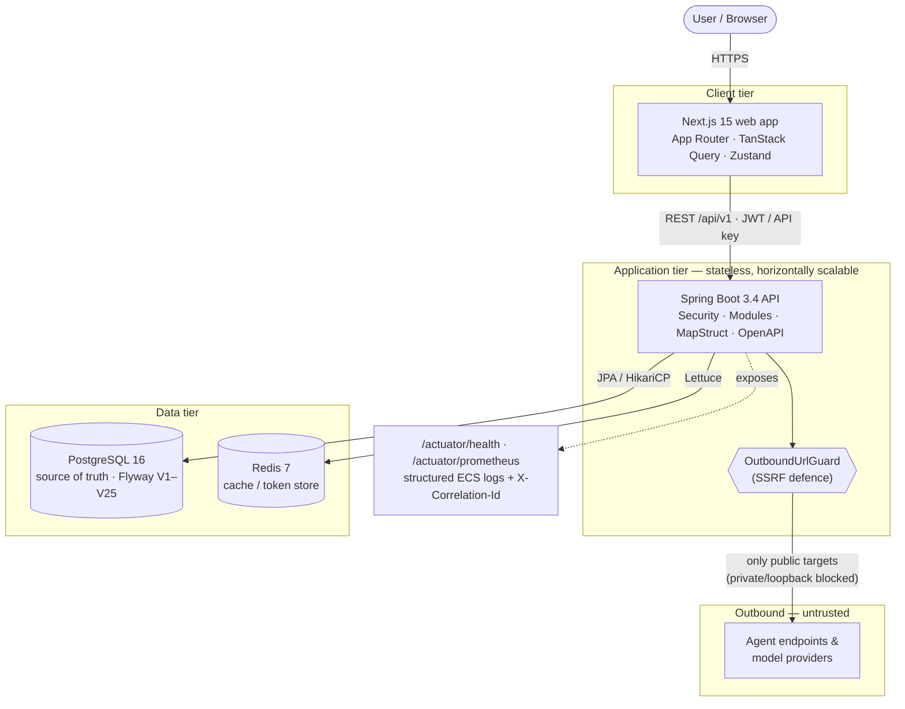
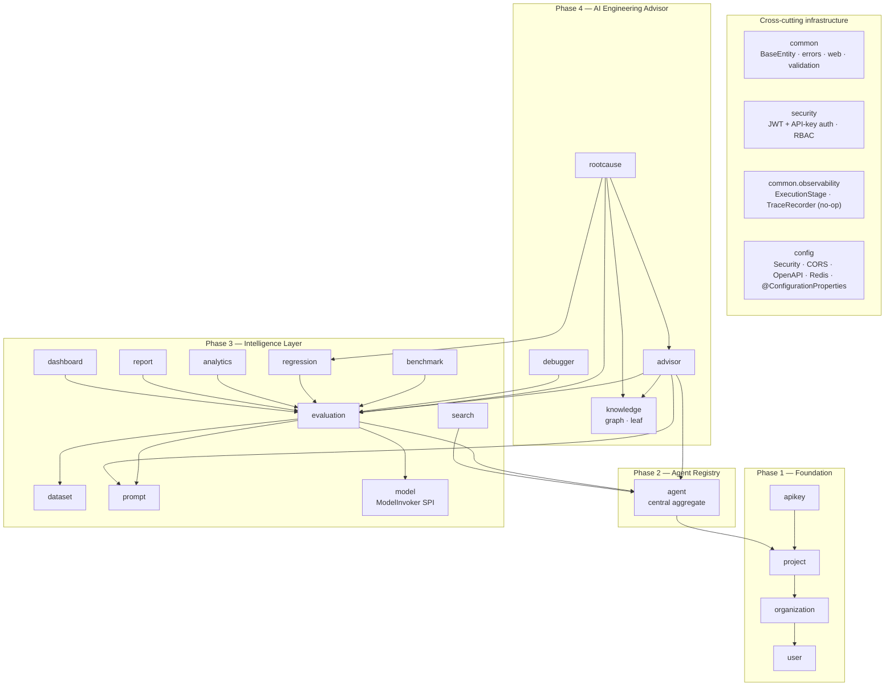
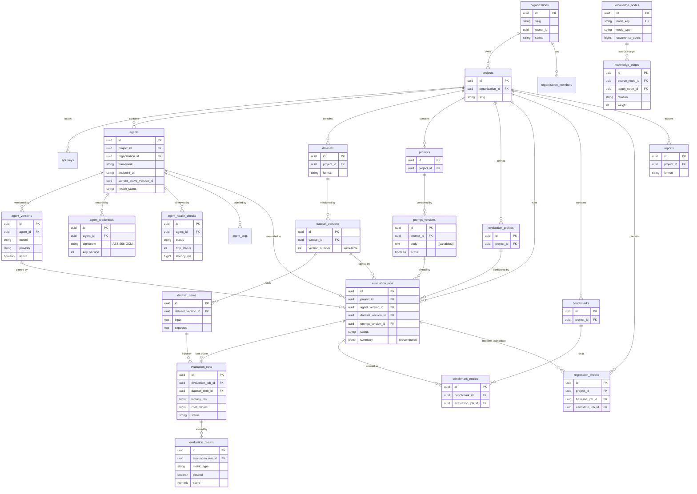
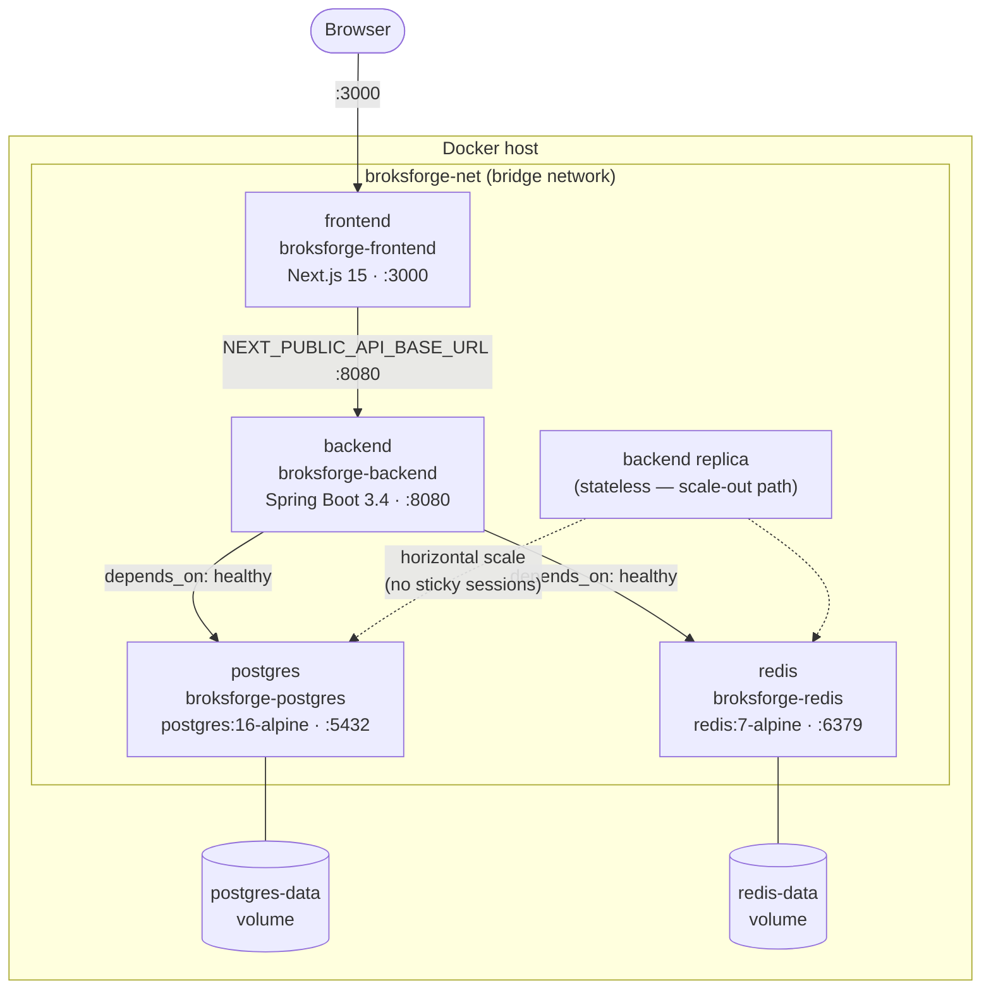
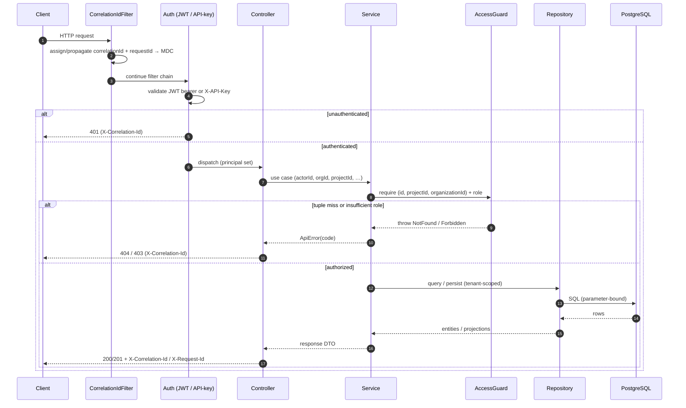
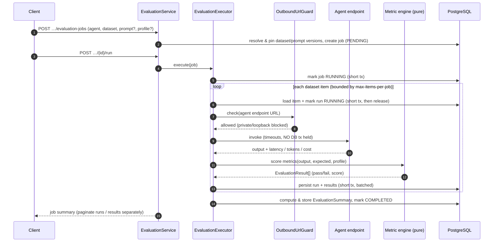
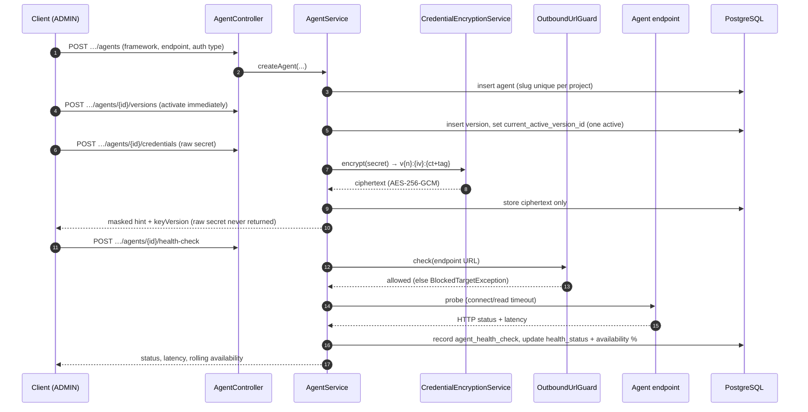
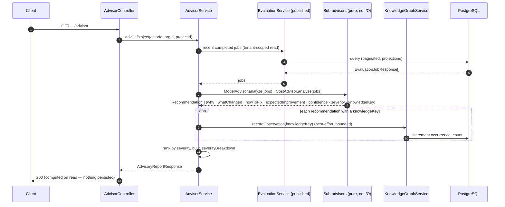

# Architecture Diagrams — Brok's Forge

> A consolidated, visual reference for **Brok's Forge — The Engineering Platform for AI Agents.**
> Every diagram is **Mermaid** (renders on GitHub) and is accurate to the codebase as of **v1.0.0**
> (Phases 1–4 delivered; Phase 5 observability). For the prose architecture see
> [MASTER_ARCHITECTURE.md](MASTER_ARCHITECTURE.md); for the operational runbook see
> [ENGINEERING_HANDBOOK.md](ENGINEERING_HANDBOOK.md).

- Audience: engineers, reviewers, and anyone evaluating the system end to end.
- Stack: Java 21 / Spring Boot 3.4.1 (modular monolith) · PostgreSQL 16 + Flyway (V1–V25) · Redis 7 ·
  Next.js 15 / React 19.

**Contents**

1. [System architecture](#1-system-architecture)
2. [Component / module map](#2-component--module-map)
3. [Entity-relationship model](#3-entity-relationship-model)
4. [Deployment topology](#4-deployment-topology)
5. [Request flow (sequence)](#5-request-flow-sequence)
6. [Evaluation flow (sequence)](#6-evaluation-flow-sequence)
7. [Agent registration flow (sequence)](#7-agent-registration-flow-sequence)
8. [Advisor flow (sequence)](#8-advisor-flow-sequence)

---

## 1. System architecture

The end-to-end runtime: a browser talks to the **Next.js** web app, which calls the **Spring Boot
API** over HTTPS; the API owns **PostgreSQL** (source of truth) and **Redis** (cache / token store).
All **outbound** calls to user-supplied agent endpoints and model providers pass through the
`OutboundUrlGuard` (SSRF defence) before leaving the platform.

*Browser → Next.js → Spring Boot API → Postgres/Redis. Health, Prometheus metrics and correlated
structured logs are exposed for operators; every outbound call is filtered by the SSRF guard.*

---

## 2. Component / module map

The **modular monolith**: feature modules under `com.broksforge.modules` reference each other **only**
by published service APIs and id (never by reaching into another module's persistence), so any module
can later be extracted into a microservice. Cross-cutting `common` / `config` / `security` /
`observability` are shared infrastructure. Dependencies point inward and the graph stays **acyclic**.

*Foundation modules + the central `agent` + the Phase 3 intelligence modules + the Phase 4
advisor/rootcause/debugger/knowledge modules, over shared common/security/config/observability. Edges
are published-service reads, never cross-module JPA.*

---

## 3. Entity-relationship model

The key tables and their relationships. Tenancy flows `organizations → projects → {agents, datasets,
prompts, evaluation_jobs, …}`; datasets/prompts/agents carry **immutable versions**; evaluation is the
`Job → Run → Result` fan-out tree. The Phase 4 **knowledge graph** (`knowledge_nodes` /
`knowledge_edges`) is platform-global reference data and is intentionally **not** tenant-scoped (shown
detached). Columns are abbreviated to the load-bearing ones.

*Tenancy: `organizations → projects → {agents, datasets, prompts, evaluation_jobs, benchmarks,
regression_checks, reports}`. Immutable version tables (`agent_versions`, `dataset_versions` /
`dataset_items`, `prompt_versions`) are pinned by an `evaluation_job` so any result is reproducible.
The knowledge graph is platform-global reference data.*

---

## 4. Deployment topology

Docker Compose runs four services on one bridge network with two named volumes. The API depends on
Postgres and Redis being **healthy**; the frontend bakes `NEXT_PUBLIC_API_BASE_URL` at build time.
The API tier is **stateless** (stateless JWT / API-key auth, no in-process session), so it scales
**horizontally** behind a load balancer — the dashed replica shows that path.

*Compose services `postgres` + `redis` + `backend` + `frontend` on `broksforge-net`, with
`postgres-data` / `redis-data` volumes. Required env: `JWT_SECRET`, `ENCRYPTION_KEY`,
`NEXT_PUBLIC_API_BASE_URL`. Stateless API replicas scale linearly behind a load balancer.*

---

## 5. Request flow (sequence)

Every request passes the **correlation-id filter** first (assigns/propagates `X-Correlation-Id` +
`X-Request-Id` into the MDC), then authentication (JWT bearer **or** API key), then the thin controller
delegates to a service that enforces the `(id, projectId, organizationId)` **access guard** before any
repository call. The correlation id is echoed back on the response.

*Correlation-id filter → JWT/API-key auth → controller → service + access guard → repository → DB →
response. A foreign id resolves to 404 (no existence leak); the correlation id is on every response.*

---

## 6. Evaluation flow (sequence)

Creating and running an evaluation job. The job **pins immutable versions** (agent / dataset / prompt),
then the executor invokes the agent endpoint **per dataset row — through the SSRF guard, and crucially
OUTSIDE any DB transaction** so a slow agent can't hold a pooled connection. Metrics are scored and the
run/result persisted in a **short** transaction; the job summary is precomputed.

*Create job → resolve & pin versions → executor invokes the agent per row **outside** any DB
transaction (through the SSRF guard, with timeouts) → score metrics → persist run/result in a short tx
→ precomputed summary.*

---

## 7. Agent registration flow (sequence)

Onboarding an agent: register it, add a version and activate it (one active version per agent), set an
encrypted credential (write-only, **never** returned or logged), and run a health check whose outbound
probe is gated by the `OutboundUrlGuard`.

*Register agent → add version (activate) → set encrypted credential (write-only) → health check via
`OutboundUrlGuard`. Credentials are encrypted at rest and never returned or logged.*

---

## 8. Advisor flow (sequence)

The **AI Engineering Advisor** is a recommendation engine, not a chatbot. The thin `AdvisorService`
loads recent jobs via **published services only**, hands already-loaded data to **pure sub-advisors**
that emit `Recommendation`s linked to the knowledge graph by key, records each observed pattern into
the graph (best-effort occurrence bump — the only write on this read path), then ranks and returns the
report. Nothing is persisted as a recommendation — it's **computed on read** so it can't drift.

*GET advisor → load recent jobs via published services → pure sub-advisors produce `Recommendation`s →
record observations in the knowledge graph (bounded, best-effort) → ranked advisory report.*

---

> These diagrams are intended to render anywhere Mermaid is supported (GitHub, most IDEs, MkDocs /
> Docusaurus with the Mermaid plugin). If you change the schema or a module boundary, update the
> relevant diagram here alongside [MASTER_ARCHITECTURE.md](MASTER_ARCHITECTURE.md).
