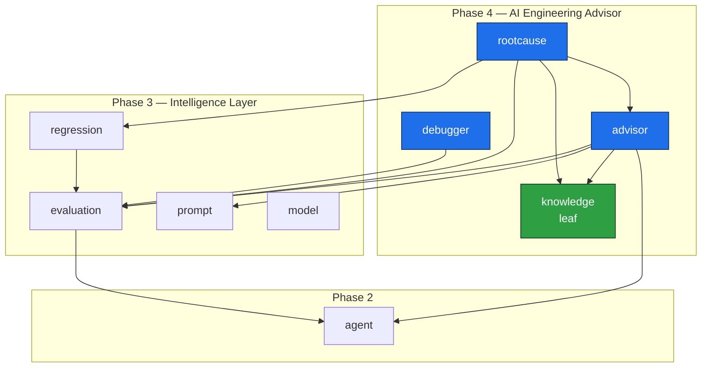

# Brok's Forge — Engineering Handbook

> **The Engineering Platform for AI Agents.**
>
> | | |
> |---|---|
> | **Document** | `docs/ENGINEERING_HANDBOOK.md` |
> | **Status** | Onboarding handbook (orientation + how-to) |
> | **Last updated** | 2026-07-01 |
> | **Audience** | A new senior engineer joining Brok's Forge |
> | **Scope** | The whole backend modular monolith, Phases 1–4, plus how to extend it |

This handbook exists so a new senior engineer can become **productive without chat history and
without reading every file**. It is the orientation layer: it tells you *what the platform is*, *how
it is shaped*, *how a request flows*, *what the conventions are*, and *how to add a feature* — and it
points at the deeper documents for everything else.

It is deliberately a **map, not a duplicate**. Where another document is the source of truth, this
handbook summarises and links rather than restating:

- [`./MASTER_ARCHITECTURE.md`](./MASTER_ARCHITECTURE.md) — **the** architecture reference (source of
  truth). When it and this handbook disagree, that document wins; when it and the **database schema**
  disagree, the schema wins.
- [`./PROJECT_RULES.md`](./PROJECT_RULES.md) — the non-negotiable engineering rules (DB, security,
  architecture, API, process).
- [`./CODING_STANDARDS.md`](./CODING_STANDARDS.md) — how we write Java and TypeScript.
- [`./DEVELOPER_GUIDE.md`](./DEVELOPER_GUIDE.md) — clean machine → running stack → worked feature.
- [`./API_GUIDELINES.md`](./API_GUIDELINES.md) · [`./ERROR_HANDLING_GUIDE.md`](./ERROR_HANDLING_GUIDE.md)
  · [`./SECURITY_GUIDE.md`](./SECURITY_GUIDE.md) · [`./TESTING_STRATEGY.md`](./TESTING_STRATEGY.md)
  · [`./PERFORMANCE_GUIDE.md`](./PERFORMANCE_GUIDE.md)
- [`./ROADMAP.md`](./ROADMAP.md) — what ships next. [`./FEATURE_DECISIONS.md`](./FEATURE_DECISIONS.md)
  and [`./adr/`](./adr/README.md) — why decisions were made.

---

## 1. What Brok's Forge is

Brok's Forge is **the engineering platform for AI agents**: a production-grade, open-source
foundation for building, shipping, evaluating and operating AI agents at scale. Application
frameworks (Spring AI, LangGraph, CrewAI, AutoGen, PydanticAI, Semantic Kernel, custom REST
services) help you *build* an agent. Brok's Forge helps you *engineer* one — register it, version
it, secure its credentials, point real datasets and prompts at it, evaluate its outputs against
objective metrics, benchmark competing variants, catch regressions before they ship, and — as of
Phase 4 — **diagnose and advise**: explain *why* something failed and *what to do about it*.

The platform is **framework-agnostic and provider-agnostic by construction**. An agent is described
by metadata, never by a framework's types, and every LLM provider is reached through a uniform SPI.
Adding a framework or provider is a code-only change with **no schema migration**, because frameworks
and providers are stored as text-backed enumerations.

It ships as a **modular monolith**: a single deployable Spring Boot application of independent feature
modules, deliberately shaped so any module can later be extracted into its own microservice with
minimal change. We get the operational simplicity of a monolith today and the option value of
microservices tomorrow.

### The four phases

| Phase | Theme | What it adds |
|---|---|---|
| **Phase 1 — Foundation** | Identity, multi-tenancy, access control | `auth`, `user`, `organization` (+ members), `project`, `apikey` |
| **Phase 2 — The Agent Registry** | The central aggregate root | `agent` — framework-agnostic agents, versioning, encrypted credentials, scheduler-ready health checks |
| **Phase 3 — The Intelligence Layer** | Turn a registry into a measurement platform | `dataset`, `prompt`, `model`, `evaluation`, `benchmark`, `regression`, `analytics`, `report`, `search`, `dashboard` |
| **Phase 4 — The AI Engineering Advisor** | Turn measurement into **advice** | `knowledge`, `advisor`, `rootcause`, `debugger`, plus the `common.observability` tracing seam |

Phase 4 is the step from *measuring* agents to *advising* on them. A dashboard that says "pass rate
is 72%" is data; an advisor that says "switch model X→Y for +8pp quality at equal cost, here is the
evidence" is engineering value. See [§8](#8-phase-4--the-ai-engineering-advisor) and the
authoritative deep-dive in
[`MASTER_ARCHITECTURE.md` → Phase 4](./MASTER_ARCHITECTURE.md#phase-4--the-ai-engineering-advisor).

### Product philosophy (the non-negotiables)

These are reflected in code, schema and review (full list in
[`PROJECT_RULES.md`](./PROJECT_RULES.md)):

1. **The agent is the centre of gravity.** `Agent` is the one stable aggregate root every module
   attaches to — by `agentId` and, where results must be attributable, `agentVersionId`.
2. **The database is the source of truth.** Flyway owns the schema; entities conform exactly
   (`ddl-auto=validate`). Migrations are append-only and never edited.
3. **Provider- and framework-neutrality.** Nothing couples to one provider/framework; provider
   behaviour lives behind the `ModelInvoker` SPI.
4. **Secrets are sacred.** Verification secrets are hashed; usage secrets are encrypted
   (AES-256-GCM). Secrets are never logged and never returned by the API.
5. **Tenant isolation is enforced, not assumed.** Every aggregate is resolved by its full
   `(id, projectId, organizationId)` tuple — a foreign id is a 404, never a 403 that leaks existence.
6. **Built to scale to millions of evaluations.** The evaluation pipeline is shaped and seamed so it
   can move behind a queue without touching the domain model.
7. **Thin controllers, rich services, explicit contracts.** Controllers orchestrate; services hold
   logic; DTOs are immutable records validated at the edge.
8. **Operable by default.** Correlation/request IDs flow through every request and log line; the
   stack is OpenTelemetry-ready.
9. **New work is additive.** Phase 4 added four modules and a tracing seam and changed **no** Phase
   1–3 behaviour. Don't delete or downgrade a working capability to make a feature easier.

---

## 2. The modular-monolith architecture

Brok's Forge is a single Spring Boot application composed of **independent feature modules** plus
shared cross-cutting infrastructure (decision in
[ADR 0001](./adr/0001-modular-monolith.md)). Each feature module lives under
`com.broksforge.modules.<feature>` and is internally layered; dependencies point **downward only**.

```
┌───────────────────────────────────────────────────────────────┐
│  web/         Controllers · DTOs (records) · MapStruct mappers │  ← HTTP edge
│               @PreAuthorize · @SecurityRequirement · OpenAPI   │
├───────────────────────────────────────────────────────────────┤
│  service/     Application services — use cases, transactions,  │  ← business logic
│               access guards, invariants, orchestration         │
├───────────────────────────────────────────────────────────────┤
│  domain/      JPA entities · enums · value objects · invariants│  ← model
├───────────────────────────────────────────────────────────────┤
│  repository/  Spring Data JPA repositories (this module only)  │  ← persistence
└───────────────────────────────────────────────────────────────┘
        cross-cutting: common/ · config/ · security/
```

- **`web/`** is thin: authenticate, resolve the caller (`SecurityUtils.requireCurrentUserId()`),
  delegate to a service, map the result to a DTO. No business logic, no repository access.
- **`service/`** owns the use cases: transactions (`@Transactional`), the module's access guard,
  domain invariants, and calls to **other modules only through their published services**.
- **`domain/`** holds JPA entities (extending `BaseEntity` or `SoftDeletableEntity`), enums and value
  objects, matching the Flyway schema exactly.
- **`repository/`** holds Spring Data JPA repositories — **private to the module**; no other module
  injects them.

### Module boundary rules (enforced in review)

These three rules are what make later extraction mechanical rather than archaeological (ARCH-1 in
[`PROJECT_RULES.md`](./PROJECT_RULES.md)):

1. **No cross-module JPA associations.** `evaluation` never has `@ManyToOne Agent agent`; it stores a
   plain `UUID agentId`.
2. **No shared repositories.** `BenchmarkService` never injects `AgentRepository`; it reads via the
   `agent` module's published service.
3. **Reference by id (UUID) + read via published service.** Attach to a thing by id; read it through
   its service. The cost is an occasional extra query; the benefit is clean, extractable boundaries.

Cross-module communication is therefore **id references + published application services + value
records (DTOs)** — never a cross-module entity or repository. Phase 4 follows this strictly: its
modules compose published services and exchange value records, holding no foreign JPA associations.

### The module map

Every domain maps to one module under `com.broksforge.modules.<feature>`.

| Domain | Module | Phase | Aggregate(s) / what it owns |
|---|---|---|---|
| Authentication | `auth` | P1 | `RefreshToken`, `PasswordResetToken`, `EmailVerificationToken` |
| Users | `user` | P1 | `User` (platform role `USER`/`ADMIN`) |
| Organizations | `organization` | P1 | `Organization`, `OrganizationMember`, `OrganizationRole` (OWNER/ADMIN/MEMBER) |
| Projects | `project` | P1 | `Project` — the scope every resource lives in |
| API keys | `apikey` | P1 | `ApiKey` (SHA-256-hashed, project-scoped) |
| **Agents** | `agent` | P2 | `Agent`, `AgentVersion`, `AgentCredential`, `AgentHealthCheck`, `AgentTag` — the central registry |
| Datasets | `dataset` | P3 | `Dataset`, `DatasetVersion`, `DatasetItem` (immutable, versioned) |
| Prompts | `prompt` | P3 | `Prompt`, `PromptVersion` (`{{variable}}` templates, activate/rollback) |
| Model invocation | `model` | P3 | SPI (no tables): `LlmProvider`, `ModelInvoker`, `ModelInvocationService`, `AgentEndpointInvoker` |
| Evaluation | `evaluation` | P3 | `EvaluationJob → EvaluationRun → EvaluationResult`, `EvaluationProfile` |
| Benchmarking | `benchmark` | P3 | `Benchmark`, `BenchmarkEntry`; leaderboards |
| Regression | `regression` | P3 | `RegressionCheck` (baseline vs candidate) |
| Analytics | `analytics` | P3 | cost/latency/token/usage aggregates (read models) |
| Reporting | `report` | P3 | `Report` + JSON/CSV/HTML export |
| Search | `search` | P3 | global search (read models) |
| Dashboard | `dashboard` | P3 | aggregate platform view (read models) |
| **Knowledge graph** | `knowledge` | **P4** | `KnowledgeNode`, `KnowledgeEdge` — platform-global reference data + the learning seam |
| **Advisor** | `advisor` | **P4** | `Recommendation` value type + five pure sub-advisors + `AdvisorService` (no tables) |
| **Root cause** | `rootcause` | **P4** | pure `RootCauseEngine` + `RootCauseFinding` + `RootCauseService` (no tables) |
| **AI debugger** | `debugger` | **P4** | `DebuggerService` — reconstructs a per-run execution timeline (no tables) |

Plus the cross-cutting **`common.observability`** tracing seam (Phase 4): `ExecutionStage`,
`StageStatus`, `TraceRecorder` + `NoOpTraceRecorder`.

### Module dependency graph

The dependency graph is **acyclic**. The Phase 4 modules compose Phase 1–3 services; `knowledge` is a
leaf (no outgoing module dependencies); nothing in Phases 1–3 depends on a Phase 4 module.



Read it as: `advisor → knowledge + evaluation + prompt + agent`; `rootcause → advisor + evaluation +
regression + knowledge`; `debugger → evaluation`; `knowledge` depends on nothing. All edges are
"reads-via-published-service", never a JPA association.

---

## 3. The request lifecycle

Every authenticated request travels the same path. Knowing it end-to-end means you can place any new
code correctly and debug any request by its id.

```mermaid
sequenceDiagram
    participant C as Client (SPA / API key)
    participant CF as CorrelationIdFilter
    participant JWT as JwtAuthenticationFilter
    participant AK as ApiKeyAuthenticationFilter
    participant AZ as Authorization (@PreAuthorize)
    participant Ctl as Controller (web/)
    participant Svc as Service (service/)
    participant Guard as Access guard
    participant Repo as Repository (repository/)
    participant DB as PostgreSQL

    C->>CF: HTTP request
    CF->>CF: assign/propagate correlationId + requestId → MDC + response headers
    CF->>JWT: continue chain
    JWT->>AK: validate Bearer JWT (if present) → SecurityContext
    AK->>AZ: validate X-API-Key (if present) → SecurityContext
    AZ->>Ctl: isAuthenticated() / role check passes
    Ctl->>Ctl: SecurityUtils.requireCurrentUserId(); @Valid DTO
    Ctl->>Svc: delegate (orgId, projectId, request)
    Svc->>Guard: requireRole / load by (id, projectId, organizationId)
    Guard->>Repo: scoped query
    Repo->>DB: SQL (tenant + deleted=false)
    DB-->>Svc: entity
    Svc-->>Ctl: domain result
    Ctl-->>C: MapStruct → DTO (PageResponse / ApiError)
```

Stage by stage:

1. **Correlation / request IDs.** `CorrelationIdFilter` (in `common.observability`) assigns or
   propagates a correlation id and a per-request request id, places both in the SLF4J **MDC** (so they
   appear on every log line), and returns them as `X-Correlation-Id` / `X-Request-Id` headers. Every
   incident is traceable end to end without exposing secret material.
2. **Security filter chain** (`SecurityConfig`, stateless, no HTTP session, CSRF disabled because auth
   is header-based): `JwtAuthenticationFilter` runs first (HS256 bearer access token), then
   `ApiKeyAuthenticationFilter` (`X-API-Key`). Either populates the `SecurityContext`. Public paths
   (`/api/v1/auth/**`, health, Swagger/OpenAPI, `/error`) are permitted; `/actuator/**` requires role
   `ADMIN`; everything else requires authentication. Security headers (CSP, `frame-ancestors 'none'`,
   `X-Content-Type-Options`, referrer-policy, HSTS) and environment-driven CORS apply to every
   response.
3. **Authorization.** Method security: controllers carry `@PreAuthorize("isAuthenticated()")`; the
   real authorization decision — org membership and role — happens in the **service** via
   `OrganizationAccessService.requireRole(...)` / `requireMembership(...)`.
4. **Controller (`web/`).** Thin. It calls `SecurityUtils.requireCurrentUserId()`, validates the
   `@Valid` request record (Bean Validation), and delegates to a service. No logic, no repository.
5. **Service (`service/`).** The use case. Opens the transaction (`@Transactional`, `readOnly` on
   reads), applies the **access guard** that loads every aggregate by its full
   `(id, projectId, organizationId)` tuple, upholds invariants, calls other modules **only** via
   published services, and throws typed `ApiException`s with a stable `ErrorCode`.
6. **Repository (`repository/`).** Module-private Spring Data JPA. Derived query names include
   `ProjectId`, `OrganizationId`, and `DeletedFalse`, so cross-tenant leaks are impossible by
   construction.
7. **Response / errors.** Success maps through a **MapStruct** mapper to a response record; lists
   return `PageResponse<T>`. Errors are rendered by `GlobalExceptionHandler` as the stable `ApiError`
   contract `{ timestamp, status, error, code, message, path, errors[] }` — **no stack trace ever
   leaks**.

### DTO / mapper separation (and why mass-assignment is impossible)

- **Request records omit every server-controlled field** (ids, tenancy keys, audit columns, status
  pointers, `version`). A client physically cannot set `organizationId`, `ownerId`, `status` or
  `createdBy`.
- **MapStruct mappers** (`componentModel = "spring"`) map only the declared request fields onto the
  entity; server-controlled values are set by the service.
- **Response records never contain secrets** — credential reads return masked metadata only.

---

## 4. Persistence conventions

The contract is simple and absolute: **the database is the source of truth, and entities conform to
it.** `spring.jpa.hibernate.ddl-auto=validate` means Hibernate never creates or alters schema — on
boot, Flyway migrates, then Hibernate validates that every entity maps exactly onto the existing
tables. A mismatch (column name, type, nullability, length) **fails startup**. Fix the entity or the
migration, never relax validation.

### The universal column skeleton

Every table carries the same skeleton, materialised by `BaseEntity` and (for soft-deletable
aggregates) `SoftDeletableEntity`:

```sql
id          UUID        NOT NULL DEFAULT gen_random_uuid(),  -- PK, GenerationType.UUID
version     BIGINT      NOT NULL DEFAULT 0,                  -- @Version, optimistic lock
created_at  TIMESTAMPTZ NOT NULL,                            -- @CreatedDate
updated_at  TIMESTAMPTZ NOT NULL,                            -- @LastModifiedDate
created_by  UUID,                                            -- @CreatedBy
updated_by  UUID,                                            -- @LastModifiedBy
-- soft-deletable aggregates additionally carry:
deleted     BOOLEAN     NOT NULL DEFAULT FALSE,
deleted_at  TIMESTAMPTZ,
deleted_by  UUID
```

- **UUID primary keys** via `gen_random_uuid()` — no sequence contention, safe to reference across
  modules, opaque to clients.
- **Audit columns** populated automatically by Spring Data JPA auditing
  (`JpaAuditingConfig` + `ApplicationAuditAware` resolve the current user id).
- **Optimistic locking** via `version` — concurrent updates fail loudly.
- **Soft delete** via `deleted/deleted_at/deleted_by`; repositories filter `deleted = false`. Deletes
  are reversible by default; evaluation data is evidence and must stay auditable.
- **Time** is `java.time.Instant` ↔ `TIMESTAMPTZ` — never `TIMESTAMP` / `LocalDateTime`.

### Other conventions you will reuse

- **Tenancy columns** `organization_id` and `project_id` on every project-scoped aggregate, indexed,
  with FKs + `ON DELETE CASCADE` to their parents. A `(project_id, slug)` unique constraint gives
  stable human-readable identity within a project.
- **Enumerations stored as text** via `@Enumerated(EnumType.STRING)` (`VARCHAR`) — never `ORDINAL`
  (reordering would corrupt data). Adding a value is a code-only change, never a migration. This is
  what makes the platform framework- and provider-agnostic at the schema level.
- **JSON in TEXT, not jsonb.** JSON/map columns use `JsonMetadataConverter` (`@Convert`) into a `TEXT`
  column, because `ddl-auto=validate` plus Hibernate's `jsonb` mapping is brittle across drivers.
  (`evaluation_jobs.summary`, `agents.custom_metadata`, `knowledge_nodes.tags`, etc.)
- **Index the access path** — tenancy columns, foreign keys and filter/sort columns are indexed.

### Flyway: append-only, V1..V25

Migrations live in `backend/src/main/resources/db/migration/` and are **append-only and immutable
once merged** — Flyway validates checksums on boot, so editing an applied `V*` file breaks every
environment. Corrections ship as a new `V<n+1>`.

| Range | Phase | Tables |
|---|---|---|
| `V1`..`V5` | P1 | users, auth tokens, organizations, projects, api keys |
| `V6`..`V10` | P2 | agents, agent versions, credentials, health checks, tags |
| `V11`..`V23` | P3 | datasets/versions/items, prompts/versions, evaluation profiles/jobs/runs/results, benchmarks/entries, regression checks, reports |
| `V24`..`V25` | **P4** | `knowledge_nodes`, `knowledge_edges` (the only new Phase 4 tables) |

Phase 4 added only **two** tables — the advisor, root-cause and debugger features compute on read and
persist nothing (see [§8](#8-phase-4--the-ai-engineering-advisor)).

---

## 5. Cross-module integration & the published-service contract

A module never reaches into another module's tables. It **references foreign aggregates by UUID** and
**reads them through the owning module's published application service**, receiving **value records**.
This is the single integration contract across the whole platform, and it is exactly how the Phase 4
modules consume Phase 1–3 data.

```text
advisor.service.AdvisorService
      │ reads via published services (never repositories)
      ├──► evaluation.service.EvaluationService   (jobs, runs, failed-run samples, metric tallies)
      ├──► prompt.service.PromptService            (prompt version body to analyse)
      ├──► agent.service.AgentService              (agent + health context)
      └──► knowledge.service.KnowledgeGraphService (link findings + record observations)
```

When you add a feature that needs another module's data, **do not** inject its repository or add a JPA
relationship. Add (or reuse) a method on that module's published service that returns a neutral,
tenant-scoped value record. Phase 4's root-cause work is the canonical example: it needed a single
run, a bounded sample of failed runs, and a per-metric failure tally, so the `evaluation` module grew
three new **published reads** (`getRun`, `sampleFailedRuns`, `metricFailureBreakdown`) returning value
records — the module kept ownership of its tables; consumers got scoped views.

---

## 6. The evaluation pipeline and the on-read advisor model

### The evaluation pipeline (Phase 3, the heart of the platform)

The top-level object is **`EvaluationJob`** (there is no entity called "Evaluation"). A job takes an
agent (or a specific version), a dataset version, a prompt version and an evaluation profile, and
fans out into a tree sized to reach millions of evaluations:

```text
evaluation_jobs        1   ── config + status + summary (cost/latency/quality)
   └── evaluation_runs  N   ── exactly one per dataset item        (the unit of work)
          └── evaluation_results  M ── exactly one per metric, per run  (the atomic score)
```

Pipeline in one line: **Job → N prompts → N executions → N results → summary.** Two seams make it
scale: `EvaluationJobExecutor` is the single fan-out point (queue-ready), and precomputed job
summaries let every downstream consumer read one row per job instead of millions. Metrics are an enum
with **one evaluator strategy per type** (`EvaluationMetricEngine` is pure). Full detail in
[`MASTER_ARCHITECTURE.md` → Evaluation Architecture](./MASTER_ARCHITECTURE.md#evaluation-architecture).

### The on-read model (Phase 4)

Phase 4's advisor and root-cause features follow a principle already established by benchmark
leaderboards and regression findings: **they are computed on read from current data and never
persisted.** An advisory report or a root-cause finding is derived fresh each time it is requested,
so it can **never drift** — a recommendation about a job whose model later changed cannot become a
lie, because it is re-derived from live state. The consequences:

- **Always current.** No stale snapshot, no invalidation, no scheduler.
- **Zero schema cost.** Shipping the advisor — and adding future advisors — needs no migration.
- **Deterministic and testable.** The analyzers are **pure** (no I/O), like `EvaluationMetricEngine`,
  so they unit-test trivially.

The only write these read paths perform is incrementing a knowledge-graph **occurrence counter** (the
learning seam) — never the agents, prompts or jobs they analyse. Decision:
[ADR 0011](./adr/0011-ai-engineering-advisor.md).

---

## 7. The observability / tracing seam

Implemented today: **correlation/request id propagation** (MDC + headers), the **structured `ApiError`
contract** with a stable `ErrorCode` enum, and **Actuator health**. The stack is **OpenTelemetry-ready**.

Phase 4 added the **tracing seam** that future live tracing will attach to —
**architecture only, with no exporters wired** (a deliberate scope boundary;
[ADR 0014](./adr/0014-ai-debugger-and-tracing-seam.md)):

- **`ExecutionStage`** — the canonical 7-stage vocabulary: `PROMPT, MEMORY, RETRIEVER, TOOLS, MODEL,
  PARSER, OUTPUT`.
- **`StageStatus`** — `OK, WARN, ERROR, SKIPPED, NOT_INSTRUMENTED`. `NOT_INSTRUMENTED` is a
  first-class state: the platform does not yet capture per-stage spans, so `MEMORY`, `RETRIEVER` and
  `TOOLS` are reported as `NOT_INSTRUMENTED` rather than faked.
- **`TraceRecorder`** — a dependency-free interface with a **`NoOpTraceRecorder`** default. It is the
  single point where live per-stage span recording (and, later, an OpenTelemetry exporter) will
  attach. The correlation id is the natural trace seam.

When live tracing lands (Phase 5), driving `TraceRecorder` from instrumented execution lights up the
placeholder stages with real spans — **no API or UI rewrite**, because the contract shape is already
fixed.

---

## 8. Phase 4 — The AI Engineering Advisor

> This handbook gives the orientation; the **authoritative deep-dive** (every endpoint, column,
> record, and the data-flow diagrams) is
> [`MASTER_ARCHITECTURE.md` → Phase 4](./MASTER_ARCHITECTURE.md#phase-4--the-ai-engineering-advisor).

Phase 4 turns the measurement platform into one that **advises**. It adds four modules and the tracing
seam, persists only the knowledge graph, and changed no Phase 1–3 behaviour.

### `knowledge` — the Engineering Knowledge Graph

A persisted, **platform-global** (not tenant-scoped) catalogue of recurring engineering patterns —
failure modes, regressions, recommendations, optimisations — as a node table + an edge table, seeded
with **20 nodes and 20 edges** via Flyway `V24`/`V25`. It is the shared spine the advisor and
root-cause engine link their findings to, and it carries the platform's **learning seam**.

- **`KnowledgeNode`** — a `node_key`-addressed pattern (`node_type`, `category`, `summary`,
  `detection_hint`, `remediation`, `expected_improvement`, default severity/confidence, `tags`,
  `occurrence_count`). `KnowledgeNodeType` = `FAILURE_MODE, REGRESSION, RECOMMENDATION, OPTIMIZATION`.
- **`KnowledgeEdge`** — a typed, directed, weighted relation between two nodes. `KnowledgeRelation` =
  `CAUSES, MITIGATED_BY, LEADS_TO, RELATED_TO`.
- **`occurrenceCount` is the learning seam.** A published `recordObservation(nodeKey)` increments a
  pattern's counter (atomically, best-effort) whenever the advisor or root-cause engine surfaces it —
  the platform begins accumulating *which* patterns actually occur, the raw material for future
  learning. Decision: [ADR 0013](./adr/0013-engineering-knowledge-graph.md).

### `advisor` — pure, composed sub-advisors

A fixed **`Recommendation`** value record captures the questions an engineer asks — `category`,
`title`, `why`, `whatChanged`, `howToFix`, `expectedImprovement`, `confidence`, `severity`,
`evidence[]`, `knowledgeKey` — backed by enums `Severity` (`INFO, LOW, MEDIUM, HIGH, CRITICAL`),
`Confidence` (`LOW, MEDIUM, HIGH`) and `RecommendationCategory` (`PROMPT, RAG, AGENT, MODEL, COST,
RELIABILITY, QUALITY, LATENCY`). Five **pure** sub-advisors — `PromptAdvisor`, `ModelAdvisor`,
`CostAdvisor`, `AgentAdvisor`, `RagAdvisor` — each do no I/O; **`AdvisorService`** loads data through
published services and feeds the analyzers. Thresholds live in `AdvisorProperties`
(`broksforge.advisor.*`), not in code. Decision:
[ADR 0011](./adr/0011-ai-engineering-advisor.md).

### `rootcause` — explain *why* it failed

A **pure `RootCauseEngine`** turns already-loaded signal (job summary, per-metric pass/fail tally, a
bounded sample of failed runs, or a regression check's findings) into **`RootCauseFinding`** records
(`rootCause`, `severity`, `confidence`, `evidence[]`, `recommendation`, `expectedImprovement`,
`knowledgeKey`). `RootCauseService` loads via published services (the new evaluation reads +
`RegressionService`), classifies by **dominant failure mode**, de-duplicates by knowledge key, ranks
by severity, and links findings to the knowledge graph. Decision:
[ADR 0012](./adr/0012-root-cause-analysis-engine.md).

### `debugger` — the AI Debugger execution timeline

`DebuggerService` reconstructs a per-run **execution timeline** over the 7 `ExecutionStage`s. From the
persisted run it populates `PROMPT` (input), `MODEL` (the timed endpoint invocation — latency, tokens,
cost, HTTP status), `PARSER` (JSON-valid metric + output presence) and `OUTPUT` (pass/fail + failing
metrics); `MEMORY`, `RETRIEVER` and `TOOLS` are honestly `NOT_INSTRUMENTED` until live tracing. The
response is explicit that only the model call is timed end to end. Decision:
[ADR 0014](./adr/0014-ai-debugger-and-tracing-seam.md).

### New error codes

`ADVISOR_INPUT_INSUFFICIENT`, `ROOT_CAUSE_INPUT_INVALID`, `DEBUG_TIMELINE_UNAVAILABLE`,
`KNOWLEDGE_PATTERN_NOT_FOUND` — surfaced through the standard `ApiError` contract.

### New REST endpoints (all require auth)

| Method | Path | Purpose |
|---|---|---|
| GET | `/api/v1/organizations/{orgId}/projects/{projectId}/advisor` | Project-wide recommendations across recent jobs |
| GET | `…/advisor/agents/{agentId}` | Recommendations focused on one agent |
| GET | `…/advisor/prompts/{promptId}?versionId=` | Prompt-focused recommendations (optional version) |
| GET | `…/root-cause/jobs/{jobId}` | Root-cause findings for a failed/under-performing job |
| GET | `…/root-cause/regressions/{checkId}` | Root-cause findings for a regression check |
| GET | `…/debugger/jobs/{jobId}/runs/{runId}/timeline` | Per-run execution timeline |
| GET | `/api/v1/knowledge/nodes?type=&category=` | List knowledge nodes (filterable) |
| GET | `/api/v1/knowledge/nodes/{nodeKey}` | One pattern by stable key |
| GET | `/api/v1/knowledge/graph` | The whole node/edge graph |

Note the knowledge endpoints are **not** tenant-nested — the graph is platform-global reference data
readable by any authenticated user.

---

## 9. The security model

Two stateless authentication mechanisms, role-based authorization in services, scoped loads for
isolation, and a hard line on secrets. Deep dive in [`SECURITY_GUIDE.md`](./SECURITY_GUIDE.md) and
[`PROJECT_RULES.md` → Security](./PROJECT_RULES.md).

- **JWT bearer tokens.** Short-lived HS256 access tokens minted by `JwtService`, validated by
  `JwtAuthenticationFilter`. The signing secret comes from the environment (`JWT_SECRET`, Base64,
  ≥ 256 bits); the app fails fast without it. Library: `jjwt` 0.12.6.
- **Refresh tokens.** Opaque, stored server-side, **rotated on every refresh**; changing a password
  revokes all sessions.
- **API keys.** Project-scoped, authenticated by `ApiKeyAuthenticationFilter` (`X-API-Key`),
  SHA-256-hashed at rest, shown once.
- **RBAC.** Platform roles `USER`/`ADMIN` on `User`; organization roles `OWNER > ADMIN > MEMBER`
  compared with `isAtLeast(...)`. Enforced centrally via `OrganizationAccessService.requireRole(...)`
  / `requireMembership(...)` **in services**, not scattered across controllers.
- **Tenant isolation / IDOR.** Every aggregate is loaded by its full `(id, projectId, organizationId)`
  tuple through a per-aggregate access guard, so a foreign id resolves to **404, not 403**.
- **Encryption vs hashing.** **Verification secrets** (passwords, API keys, reset/verification tokens)
  are **hashed** (BCrypt strength 12 for passwords, SHA-256 for tokens/keys). **Usage secrets**
  (`AgentCredential` — the agent's upstream API key/bearer, which the platform must present upstream)
  are **encrypted** with AES-256-GCM via `CredentialEncryptionService`, using a 32-byte key from
  `BROKSFORGE_SECURITY_ENCRYPTION_KEY` / `ENCRYPTION_KEY`. Ciphertext is versioned, never logged, never
  returned (reads expose a masked hint only). Decision:
  [ADR 0003](./adr/0003-credential-encryption-vs-hashing.md).
- **SSRF defence.** Agent endpoints are user-supplied outbound URLs. `@ValidEndpointUrl` does
  syntactic validation on write; `OutboundUrlGuard` re-resolves the host at call time and blocks
  loopback/link-local/private/metadata targets (overridable for local dev). The guard runs for **every**
  outbound call. Decision: [ADR 0004](./adr/0004-ssrf-protection-for-agent-endpoints.md).
- **No secret or stack trace ever leaks** — not in logs, responses, exceptions or traces.
  `GlobalExceptionHandler` returns the sanitised `ApiError` contract.

---

## 10. How to add a new feature or module — step by step

Follow the same order every time: **schema first, UI last.** This mirrors the worked example in
[`DEVELOPER_GUIDE.md` §7](./DEVELOPER_GUIDE.md) and the rules in
[`PROJECT_RULES.md`](./PROJECT_RULES.md).

1. **State the problem.** Every feature must answer a concrete AI-engineering problem (PROC-1), e.g.
   "compare two prompt versions on a fixed dataset" or "explain why this job regressed".
2. **Pick the right home.** New capability → a feature module under `com.broksforge.modules.<feature>`
   with `domain/ repository/ service/ web/(dto/)`. Cross-cutting code → `common/`, `config/` or
   `security/`, never a feature module.
3. **Schema first, append-only.** Add the next `V<n>__<description>.sql`. Use the universal column
   skeleton (UUID PK, `version`, audit, soft-delete where logically deletable), text-backed enums,
   tenancy columns + FKs + indexes. **Never edit an applied migration.** (If your feature computes on
   read and persists nothing — like the advisor/root-cause/debugger — you add **no** migration.)
4. **Entity conforms to schema.** Extend `BaseEntity` or `SoftDeletableEntity`; map exactly onto the
   table. `@Enumerated(EnumType.STRING)`, explicit `@Column(nullable, length)`, `TIMESTAMPTZ`↔`Instant`,
   JSON via `JsonMetadataConverter` into `TEXT`. `ddl-auto=validate` fails the boot on any drift.
5. **Repository per module.** Spring Data JPA, private to the module. Scope every read by tenant
   (`…ProjectIdAndOrganizationIdAndDeletedFalse`). Dynamic filters go through `JpaSpecificationExecutor`
   + a `final *Specifications` class. **Never inject another module's repository.**
6. **Service holds the logic.** `@Transactional` writes / `readOnly` reads, constructor injection
   only, the module's access guard loading by `(id, projectId, organizationId)`, typed `ApiException`s
   with an `ErrorCode`. Call other modules **only** via their published services and by id. If you need
   another module's data, add a published read returning a value record — don't reach into its tables.
   Pure compute (analyzers, engines) should be **no-I/O** so it unit-tests trivially.
7. **Thin controller + record DTOs.** Versioned route under `/api/v1`, nested under
   `…/organizations/{organizationId}/projects/{projectId}/<resource>` (unless it is platform-global
   reference data, like `knowledge`). `@PreAuthorize("isAuthenticated()")`,
   `@SecurityRequirement(name = "bearerAuth")`, `SecurityUtils.requireCurrentUserId()`. Request DTOs
   omit server-controlled fields; lists return `PageResponse<T>`; MapStruct mapper at the boundary.
8. **Errors via the contract.** Throw `ResourceNotFoundException` / `ForbiddenException` / … with an
   `ErrorCode`; let `GlobalExceptionHandler` render `ApiError`.
9. **Frontend.** Add a TanStack Query hook in `lib/hooks/`, a Zod schema, a route under
   `app/(dashboard)/<resource>/`, components under `components/<resource>/`; handle loading/empty/
   error/success.
10. **Tests.** JUnit 5 + Mockito; `@DataJpaTest` (Testcontainers Postgres) for repositories,
    `@WebMvcTest` for controllers, plain unit tests for services and pure engines. Name tests
    `method_whenCondition_expectedOutcome`. Every bug fix ships a regression test.
11. **Docs + ADR.** Update [`ROADMAP.md`](./ROADMAP.md), [`FEATURE_DECISIONS.md`](./FEATURE_DECISIONS.md)
    and, for architecturally significant changes, [`MASTER_ARCHITECTURE.md`](./MASTER_ARCHITECTURE.md);
    write a new ADR for any non-trivial decision (ADRs are immutable once accepted — supersede, never
    rewrite).
12. **Phase/PR self-review.** Run the checklist in
    [`PROJECT_RULES.md` → How rules are enforced](./PROJECT_RULES.md#how-rules-are-enforced) and the
    PR checklist in [`CODING_STANDARDS.md` §16](./CODING_STANDARDS.md).

---

## 11. Running locally

The fastest path to a working stack is Docker Compose (full detail in
[`DEVELOPER_GUIDE.md` §3–§5](./DEVELOPER_GUIDE.md)).

```bash
git clone git@github.com:broksforge/broks-forge.git
cd broks-forge
cp .env.example .env          # fill in the values below
docker compose up --build     # postgres + redis + backend (api) + frontend (web)
```

Once healthy:

| Service | URL |
|---|---|
| Frontend | http://localhost:3000 |
| Backend API | http://localhost:8080/api/v1 |
| Swagger UI | http://localhost:8080/swagger-ui.html |
| OpenAPI JSON | http://localhost:8080/v3/api-docs |
| Actuator health | http://localhost:8080/actuator/health |

Configuration is **12-factor** — everything comes from the environment, the app fails fast when a
required secret is absent, and nothing is hardcoded. The essentials:

| Variable | Required | Purpose |
|---|---|---|
| `SPRING_DATASOURCE_URL` / `_USERNAME` / `_PASSWORD` | yes | Postgres connection |
| `SPRING_DATA_REDIS_HOST` / `_PORT` | yes | Redis |
| `BROKSFORGE_SECURITY_JWT_SECRET` (`JWT_SECRET`) | yes | HMAC JWT signing key (Base64, ≥ 32 bytes) |
| **`BROKSFORGE_SECURITY_ENCRYPTION_KEY`** (`ENCRYPTION_KEY`) | **yes** | **AES-256 key encrypting provider credentials at rest** |
| `NEXT_PUBLIC_API_BASE_URL` | yes | Frontend → backend base URL |
| `BROKSFORGE_AGENT_HEALTH_*` | no | Agent health-check toggles/intervals |
| `BROKSFORGE_ADVISOR_*` | no | Phase 4 advisor thresholds (`broksforge.advisor.*`) |

Generate the two security keys (32 random bytes, base64):

```bash
echo "base64:$(openssl rand -base64 32)"   # JWT signing secret
echo "base64:$(openssl rand -base64 32)"   # AES-256 encryption key for credentials
```

> **`ENCRYPTION_KEY` is load-bearing.** It encrypts model-provider API keys before they hit the
> database. If it is missing the app cannot start cleanly; if it changes, previously stored provider
> keys can no longer be decrypted — re-enter them. Never commit it.

Flyway runs **automatically on backend startup**, before the JPA `EntityManagerFactory` initialises;
then `ddl-auto=validate` verifies every entity against the migrated schema (any drift fails the boot).
For host-side iteration, run only infra in Docker (`docker compose up -d postgres redis`) and the apps
on your host (`./mvnw spring-boot:run`, `npm run dev`). Reproduce any API question against Swagger UI
first, and correlate logs by the `X-Request-Id` on every response.

---

## 12. Where to go next

| You want… | Read |
|---|---|
| The authoritative architecture (incl. the full Phase 4 deep-dive) | [`MASTER_ARCHITECTURE.md`](./MASTER_ARCHITECTURE.md) |
| The enforceable rules | [`PROJECT_RULES.md`](./PROJECT_RULES.md) |
| How to write code here | [`CODING_STANDARDS.md`](./CODING_STANDARDS.md) |
| Clean machine → running stack → worked feature | [`DEVELOPER_GUIDE.md`](./DEVELOPER_GUIDE.md) |
| The HTTP contract | [`API_GUIDELINES.md`](./API_GUIDELINES.md) |
| Error codes & failure modes | [`ERROR_HANDLING_GUIDE.md`](./ERROR_HANDLING_GUIDE.md) |
| Security in depth | [`SECURITY_GUIDE.md`](./SECURITY_GUIDE.md) |
| Testing approach | [`TESTING_STRATEGY.md`](./TESTING_STRATEGY.md) |
| Performance guidance | [`PERFORMANCE_GUIDE.md`](./PERFORMANCE_GUIDE.md) |
| What ships next | [`ROADMAP.md`](./ROADMAP.md) |
| *Why* a decision was made | [`FEATURE_DECISIONS.md`](./FEATURE_DECISIONS.md) · [`adr/`](./adr/README.md) |

**Phase 4 ADRs:** [0011 — AI Engineering Advisor + on-read model](./adr/0011-ai-engineering-advisor.md)
· [0012 — Root-cause analysis engine](./adr/0012-root-cause-analysis-engine.md)
· [0013 — Engineering Knowledge Graph](./adr/0013-engineering-knowledge-graph.md)
· [0014 — AI Debugger + tracing seam](./adr/0014-ai-debugger-and-tracing-seam.md).

---

<sub>Brok's Forge — Engineering Handbook. Orientation for new engineers; keep it in step with
`MASTER_ARCHITECTURE.md` and the ADRs. When this handbook and the architecture reference disagree, the
architecture reference wins; when it and the schema disagree, the schema wins.</sub>
