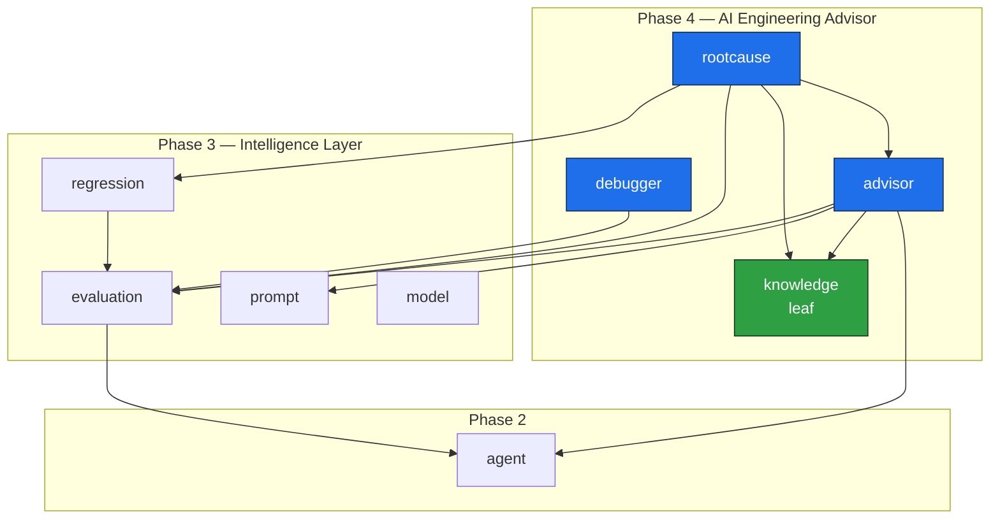
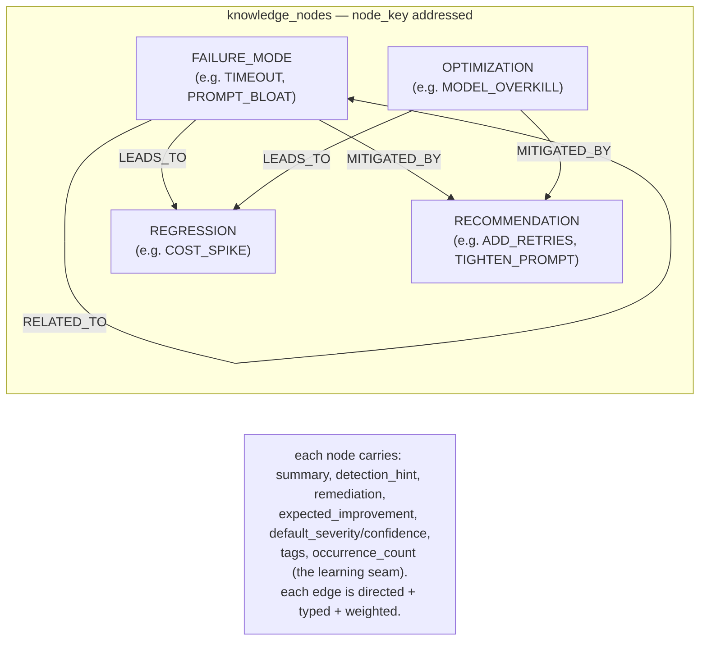
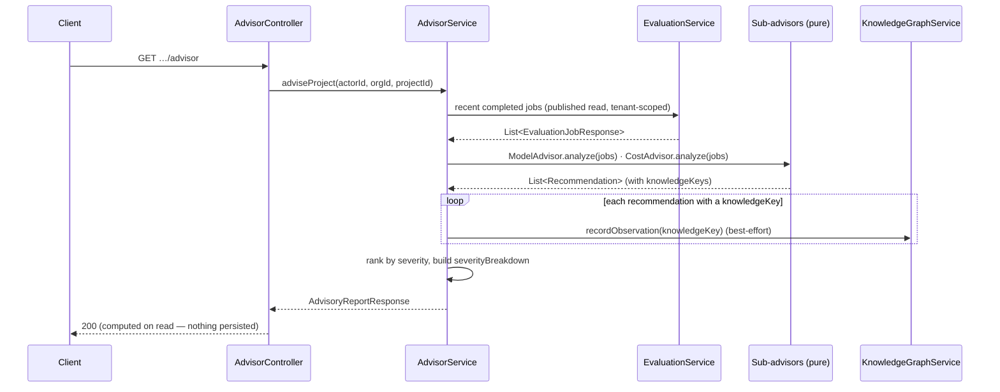

# Brok's Forge — Master Architecture

> **The Engineering Platform for AI Agents.**
>
> | | |
> |---|---|
> | **Document** | `docs/MASTER_ARCHITECTURE.md` |
> | **Status** | Source of Truth (authoritative) |
> | **Last updated** | 2026-07-01 |
> | **Audience** | Every engineer contributing to Brok's Forge |
> | **Scope** | Backend (Java 21 / Spring Boot 3.4.1) + Frontend (Next.js 15) modular monolith, Phases 1–4 |

This is **THE** architecture reference. It is detailed enough that a new engineer can ship a
correct, conventional contribution without reading any chat history, ticket thread, or design doc
beyond the ones cross-linked here. When this document and your memory disagree, this document wins.
When this document and the **database schema** disagree, the **schema wins** (see
[Database Strategy](#database-strategy)).

**Sibling documents**

- [./PROJECT_RULES.md](./PROJECT_RULES.md) — the enforceable engineering rules (naming, layering, PR checklist).
- [./ROADMAP.md](./ROADMAP.md) — phased delivery plan and milestone tracking.
- [./adr/0001-modular-monolith.md](./adr/0001-modular-monolith.md) — why modular monolith, module-boundary rules.
- [./adr/0002-agent-as-central-entity.md](./adr/0002-agent-as-central-entity.md) — `Agent` as the central aggregate root.
- [./adr/0003-credential-encryption-vs-hashing.md](./adr/0003-credential-encryption-vs-hashing.md) — encryption vs hashing of secrets.
- [./adr/0004-ssrf-protection-for-agent-endpoints.md](./adr/0004-ssrf-protection-for-agent-endpoints.md) — SSRF defence for outbound agent calls.
- [./adr/0011-ai-engineering-advisor.md](./adr/0011-ai-engineering-advisor.md) — the AI Engineering Advisor and the on-read recommendation model (Phase 4).
- [./adr/0012-root-cause-analysis-engine.md](./adr/0012-root-cause-analysis-engine.md) — the pure root-cause analysis engine (Phase 4).
- [./adr/0013-engineering-knowledge-graph.md](./adr/0013-engineering-knowledge-graph.md) — the Engineering Knowledge Graph (Phase 4).
- [./adr/0014-ai-debugger-and-tracing-seam.md](./adr/0014-ai-debugger-and-tracing-seam.md) — the AI Debugger execution timeline and the tracing seam (Phase 4).
- For the full onboarding handbook (orientation, request lifecycle, how to add a module): [./ENGINEERING_HANDBOOK.md](./ENGINEERING_HANDBOOK.md).

---

## Project Vision

Brok's Forge is **the engineering platform for AI agents**: a production-grade, open-source
foundation for building, shipping, evaluating and operating AI agents at scale. Where application
frameworks (Spring AI, LangGraph, CrewAI, AutoGen, PydanticAI, Semantic Kernel, custom REST
services) help you *build* an agent, Brok's Forge is the platform that helps you *engineer* one:
register it, version it, secure its credentials, point real datasets and prompts at it, evaluate
its outputs against objective metrics, benchmark competing variants against each other, catch
regressions before they ship, and report on cost, latency and quality over time.

The platform is **framework-agnostic and provider-agnostic by construction**. An agent is described
by metadata — not by any framework's types — and every LLM provider is reached through a uniform
SPI. Adding "LangGraph 0.4" or a new provider such as DeepSeek is a code-only change with **no
schema migration**, because frameworks and providers are stored as text-backed enumerations.

The product is delivered as a **modular monolith** that is deliberately shaped so that any module
can later be extracted into its own microservice with minimal change (see
[Future Microservice Boundaries](#future-microservice-boundaries)). We get the operational
simplicity of a monolith today and the option value of microservices tomorrow.

Phases of capability:

- **Phase 1 — Foundation.** Identity, multi-tenancy and access control: `auth`, `user`,
  `organization` (+ members), `project`, `apikey`.
- **Phase 2 — The Agent Registry.** `Agent` as the central aggregate root, with versioning,
  encrypted credentials and scheduler-ready health checks.
- **Phase 3 — The Intelligence Layer.** `dataset`, `prompt`, `model`, `evaluation`,
  `benchmark`, `regression`, `analytics`, `report`, `search`, `dashboard` — the modules that turn a
  registry of agents into an engineering platform.
- **Phase 4 — The AI Engineering Advisor.** `knowledge`, `advisor`, `rootcause`, `debugger` plus the
  `common.observability` tracing seam — the modules that turn *measurement* into *advice*: actionable
  recommendations, root-cause diagnoses, a queryable engineering knowledge graph, and a per-run
  execution timeline. Recommendations and findings are **computed on read** and never persisted. See
  [Phase 4 — The AI Engineering Advisor](#phase-4--the-ai-engineering-advisor).

---

## Product Philosophy

These principles are non-negotiable and are reflected in code, schema and review:

1. **The agent is the centre of gravity.** `Agent` is the single, stable aggregate root every other
   module attaches to — by `agentId` and, where results must be attributable, `agentVersionId`.
   Nothing invents its own private notion of "the thing under test". (See
   [./adr/0002-agent-as-central-entity.md](./adr/0002-agent-as-central-entity.md).)

2. **The database is the source of truth.** Flyway owns the schema; JPA entities must conform to it
   exactly (`spring.jpa.hibernate.ddl-auto=validate`). Hibernate is never allowed to mutate the
   schema. Migrations are append-only and never edited.

3. **Provider- and framework-neutrality.** No business logic is ever coupled to a single LLM
   provider or agent framework. Provider-specific behaviour lives behind an SPI (`ModelInvoker`).

4. **Secrets are sacred.** Verification secrets are hashed (one-way); usage secrets (agent
   credentials we must present upstream) are encrypted (reversible, AES-256-GCM). Secrets are never
   logged and never returned by the API. (See
   [./adr/0003-credential-encryption-vs-hashing.md](./adr/0003-credential-encryption-vs-hashing.md).)

5. **Tenant isolation is enforced, not assumed.** Every aggregate is resolved by the full
   `(id, projectId, organizationId)` tuple, so a foreign id is indistinguishable from a missing one
   (404, never 403-with-information-leak).

6. **Built to scale to millions of evaluations.** The evaluation pipeline is shaped — `EvaluationJob`
   → `EvaluationRun` → `EvaluationResult` — and seamed (`EvaluationJobExecutor`) so it can move
   behind a queue and worker fleet without touching the domain model.

7. **Thin controllers, rich services, explicit contracts.** Controllers orchestrate; services hold
   logic; DTOs are immutable records validated at the edge. Mass-assignment is impossible because
   request DTOs omit server-controlled fields.

8. **Operable by default.** Correlation/request IDs flow through every request and log line, and the
   stack is OpenTelemetry-ready.

---

## Core Domains

The platform's domains, grouped by phase. Each maps to a feature module under
`com.broksforge.modules.<feature>`.

| Domain | Module | Aggregate(s) | Responsibility |
|---|---|---|---|
| Authentication | `auth` | `RefreshToken`, `PasswordResetToken`, `EmailVerificationToken`, `PasswordChangeToken`, `PasswordChangeOtp` | Register/login, JWT issuance, rotating refresh tokens, password reset, email verification, OTP password change ([ADR 0017](./adr/0017-otp-password-change.md)) |
| Users | `user` | `User` | Profile, platform role (`USER`/`ADMIN`), credentials |
| Organizations | `organization` | `Organization`, `OrganizationMember` | Tenancy boundary, membership, `OrganizationRole` (OWNER/ADMIN/MEMBER) |
| Projects | `project` | `Project` | Workspace within an organization; the scope every resource lives in |
| API keys | `apikey` | `ApiKey` | Project-scoped, SHA-256-hashed programmatic credentials |
| **Agents** | `agent` | `Agent`, `AgentVersion`, `AgentCredential`, `AgentHealthCheck`, `AgentTag` | The central registry: framework-agnostic agents, versioning, encrypted credentials, health |
| **Datasets** | `dataset` | `Dataset`, `DatasetVersion`, `DatasetItem` | Versioned, immutable evaluation inputs; CSV/JSON import, statistics |
| **Prompts** | `prompt` | `Prompt`, `PromptVersion` | Prompt library with `{{variable}}` templates, versioning, activate/rollback, comparison |
| **Model invocation** | `model` | (no tables — SPI) | Provider-agnostic invocation: `LlmProvider`, `ModelInvoker`, `ModelInvocationService`, `AgentEndpointInvoker` |
| **Evaluation** | `evaluation` | `EvaluationJob`, `EvaluationRun`, `EvaluationResult`, `EvaluationProfile` | The scoring engine; jobs fan out into runs and results |
| **Benchmarking** | `benchmark` | `Benchmark`, `BenchmarkEntry` | Compare agents/versions/prompts/models/datasets/profiles; leaderboards |
| **Regression** | `regression` | `RegressionCheck` | Baseline vs candidate job comparison against thresholds |
| **Analytics** | `analytics` | (read models) | Cost/latency/token/usage aggregates and historical trends |
| **Reporting** | `report` | `Report` | Audit record + on-demand JSON/CSV/HTML export |
| **Search** | `search` | (read models) | Global search across agents, datasets, prompts, jobs, benchmarks, reports |
| **Dashboard** | `dashboard` | (read models) | Aggregate operational view of the whole platform |
| **Knowledge graph** | `knowledge` | `KnowledgeNode`, `KnowledgeEdge` | Phase 4 — platform-global catalogue of failure modes/regressions/recommendations/optimisations; nodes + typed edges; the learning seam |
| **Advisor** | `advisor` | (no tables — on-read) | Phase 4 — pure per-domain sub-advisors producing `Recommendation`s; composed by `AdvisorService` |
| **Root cause** | `rootcause` | (no tables — on-read) | Phase 4 — pure `RootCauseEngine` producing `RootCauseFinding`s over published evaluation/regression reads |
| **AI debugger** | `debugger` | (no tables — on-read) | Phase 4 — `DebuggerService` reconstructs a per-run execution timeline over the `ExecutionStage` vocabulary |

`Agent` is the **central aggregate root**: datasets, prompts, evaluation jobs, benchmarks,
regressions, analytics and reports all reference an agent by `agentId` (and frequently an
`agentVersionId`) and never by a JPA association.

---

## Architecture

### Modular monolith

Brok's Forge is a single deployable Spring Boot application composed of **independent feature
modules** plus shared cross-cutting infrastructure. This is a deliberate decision recorded in
[./adr/0001-modular-monolith.md](./adr/0001-modular-monolith.md): we want the development and
operational simplicity of a monolith now, with module boundaries strict enough that extraction to
microservices later is mechanical rather than archaeological.

### Layering

Every feature module is internally layered. Dependencies point **downward only**:

```
┌───────────────────────────────────────────────────────────────┐
│  web/         Controllers · DTOs (records) · MapStruct mappers │  ← HTTP edge
│               @PreAuthorize · @SecurityRequirement · OpenAPI   │
├───────────────────────────────────────────────────────────────┤
│  service/     Application services — use cases, transactions,  │  ← business logic
│               access guards, invariants, orchestration         │
├───────────────────────────────────────────────────────────────┤
│  domain/      JPA entities · enums · value objects · invariants│  ← model
├───────────────────────────────────────────────────────────────┤
│  repository/  Spring Data JPA repositories (this module only)  │  ← persistence
└───────────────────────────────────────────────────────────────┘
        cross-cutting: common/ · config/ · security/
```

- **`web/`** is thin. Controllers authenticate (`@PreAuthorize("isAuthenticated()")`), resolve the
  caller (`SecurityUtils.requireCurrentUserId()`), delegate to a service, and map the result to a
  DTO. No business logic, no repository access.
- **`service/`** holds the use cases. Services own transactions (`@Transactional`), enforce access
  via the module's access guard, uphold domain invariants, and call **other modules only through
  their published application services**.
- **`domain/`** holds JPA entities (extending `BaseEntity` or `SoftDeletableEntity`), enums and
  value objects. Entities must match the Flyway schema exactly.
- **`repository/`** holds Spring Data JPA repositories. A repository is **private to its module**;
  no other module may inject it.

### Module boundaries and id-references

The boundary rules (enforced in review; see [./PROJECT_RULES.md](./PROJECT_RULES.md)):

1. **No cross-module JPA associations.** The `evaluation` module never has a
   `@ManyToOne Agent agent`. It stores a plain `UUID agentId`.
2. **No shared repositories.** `BenchmarkService` never injects `AgentRepository`. To read an agent
   it calls the `agent` module's published application service.
3. **Reference by id (UUID) + published service.** This is the integration contract: *attach to an
   agent by id; read it through its service.* The deliberate cost is an occasional extra query; the
   benefit is that module boundaries stay clean enough to extract later.

```text
  evaluation.service.EvaluationJobService
        │  references by UUID (agentId, agentVersionId, datasetVersionId, promptVersionId)
        │  reads via published application services
        ▼
  agent.service.AgentService        dataset.service.DatasetService     prompt.service.PromptService
        │                                 │                                  │
        ▼ (own repos, own tables)         ▼                                  ▼
  agents / agent_versions          datasets / dataset_versions        prompts / prompt_versions
```

The **security layer** depends on no feature module's internals: it authenticates via small ports
(e.g. `ApiKeyAuthenticator`) so it never reaches into a module.

---

## Folder Structure

### Backend (`backend/`)

```text
backend/
├── Dockerfile
├── pom.xml
└── src/main/
    ├── java/com/broksforge/
    │   ├── BroksForgeApplication.java
    │   │
    │   ├── common/                      # cross-cutting infrastructure (no business logic)
    │   │   ├── audit/                   # JpaAuditingConfig, ApplicationAuditAware
    │   │   ├── domain/                  # BaseEntity, SoftDeletableEntity
    │   │   ├── exception/               # ApiError, ApiException, ErrorCode, GlobalExceptionHandler,
    │   │   │                            #   BadRequest/Forbidden/Unauthorized/ResourceNotFound/ResourceConflict
    │   │   ├── observability/           # CorrelationIdFilter (MDC + X-Correlation-Id/X-Request-Id)
    │   │   ├── persistence/             # JPA/Hibernate plumbing, converters
    │   │   ├── security/                # CredentialEncryptionService (AES-256-GCM), OutboundUrlGuard (SSRF)
    │   │   ├── util/                    # shared helpers
    │   │   ├── validation/              # StrongPassword(+Validator), ValidEndpointUrl/@EndpointUrlValidator
    │   │   └── web/                      # PageResponse<T>, MessageResponse, RequestUtils
    │   │
    │   ├── config/                      # SecurityConfig, CorsConfig, OpenApiConfig, RedisConfig, ObservabilityConfig
    │   │   └── properties/              # @ConfigurationProperties: Jwt, Auth, Cors, Encryption, App, ApiKey, AgentHealth
    │   │
    │   ├── security/                    # authentication mechanisms (provider-neutral)
    │   │   ├── jwt/                      # JwtService, JwtAuthenticationFilter
    │   │   └── apikey/                   # ApiKeyAuthenticator, ApiKeyAuthenticationFilter/Token, ApiKeyPrincipal
    │   │
    │   └── modules/                     # feature modules (each: domain/ repository/ service/ web/[dto/])
    │       ├── auth/                     # Phase 1 — domain/ email/ repository/ service/ web/dto/
    │       ├── user/                     # Phase 1 — + security/ (UserDetails adapter)
    │       ├── organization/             # Phase 1 — Organization, OrganizationMember, OrganizationAccessService
    │       ├── project/                  # Phase 1
    │       ├── apikey/                   # Phase 1
    │       ├── system/                   # health/info endpoints
    │       │
    │       ├── agent/                    # Phase 2 — Agent (central aggregate root)
    │       │   ├── domain/               #   Agent, AgentVersion, AgentCredential, AgentHealthCheck, AgentTag,
    │       │   │                         #   AgentStatus, AgentVisibility, AgentAuthType, AgentFramework,
    │       │   │                         #   AgentLanguage, AgentCapabilities, AgentHealthStatus,
    │       │   │                         #   HealthCheckType, DeploymentEnvironment, LlmProvider
    │       │   ├── repository/
    │       │   ├── service/              #   AgentService, AgentAccessGuard, version/credential/health services
    │       │   └── web/  dto/
    │       │
    │       │   # ── Phase 3: The Intelligence Layer ─────────────────────────────
    │       ├── dataset/                  # Dataset, DatasetVersion, DatasetItem  (immutable, versioned)
    │       │   ├── domain/ repository/ service/ web/dto/
    │       ├── prompt/                   # Prompt, PromptVersion  ({{variable}} templates, activate/rollback)
    │       │   ├── domain/ repository/ service/ web/dto/
    │       ├── model/                    # provider-agnostic SPI (no tables)
    │       │   ├── domain/               #   ModelInvoker, ModelInvocationRequest/Response
    │       │   ├── service/              #   ModelInvocationService (registry/dispatcher), AgentEndpointInvoker
    │       │   └── web/dto/
    │       ├── evaluation/               # EvaluationJob → EvaluationRun → EvaluationResult; EvaluationProfile
    │       │   ├── domain/               #   EvaluationMetricType, EvaluationJobStatus, evaluator strategies
    │       │   ├── repository/
    │       │   ├── service/              #   EvaluationJobService, EvaluationJobExecutor (queue-ready seam),
    │       │   │                         #   MetricEvaluator registry
    │       │   └── web/dto/
    │       ├── benchmark/                # Benchmark, BenchmarkEntry; BenchmarkComparisonType; leaderboards
    │       │   ├── domain/ repository/ service/ web/dto/
    │       ├── regression/               # RegressionCheck (baseline vs candidate, threshold detectors)
    │       │   ├── domain/ repository/ service/ web/dto/
    │       ├── analytics/                # cost/latency/token/usage aggregates + trends (read models)
    │       │   ├── service/ web/dto/
    │       ├── report/                   # Report (audit record) + JSON/CSV/HTML exporters
    │       │   ├── domain/ repository/ service/ web/dto/
    │       ├── search/                   # global search across agents/datasets/prompts/jobs/benchmarks/reports
    │       │   ├── service/ web/dto/
    │       ├── dashboard/                # aggregate platform view (read models)
    │       │   └── service/ web/dto/
    │       │
    │       │   # ── Phase 4: The AI Engineering Advisor ──────────────────────
    │       ├── knowledge/               # Engineering Knowledge Graph (platform-global reference data)
    │       │   ├── domain/              #   KnowledgeNode, KnowledgeEdge, KnowledgeNodeType, KnowledgeRelation
    │       │   ├── repository/          #   KnowledgeNodeRepository, KnowledgeEdgeRepository
    │       │   ├── service/             #   KnowledgeGraphService, KnowledgePattern (findPattern/recordObservation seams)
    │       │   └── web/  dto/           #   KnowledgeController, KnowledgeDtos
    │       ├── advisor/                 # on-read recommendations (NO tables)
    │       │   ├── domain/              #   Recommendation, Severity, Confidence, RecommendationCategory
    │       │   ├── service/             #   PromptAdvisor, ModelAdvisor, CostAdvisor, AgentAdvisor, RagAdvisor (pure), AdvisorService
    │       │   └── web/  dto/           #   AdvisorController, AdvisorDtos
    │       ├── rootcause/               # on-read root-cause findings (NO tables)
    │       │   ├── service/             #   RootCauseEngine (pure), RootCauseFinding, RootCauseService
    │       │   └── web/  dto/           #   RootCauseController, RootCauseDtos
    │       └── debugger/                # on-read execution timeline (NO tables)
    │           ├── service/             #   DebuggerService (reconstructs over ExecutionStage)
    │           └── web/  dto/           #   DebuggerController, DebuggerDtos
    │
    │   # Phase 4 cross-cutting: common/observability/ adds ExecutionStage, StageStatus,
    │   #   TraceRecorder + NoOpTraceRecorder (default, no exporters wired);
    │   #   config/properties/ adds AdvisorProperties (broksforge.advisor.*)
    │
    └── resources/
        ├── application.yml  application-dev.yml  application-docker.yml
        └── db/migration/                # Flyway, append-only
            ├── V1__create_users.sql               V6__create_agents.sql
            ├── V2__create_auth_tokens.sql         V7__create_agent_versions.sql
            ├── V3__create_organizations.sql       V8__create_agent_credentials.sql
            ├── V4__create_projects.sql            V9__create_agent_health_checks.sql
            ├── V5__create_api_keys.sql            V10__create_agent_tags.sql
            ├── # Phase 3 adds V11..V23 : datasets, dataset_versions, dataset_items,
            │ #   prompts, prompt_versions, evaluation_profiles, evaluation_jobs,
            │ #   evaluation_runs, evaluation_results, benchmarks, benchmark_entries,
            │ #   regression_checks, reports
            └── # Phase 4 adds V24..V25 : knowledge_nodes, knowledge_edges
              #   (the only Phase 4 tables — advisor/rootcause/debugger persist nothing)
```

### Frontend (`frontend/`)

```text
frontend/
├── Dockerfile
├── package.json                         # Next.js 15, React 19, TS, Tailwind, shadcn-ui, TanStack Query, Zustand
└── src/
    ├── app/                             # App Router
    │   ├── (auth)/                       # login, register, forgot-password, reset-password
    │   ├── (dashboard)/
    │   │   ├── dashboard/                # aggregate dashboard (agents, jobs, benchmarks, trends, alerts)
    │   │   ├── agents/                   # global agents list + detail (overview/versions/health/credentials)
    │   │   ├── organizations/[orgId]/
    │   │   │   └── projects/[projectId]/
    │   │   │       └── agents/[agentId]/ # nested, project-scoped resources
    │   │   ├── projects/  profile/  settings/
    │   │   │
    │   │   ├── datasets/                 # Phase 3 — versioned datasets, import, items, stats
    │   │   ├── prompts/                  # Phase 3 — prompt library, versions, comparison
    │   │   ├── evaluations/              # Phase 3 — jobs, runs, results, profiles
    │   │   ├── benchmarks/               # Phase 3 — leaderboards / rankings / reports
    │   │   ├── regressions/              # Phase 3 — baseline vs candidate diffs
    │   │   ├── analytics/                # Phase 3 — cost/latency/token/usage trends
    │   │   ├── reports/                  # Phase 3 — export & audit history
    │   │   │
    │   │   ├── advisor/                  # Phase 4 — recommendations (project / agent / prompt)
    │   │   ├── root-cause/               # Phase 4 — failure & regression diagnoses
    │   │   ├── debugger/                 # Phase 4 — per-run execution timeline
    │   │   └── knowledge/                # Phase 4 — knowledge graph browser (platform-global)
    │   └── verify-email/
    │
    ├── components/
    │   ├── ui/                           # shadcn-style primitives (Radix)
    │   ├── layout/                       # shell, sidebar, header
    │   ├── brand/  common/  auth/
    │   ├── agents/  organizations/  projects/  api-keys/
    │   └── (Phase 3) datasets/  prompts/  evaluations/  benchmarks/  reports/
    │
    └── lib/
        ├── api/                         # axios client, interceptors, transparent token refresh
        ├── hooks/                       # TanStack Query hooks (one per resource)
        ├── stores/                      # Zustand (auth/session, UI state)
        └── (schemas)                    # Zod schemas shared by React Hook Form
```

---

## Database Strategy

### The database is the source of truth

`spring.jpa.hibernate.ddl-auto=validate`. Hibernate **never** creates or alters schema. On startup
Flyway applies migrations, then Hibernate validates that every entity maps exactly onto the
existing tables; a mismatch fails the boot. **JPA entities must conform to the Flyway schema, not
the other way around.**

### Flyway: append-only, never modified

Migrations live in `backend/src/main/resources/db/migration/` and are **append-only**. `V1`..`V25`
exist today (Phase 1 = `V1`..`V5`, Phase 2 agent registry = `V6`..`V10`, Phase 3 Intelligence Layer =
`V11`..`V23`, Phase 4 AI Engineering Advisor = `V24`..`V25`; post-1.0 additions = `V26`..`V29`
— password-change tokens/OTPs ([ADR 0017](./adr/0017-otp-password-change.md)) and the
agent-credential / health-check extensions ([ADR 0018](./adr/0018-provider-aware-health-checks.md))). **An applied migration is never
edited** — corrections ship as a new `V<n+1>`. Note that Phase 4 added only **two** tables
(`knowledge_nodes`, `knowledge_edges`): the advisor, root-cause and debugger features compute on read
and persist nothing.

### Universal conventions (every table)

Every table carries the same skeleton, materialised in code by `BaseEntity` and (for soft-deletable
aggregates) `SoftDeletableEntity`:

```sql
id          UUID        NOT NULL DEFAULT gen_random_uuid(),  -- PK, GenerationType.UUID
version     BIGINT      NOT NULL DEFAULT 0,                  -- @Version, optimistic lock
created_at  TIMESTAMPTZ NOT NULL,                            -- @CreatedDate
updated_at  TIMESTAMPTZ NOT NULL,                            -- @LastModifiedDate
created_by  UUID,                                            -- @CreatedBy
updated_by  UUID,                                            -- @LastModifiedBy
-- soft-deletable aggregates additionally carry:
deleted     BOOLEAN     NOT NULL DEFAULT FALSE,
deleted_at  TIMESTAMPTZ,
deleted_by  UUID
```

- **UUID primary keys** via `gen_random_uuid()` — no sequence contention, safe to reference across
  modules, opaque to clients.
- **Audit columns** populated automatically by Spring Data JPA auditing (`JpaAuditingConfig` +
  `ApplicationAuditAware` resolve the current user id).
- **Optimistic locking** via `version BIGINT` — concurrent updates fail loudly rather than silently
  clobbering.
- **Soft delete** via `deleted/deleted_at/deleted_by` on soft-deletable aggregates;
  `SoftDeletableEntity.softDelete(actorId)` stamps them and repositories filter `deleted = false`
  by convention.
- **Time** is `java.time.Instant` ↔ `TIMESTAMPTZ`, with
  `hibernate.type.preferred_instant_jdbc_type=TIMESTAMP_UTC` so instants persist as UTC unambiguously.

### Constraints and indexes (the `agents` table as the canonical example)

```sql
CREATE TABLE agents (
    id                        UUID          NOT NULL DEFAULT gen_random_uuid(),
    version                   BIGINT        NOT NULL DEFAULT 0,
    created_at                TIMESTAMPTZ   NOT NULL,
    updated_at                TIMESTAMPTZ   NOT NULL,
    created_by                UUID,
    updated_by                UUID,
    deleted                   BOOLEAN       NOT NULL DEFAULT FALSE,
    deleted_at                TIMESTAMPTZ,
    deleted_by                UUID,
    organization_id           UUID          NOT NULL,
    project_id                UUID          NOT NULL,
    name                      VARCHAR(120)  NOT NULL,
    slug                      VARCHAR(64)   NOT NULL,
    owner_id                  UUID          NOT NULL,
    visibility                VARCHAR(32)   NOT NULL DEFAULT 'PRIVATE',
    framework                 VARCHAR(48)   NOT NULL,   -- enum-as-text: new frameworks need no migration
    language                  VARCHAR(32)   NOT NULL,
    endpoint_url              VARCHAR(2048) NOT NULL,
    auth_type                 VARCHAR(32)   NOT NULL DEFAULT 'NONE',
    current_active_version_id UUID,
    health_status             VARCHAR(32)   NOT NULL DEFAULT 'UNKNOWN',
    status                    VARCHAR(32)   NOT NULL DEFAULT 'ACTIVE',
    custom_metadata           TEXT,                     -- forward-compat seam (JSON)
    CONSTRAINT pk_agents PRIMARY KEY (id),
    CONSTRAINT uq_agents_project_slug UNIQUE (project_id, slug),
    CONSTRAINT fk_agents_org     FOREIGN KEY (organization_id) REFERENCES organizations (id) ON DELETE CASCADE,
    CONSTRAINT fk_agents_project FOREIGN KEY (project_id)      REFERENCES projects (id)      ON DELETE CASCADE,
    CONSTRAINT fk_agents_owner   FOREIGN KEY (owner_id)        REFERENCES users (id)
);

CREATE INDEX idx_agents_project ON agents (project_id);
CREATE INDEX idx_agents_org     ON agents (organization_id);
```

Conventions visible here generalise to every table:

- **Tenancy columns** `organization_id` and `project_id` on every project-scoped aggregate, indexed,
  with FKs and `ON DELETE CASCADE` to their parents. The `(project_id, slug)` unique constraint
  gives stable human-readable identity within a project.
- **Enumerations stored as text** (`framework`, `language`, `visibility`, `auth_type`,
  `health_status`, `status`, and in Phase 3 `provider`, `metric_type`, job `status`, comparison
  type) — adding a value is a code-only change, never a migration. This is what makes the platform
  framework- and provider-agnostic at the schema level.
- **Index the access path.** Tenancy columns, foreign keys and filter/sort columns are indexed.

### Versioning of datasets and prompts (immutability)

`dataset` and `prompt` model **immutable, append-only versions**, mirroring the agent registry's
versioning:

- **`datasets`** (header / aggregate) → **`dataset_versions`** (immutable snapshots) →
  **`dataset_items`** (the rows belonging to a version). Once a `DatasetVersion` is created its
  items never change; importing a corrected CSV/JSON produces a **new version**. This guarantees an
  `EvaluationJob` that references a `datasetVersionId` is forever reproducible — the inputs cannot
  shift under it.
- **`prompts`** → **`prompt_versions`**. Each `PromptVersion` is an immutable template body with
  `{{variable}}` placeholders. Prompts support **activate/rollback** (one active version pointer,
  exactly like `AgentVersion`) and **comparison** between versions. Evaluation references a
  `promptVersionId`, not a mutable prompt.

This is the same pattern as `agent_versions`: an aggregate header, a pointer to the active version,
and immutable version rows that results can be attributed to.

### The `EvaluationJob → EvaluationRun → EvaluationResult` hierarchy, and why it scales

The evaluation schema is intentionally a **fan-out tree**, sized to reach millions of evaluations:

```text
evaluation_jobs              1   ── job-level config + status + summary (cost/latency/quality)
   └── evaluation_runs       N   ── exactly one per dataset item  (the unit of work)
          └── evaluation_results  M ── exactly one per metric, per run  (the atomic score)
```

```sql
-- one row per job
evaluation_jobs (
    id UUID PK, organization_id, project_id,
    agent_id UUID, agent_version_id UUID,
    dataset_version_id UUID, prompt_version_id UUID,
    evaluation_profile_id UUID,
    status VARCHAR(32) NOT NULL DEFAULT 'PENDING',   -- PENDING→RUNNING→COMPLETED/FAILED/CANCELLED
    total_items INT, completed_items INT,
    summary JSONB,                                   -- aggregate cost/latency/token/quality
    ... audit/version columns ...
)

-- one row per (job, dataset item)
evaluation_runs (
    id UUID PK, evaluation_job_id UUID NOT NULL,     -- indexed FK
    dataset_item_id UUID NOT NULL,
    input TEXT, output TEXT,
    latency_ms BIGINT, cost_micros BIGINT, token_count INT,
    status VARCHAR(32) NOT NULL,
    ... audit/version columns ...
)

-- one row per (run, metric)
evaluation_results (
    id UUID PK, evaluation_run_id UUID NOT NULL,     -- indexed FK
    metric_type VARCHAR(32) NOT NULL,                -- EvaluationMetricType
    passed BOOLEAN, score NUMERIC,
    threshold NUMERIC, detail TEXT,
    ... audit/version columns ...
)
```

Why this hierarchy scales:

1. **The atomic unit is small and append-only.** A `RUNNING` job produces rows continuously; nothing
   is updated in place except the job's progress counters and status. High-volume inserts are the
   workload the design is tuned for.
2. **Partitionable by job.** `evaluation_runs.evaluation_job_id` and
   `evaluation_results.evaluation_run_id` are indexed and naturally partition the data; old jobs can
   be archived or partitioned out without touching live work.
3. **Summaries are precomputed.** `evaluation_jobs.summary` carries the aggregate so dashboards,
   benchmarks and regression checks read **one row**, not millions, to compare jobs.
4. **The executor is a queue-ready seam.** `EvaluationJobExecutor` runs synchronously today but is
   the single place that fans a job into runs. Moving it behind a queue + worker fleet is a
   localised change; the `Job → Run → Result` schema does not move. See
   [Evaluation Architecture](#evaluation-architecture).

---

## Security Strategy

### Authentication

Two mechanisms, both stateless at the request edge:

- **JWT bearer tokens.** Short-lived HS256 access tokens (default 15 min) minted by `JwtService` and
  validated by `JwtAuthenticationFilter`. The signing secret is `BROKSFORGE` / `JWT_SECRET` from the
  environment (Base64, ≥ 256 bits); the app fails fast without it. Library: `jjwt` 0.12.6.
- **Refresh tokens.** Opaque, stored server-side, **rotated on every refresh** so a leaked refresh
  token has a small blast radius. Changing a password revokes all sessions.
- **API keys.** Project-scoped keys authenticated by `ApiKeyAuthenticationFilter` via the
  `ApiKeyAuthenticator` port (`X-API-Key` header). Keys are SHA-256-hashed at rest and shown once.

`SecurityConfig` wires the filter chain; CSRF is intentionally disabled (stateless, token-in-header
API); security headers (CSP, `frame-ancestors 'none'`, `X-Content-Type-Options`, HSTS) and
credential-aware, environment-driven CORS (`CorsConfig`) apply to every response.

### RBAC

- **Platform roles** `USER` / `ADMIN` on `User`.
- **Organization roles** `OrganizationRole` = `OWNER > ADMIN > MEMBER`, compared with `isAtLeast(...)`.
- **Central enforcement** through `OrganizationAccessService.requireRole(...)` /
  `requireMembership(...)` plus method security (`@PreAuthorize("isAuthenticated()")` on
  controllers). Authorization decisions live in services, not scattered across controllers.

### Tenant isolation and IDOR protection

Every aggregate is loaded by its **full identity tuple `(id, projectId, organizationId)`** through a
per-aggregate access guard (e.g. `AgentAccessGuard`, and the Phase 3 equivalents
`DatasetAccessGuard`, `PromptAccessGuard`, `EvaluationJobAccessGuard`, …). A foreign id therefore
resolves to **404, not 403** — the API never confirms the existence of a resource the caller cannot
see, closing IDOR and cross-tenant enumeration.

### Encryption vs hashing of secrets

The distinction is doctrinal (see
[./adr/0003-credential-encryption-vs-hashing.md](./adr/0003-credential-encryption-vs-hashing.md)):

| Secret kind | Examples | Treatment | Why |
|---|---|---|---|
| **Verification secrets** | user passwords; API keys; reset/verification tokens | **Hashed** (BCrypt for passwords, SHA-256 for tokens/keys) | We only ever need to *verify*, never recover them |
| **Usage secrets** | `AgentCredential` (the agent's upstream API key/bearer) | **Encrypted** (AES-256-GCM via `CredentialEncryptionService`) | The platform must *present* them upstream when invoking the agent, so they must be reversible |

`CredentialEncryptionService` uses an AES-256-GCM key from `BROKSFORGE_SECURITY_ENCRYPTION_KEY` /
`ENCRYPTION_KEY` (32 bytes). Ciphertext is **versioned** (key-version prefix) to allow rotation,
**never logged**, and **never returned** by the API — reads expose only a masked hint.

### SSRF defence

Agent endpoints are user-supplied URLs the platform calls outbound, so they are a prime SSRF vector.
Two layers (see [./adr/0004-ssrf-protection-for-agent-endpoints.md](./adr/0004-ssrf-protection-for-agent-endpoints.md)):

- **`@ValidEndpointUrl`** (`EndpointUrlValidator`) — **syntactic** validation on write: scheme,
  shape, length.
- **`OutboundUrlGuard`** — **runtime** validation at call time: re-resolves the host and blocks
  private/loopback/link-local/metadata targets by default (overridable per environment via
  `AgentHealthProperties` / `AGENT_HEALTH_ALLOW_PRIVATE_TARGETS=true` for local dev). The guard runs
  for **every** outbound call — health checks **and** the Phase 3 `AgentEndpointInvoker`.

### Mass-assignment prevention

Request DTOs are Java `record`s that **omit every server-controlled field** (ids, tenancy keys,
audit columns, status pointers, `version`). A client physically cannot set `organizationId`,
`ownerId`, `status` or `createdBy`. MapStruct mappers (`componentModel = "spring"`) map only the
declared request fields onto the entity; server-controlled values are set by services.

### Secret handling and logging

Secrets never appear in logs, responses, exceptions or traces. Error responses are sanitised:
`GlobalExceptionHandler` returns the stable `ApiError` contract and **no stack trace ever leaks**.
Correlation/request ids in logs (below) let operators trace an incident without any secret material.

---

## Evaluation Architecture

The evaluation module is the heart of the Intelligence Layer. The **top-level object is
`EvaluationJob`** — there is no entity called "Evaluation". A job is a unit of work that takes an
agent (or a specific version), a dataset version, a prompt version and an evaluation profile, and
produces scored results.

### The Job-as-top-level pipeline

```text
                         ┌──────────────────────────────────────────────┐
                         │  EvaluationJob  (top-level object)            │
                         │  agentVersionId · datasetVersionId           │
                         │  promptVersionId · evaluationProfileId       │
                         │  status: PENDING → RUNNING → COMPLETED        │
                         └───────────────────────┬──────────────────────┘
                                                 │  EvaluationJobExecutor  (queue-ready seam)
              ┌──────────────────────────────────┼──────────────────────────────────┐
              ▼ for each dataset item             ▼                                   ▼
        render prompt template            render prompt template              render prompt template
        ({{variable}} ← item)                    │                                   │
              ▼                                   ▼                                   ▼
        ModelInvocationService.invoke()   ModelInvocationService.invoke()    ...  (N executions)
        → AgentEndpointInvoker                    │                                   │
              ▼                                   ▼                                   ▼
        EvaluationRun (output, latency,   EvaluationRun                       EvaluationRun
        cost, tokens)                            │                                   │
              ▼ apply profile metrics            ▼                                   ▼
        EvaluationResult × metrics        EvaluationResult × metrics          EvaluationResult × metrics
              └──────────────────────────────────┴──────────────────────────────────┘
                                                 ▼
                         ┌──────────────────────────────────────────────┐
                         │  Job summary  (aggregate cost/latency/token/  │
                         │  pass-rate)  → benchmarks, regression, reports│
                         └──────────────────────────────────────────────┘
```

Pipeline in one line: **Job → N prompts → N executions → N results → summary.**

### Evaluation profiles

`EvaluationProfile` is a **reusable metric + threshold configuration**: which `EvaluationMetricType`s
to apply and the pass/fail thresholds for each. Profiles decouple *what to measure* from *what to
run*, so the same profile drives many jobs and benchmarks compare apples to apples
(`PROFILE_VS_PROFILE`).

### Metrics engine (strategy per type)

`EvaluationMetricType` is an enum, with **one evaluator strategy per type**, resolved from a registry
(`MetricEvaluator` keyed by type). Adding a metric is: add an enum constant + one strategy bean — no
schema change.

| `EvaluationMetricType` | Evaluates |
|---|---|
| `EXACT_MATCH` | output equals expected exactly |
| `CONTAINS` | output contains the expected substring |
| `REGEX_MATCH` | output matches a regex |
| `JSON_VALID` | output is well-formed JSON |
| `LENGTH` | output length within bounds |
| `LATENCY` | run latency under threshold |
| `COST` | run cost under threshold |
| `TOKEN_COUNT` | tokens under threshold |
| `NON_EMPTY` | output is non-empty |

### Statuses

`EvaluationJobStatus`: `PENDING → RUNNING → COMPLETED | FAILED | CANCELLED`. Runs carry their own
status so a single failed item does not fail the whole job; the job's terminal status reflects the
aggregate.

### Scaling to millions

The architecture is explicitly designed to reach **millions of evaluations**:

- **`EvaluationJobExecutor` is the async/queue-ready seam.** It executes synchronously today but is
  the *only* component that fans a job into runs. Moving it behind a message queue and a worker pool
  is a contained change — domain model, schema and API are unaffected.
- The **append-only `Job → Run → Result` schema** (see [Database Strategy](#database-strategy)) keeps
  the hot path insert-only and partitionable by job.
- **Precomputed job summaries** mean every downstream consumer (benchmarks, regression, analytics,
  dashboard) reads one row per job, not the full result set.

---

## Benchmark Architecture

The `benchmark` module turns evaluation jobs into **comparisons, leaderboards and rankings**. A
`Benchmark` groups `BenchmarkEntry` rows, each entry pointing at one `EvaluationJob` summary; the
benchmark ranks entries by a chosen dimension (quality pass-rate, cost, latency, tokens).

Comparison axes (`BenchmarkComparisonType`):

| Comparison | What varies |
|---|---|
| `AGENT_VS_AGENT` | different agents, same dataset/prompt/profile |
| `VERSION_VS_VERSION` | versions of one agent (did the new deploy improve things?) |
| `PROMPT_VS_PROMPT` | prompt versions against the same agent/dataset |
| `MODEL_VS_MODEL` | different providers/models behind the agents |
| `DATASET_VS_DATASET` | the same agent on different datasets |
| `PROFILE_VS_PROFILE` | the same runs under different metric/threshold profiles |

Benchmarks are **built from `EvaluationJob` summaries**, not by re-running anything — they read the
precomputed aggregates. A benchmark therefore produces a **leaderboard / ranking / performance
report** cheaply, and re-renders instantly as referenced jobs complete.

---

## Agent Runtime / Model-Invocation Architecture

The `model` module is a **provider-agnostic SPI** for executing an agent. It owns no tables — it is
pure invocation machinery. The cardinal rule: **logic is never coupled to a single provider.**

### The SPI

```text
            ModelInvocationService            ← registry + dispatcher (single entry point)
                    │  selects an invoker
        ┌───────────┴───────────────────────────────────────────────┐
        ▼                                                            ▼
  ModelInvoker  (interface)                                  ModelInvoker  (interface)
        ▲                                                            ▲
        │ implements                                                 │ implements (SPI extension point)
  AgentEndpointInvoker                                        OpenAiInvoker / AnthropicInvoker / …
  (real execution target today:                              (provider-direct HTTP clients —
   invokes the agent's registered HTTP endpoint)              code-only to add, NO schema change)
```

- **`LlmProvider`** enum — provider metadata on each agent version. Today's constants:
  `OPENAI, ANTHROPIC, AZURE_OPENAI, AWS_BEDROCK, GOOGLE_VERTEX, GOOGLE_GEMINI, COHERE, MISTRAL,
  META_LLAMA, OLLAMA, HUGGINGFACE, CUSTOM, OTHER`. The platform additionally recognises Groq,
  OpenRouter and DeepSeek as provider targets reached through the same SPI. Stored as text — adding
  one is a code-only change.
- **`ModelInvoker`** — the SPI interface: given an invocation request (rendered prompt, credentials,
  parameters), return a response (output, latency, cost, tokens).
- **`ModelInvocationService`** — the registry/dispatcher. Callers (notably `EvaluationJobExecutor`)
  invoke *through this service only*; they never reference a concrete invoker. The service selects
  the right `ModelInvoker` for the target.
- **`AgentEndpointInvoker`** — the concrete invoker that is the **real execution target today**: it
  calls the agent's **registered HTTP endpoint** (`endpoint_url`) as a black box, reusing
  `OutboundUrlGuard` (SSRF defence) and decrypting the agent's `AgentCredential` via
  `CredentialEncryptionService` to authenticate the call. This is what makes the platform
  framework-agnostic: any agent that speaks HTTP can be evaluated.

### Extension points

Provider-direct HTTP clients (OpenAI, Anthropic, Groq, Ollama, Gemini, OpenRouter, DeepSeek, Azure,
Bedrock, Vertex, Cohere, Mistral, Llama, HuggingFace, …) are a **documented SPI extension point**:
implement `ModelInvoker`, register the bean, and `ModelInvocationService` dispatches to it.

- **No schema change** is ever required to add a provider — providers are text-backed enums.
- **No caller change** is required — callers depend on `ModelInvocationService`, not concretes.
- **Security is reused, not re-implemented** — every new invoker goes through `OutboundUrlGuard` and
  `CredentialEncryptionService`.

The Spring AI dependency is present as a **client-chat dependency only**; it is a candidate backing
for a future `ModelInvoker`, not a coupling — no platform logic depends on it.

---

## Phase 4 — The AI Engineering Advisor

Phase 3 made the platform able to **measure** agents. Phase 4 makes it **advise**: it does not just
display metrics, it answers engineering questions and produces **actionable recommendations** and
**root-cause diagnoses**, backs them with a queryable **engineering knowledge graph**, and gives an
**AI debugger** a per-run execution timeline. It adds four feature modules
(`knowledge`, `advisor`, `rootcause`, `debugger`), one cross-cutting tracing seam in
`common.observability`, one config group (`AdvisorProperties`), and exactly **two** tables
(`knowledge_nodes`, `knowledge_edges`) — everything else is computed on read. Decisions:
[ADR 0011](./adr/0011-ai-engineering-advisor.md), [ADR 0012](./adr/0012-root-cause-analysis-engine.md),
[ADR 0013](./adr/0013-engineering-knowledge-graph.md),
[ADR 0014](./adr/0014-ai-debugger-and-tracing-seam.md).

### Design principles

1. **Recommendations and findings are computed on read and never persisted.** Exactly like benchmark
   leaderboards and regression findings (Phase 3), an advisory report or a root-cause finding is
   derived from current platform data each time it is requested, so it can **never drift**. There are
   **no new tables** for the advisor, root-cause or debugger features.
2. **The analyzers are pure (no I/O).** The five sub-advisors and the `RootCauseEngine` mirror the
   pure `EvaluationMetricEngine`: they take already-loaded inputs and return value records, so they are
   deterministic and trivially unit-testable. The thin services (`AdvisorService`, `RootCauseService`,
   `DebuggerService`) do the loading, through **published services only**.
3. **The module dependency graph stays acyclic, with no cross-module JPA.** `knowledge` is a leaf;
   `advisor → knowledge + evaluation + prompt + agent`; `rootcause → advisor + evaluation + regression
   + knowledge`; `debugger → evaluation`. Every edge is a read via a published service plus value
   records — never a foreign entity or repository.
4. **Heuristics are configurable, not hard-coded.** Thresholds live in `AdvisorProperties`
   (`broksforge.advisor.*`) so teams calibrate sensitivity to their own baselines.
5. **The knowledge graph is the shared spine and the learning seam.** Advisor and root-cause findings
   link to it by a stable `knowledgeKey`, and surfacing a pattern increments its `occurrence_count` —
   the only write these read paths perform.

### Updated module dependency graph



Nothing in Phases 1–3 depends on a Phase 4 module; the only additions to existing modules are **three
new published reads** on `evaluation` (below), which keep that module's tables private while exposing
neutral, tenant-scoped views.

---

### The `knowledge` module — the Engineering Knowledge Graph

A persisted, **platform-global** (not tenant-scoped) catalogue of recurring engineering patterns,
modelled relationally in the existing PostgreSQL as a node table plus an edge table. It is identical
for every project, readable by any authenticated user, and seeded via Flyway with **20 nodes and 20
edges**. Decision: [ADR 0013](./adr/0013-engineering-knowledge-graph.md).

**Domain**

- **`KnowledgeNode`** (`@Table knowledge_nodes`) — a `node_key`-addressed pattern. Fields:
  `nodeKey` (unique), `nodeType`, `title`, `category`, `summary`, `detectionHint`, `remediation`,
  `expectedImprovement`, `defaultSeverity`, `defaultConfidence`, `tags` (a `List<String>` stored as
  JSON in a `TEXT` column via a converter), `occurrenceCount`.
- **`KnowledgeEdge`** (`@Table knowledge_edges`) — a directed, weighted relation between two node ids.
  Fields: `sourceNodeId`, `targetNodeId`, `relation`, `weight`.
- **`KnowledgeNodeType`** — `FAILURE_MODE`, `REGRESSION`, `RECOMMENDATION`, `OPTIMIZATION`.
- **`KnowledgeRelation`** — `CAUSES`, `MITIGATED_BY`, `LEADS_TO`, `RELATED_TO`.

**Repositories** — `KnowledgeNodeRepository` (`findByNodeKey`, `findByNodeTypeOrderByTitleAsc`,
`findByCategoryIgnoreCaseOrderByTitleAsc`, `findAllByOrderByCategoryAscTitleAsc`, an atomic
`incrementOccurrence(nodeKey)`); `KnowledgeEdgeRepository` (`findBySourceNodeId`,
`findByTargetNodeId`).

**Service** — `KnowledgeGraphService` exposes the read API (`list`, `getByKey`, `graph`) and two
**published seams** used by the advisor and root-cause engines:

- `Optional<KnowledgePattern> findPattern(String nodeKey)` — resolve canonical knowledge for a key;
  never throws. `KnowledgePattern` is a value record:
  `(nodeKey, title, category, remediation, expectedImprovement, defaultSeverity, defaultConfidence)`.
- `void recordObservation(String nodeKey)` — **the learning seam**: atomically increment a pattern's
  `occurrence_count`. Best-effort — unknown keys are ignored and failures never propagate, so it is
  safe to call on a read path.

The knowledge-graph node/edge model:



The 20 seeded nodes are: `EMPTY_OUTPUT`, `HTTP_ERROR`, `TIMEOUT`, `JSON_PARSE_FAILURE`,
`EXACT_MATCH_MISS`, `HIGH_LATENCY`, `COST_SPIKE`, `TOKEN_BLOAT`, `PROMPT_BLOAT`,
`PROMPT_CONTRADICTION`, `PROMPT_INJECTION_RISK`, `RAG_LOW_SIMILARITY`, `RAG_CHUNK_OVERSIZED`,
`MODEL_OVERKILL`, `MISSING_RETRY`, `MISSING_HEALTHCHECK`, `ADD_RETRIES`, `TIGHTEN_PROMPT`,
`SWITCH_CHEAPER_MODEL`, `TUNE_RETRIEVAL`. The 20 seeded edges connect them (e.g. `TIMEOUT`
**MITIGATED_BY** `ADD_RETRIES`; `PROMPT_BLOAT` **MITIGATED_BY** `TIGHTEN_PROMPT`; `MODEL_OVERKILL`
**LEADS_TO** `COST_SPIKE`). Seeds use deterministic UUIDs so V25 edges can reference V24 nodes.

---

### The `advisor` module — pure, composed sub-advisors

The advisor speaks one fixed vocabulary so the UI has a single thing to render and the knowledge graph
a single thing to link to. Recommendations are **computed on read and never persisted**. Decision:
[ADR 0011](./adr/0011-ai-engineering-advisor.md).

**Domain**

- **`Recommendation`** (a pure record) — the questions an engineer asks:
  `(category, title, why, whatChanged, howToFix, expectedImprovement, confidence, severity,
  evidence[], knowledgeKey)`. Built through a fluent `builder(category, title)` defaulting confidence
  and severity to `MEDIUM`.
- **`RecommendationCategory`** — `PROMPT`, `RAG`, `AGENT`, `MODEL`, `COST`, `RELIABILITY`, `QUALITY`,
  `LATENCY`.
- **`Severity`** — `INFO`, `LOW`, `MEDIUM`, `HIGH`, `CRITICAL` (with `parseOrDefault`).
- **`Confidence`** — `LOW`, `MEDIUM`, `HIGH` (with `parseOrDefault`).

**Sub-advisors (all pure — no I/O)** — each takes already-loaded data and returns
`List<Recommendation>`, linking findings to the knowledge graph by key:

| Sub-advisor | Input | Detects / recommends |
|---|---|---|
| `PromptAdvisor` | one `PromptVersionResponse` | prompt bloat, excess variables, redundancy, contradictions, malformed syntax, injection exposure, ambiguity |
| `ModelAdvisor` | recent `EvaluationJobResponse`s | switch to a higher-quality / lower-cost / lower-latency model, with estimated savings vs the incumbent |
| `CostAdvisor` | recent `EvaluationJobResponse`s | wasted spend from failures, token bloat, spend concentration |
| `AgentAdvisor` | an `AgentResponse` + its jobs | stale/absent health checks, high failure rates, latency spikes, weak auth, insecure transport |
| `RagAdvisor` | an `AgentResponse` | declared RAG config: chunk size, overlap, similarity threshold, top-k, embedding model (empty if RAG off) |

**`AdvisorService`** (the only component that loads data) injects the five sub-advisors plus the
published services `EvaluationService`, `AgentService`, `PromptService` and `KnowledgeGraphService`. It
exposes three use cases, each returning an `AdvisoryReportResponse` and feeding observed patterns into
the knowledge graph's occurrence counters:

- `adviseProject(actorId, orgId, projectId)` — model & cost recommendations across recent jobs.
- `adviseAgent(actorId, orgId, projectId, agentId)` — reliability, RAG and model fit for one agent.
- `advisePrompt(actorId, orgId, projectId, promptId, versionId)` — static analysis of a prompt version
  (latest if `versionId` is omitted).

**DTOs** (`AdvisorDtos`):

- `RecommendationResponse` — `(category, title, why, whatChanged, howToFix, expectedImprovement,
  confidence, severity, evidence[], knowledgeKey)`.
- `SeverityCount` — `(severity, count)`.
- `AdvisoryReportResponse` — `(scope, subject, recommendationCount, severityBreakdown[],
  recommendations[], notes[])`, recommendations sorted by severity (desc) then category.

**The "GET advisor" data flow:**



---

### The `rootcause` module — explaining *why* it failed

A failed result is red; red is not actionable. The root-cause engine turns raw signal into a diagnosis
an engineer can act on. Decision: [ADR 0012](./adr/0012-root-cause-analysis-engine.md).

- **`RootCauseEngine`** is **pure** (no I/O). Methods:
  `analyzeJob(EvaluationJobResponse job, List<MetricFailureTally> tallies, List<EvaluationRunResponse>
  failedRuns)` and `analyzeRegression(RegressionCheckResponse check)`, each returning
  `List<RootCauseFinding>`. It buckets failed-run samples (timeout, HTTP error, empty output), maps
  per-metric tallies (JSON-invalid, exact-match miss, latency, cost, tokens), de-duplicates by
  knowledge key, and ranks by severity.
- **`RootCauseFinding`** (record) — `(rootCause, severity, confidence, evidence[], recommendation,
  expectedImprovement, knowledgeKey)`.
- **`RootCauseService`** injects `EvaluationService`, `RegressionService`, `KnowledgeGraphService`, the
  `RootCauseEngine` and `AdvisorProperties`. Methods: `analyzeJob(...)` and `analyzeRegression(...)`,
  each returning a `RootCauseReportResponse`.
- **DTOs** (`RootCauseDtos`): `RootCauseFindingResponse` (same shape as the finding) and
  `RootCauseReportResponse` — `(scope, subject, findingCount, findings[], notes[])`.

---

### The `debugger` module — the AI Debugger execution timeline

`DebuggerService` reconstructs a per-run timeline over the canonical stages, honestly marking the
stages the platform cannot yet observe. Decision:
[ADR 0014](./adr/0014-ai-debugger-and-tracing-seam.md).

- It injects `EvaluationService` and `TraceRecorder`, and exposes
  `timeline(actorId, orgId, projectId, jobId, runId)` returning an `ExecutionTimelineResponse`.
- From the persisted run it populates **`PROMPT`** (input), **`MODEL`** (the timed endpoint invocation
  — latency, tokens, cost, HTTP status), **`PARSER`** (driven by the JSON-valid metric and output
  presence) and **`OUTPUT`** (pass/fail and failing metrics). **`MEMORY`**, **`RETRIEVER`** and
  **`TOOLS`** are reported `NOT_INSTRUMENTED` — never faked — until live tracing lands.
- **DTOs** (`DebuggerDtos`):
  - `TimelineStageResponse` — `(stage, label, status, startOffsetMs, durationMs, detail, explanation)`.
  - `ExecutionTimelineResponse` — `(jobId, runId, sequence, runStatus, passed, totalLatencyMs,
    provider, model, promptTokens, completionTokens, totalTokens, cost, stages[], failureExplanation,
    tracingActive, notes[])`. The `notes` state that only the model call is timed end to end and
    whether a tracing exporter is active.

---

### The observability / tracing seam

A cross-cutting seam in `common.observability` (architecture only — **no exporters wired in Phase 4**,
a deliberate scope boundary):

- **`ExecutionStage`** (enum, 7 stages) — `PROMPT`, `MEMORY`, `RETRIEVER`, `TOOLS`, `MODEL`, `PARSER`,
  `OUTPUT`; each carries a `label()` and `description()`.
- **`StageStatus`** (enum) — `OK`, `WARN`, `ERROR`, `SKIPPED`, `NOT_INSTRUMENTED`. `NOT_INSTRUMENTED`
  is first-class: the platform does not yet capture per-stage spans, so MEMORY/RETRIEVER/TOOLS report
  it rather than inventing durations.
- **`TraceRecorder`** (interface) —
  `recordStage(String correlationId, ExecutionStage stage, StageStatus status, long durationMs, String detail)`
  and `boolean isActive()`. The default **`NoOpTraceRecorder`** does nothing and reports `isActive() ==
  false`. This is the single drop-in point for live per-stage spans and a future OpenTelemetry
  exporter; the correlation id from [Observability](#observability) is the natural trace seam.

---

### New published evaluation reads (additive to `evaluation`)

So Phase 4 modules read evaluation data without touching its tables, the `evaluation` module gained
three tenant-scoped published reads and one value record:

| Method | Returns | Used by |
|---|---|---|
| `getRun(actorId, orgId, projectId, jobId, runId)` | `EvaluationRunResponse` | `debugger` (IDOR-safe single run) |
| `sampleFailedRuns(actorId, orgId, projectId, jobId, limit)` | `List<EvaluationRunResponse>` (bounded; capped) | `rootcause` |
| `metricFailureBreakdown(actorId, orgId, projectId, jobId)` | `List<MetricFailureTally>` | `rootcause` |

`MetricFailureTally` is a record `(EvaluationMetricType metricType, Long passed, Long failed)` computed
by a JPQL aggregate, with `passedOrZero()` / `failedOrZero()` helpers.

---

### New tables (Flyway V24, V25)

Both follow the universal column skeleton (UUID PK, `version`, `created_at`/`updated_at`,
`created_by`/`updated_by`). Being platform-global reference data, they carry **no** tenancy columns and
**no** soft-delete columns.

```sql
-- V24__create_knowledge_nodes.sql
CREATE TABLE knowledge_nodes (
    id                   UUID         NOT NULL DEFAULT gen_random_uuid(),
    version              BIGINT       NOT NULL DEFAULT 0,
    created_at           TIMESTAMPTZ  NOT NULL,
    updated_at           TIMESTAMPTZ  NOT NULL,
    created_by           UUID,
    updated_by           UUID,
    node_key             VARCHAR(80)  NOT NULL,                 -- stable identifier the engines link to
    node_type            VARCHAR(32)  NOT NULL,                 -- KnowledgeNodeType (text-backed enum)
    title                VARCHAR(200) NOT NULL,
    category             VARCHAR(48)  NOT NULL,
    summary              TEXT,
    detection_hint       TEXT,
    remediation          TEXT,
    expected_improvement VARCHAR(300),
    default_severity     VARCHAR(16)  NOT NULL,
    default_confidence   VARCHAR(16)  NOT NULL,
    tags                 TEXT,                                  -- JSON list via converter
    occurrence_count     BIGINT       NOT NULL DEFAULT 0,       -- the learning seam
    CONSTRAINT pk_knowledge_nodes PRIMARY KEY (id),
    CONSTRAINT uq_knowledge_nodes_key UNIQUE (node_key)
);
CREATE INDEX idx_knowledge_nodes_type     ON knowledge_nodes (node_type);
CREATE INDEX idx_knowledge_nodes_category ON knowledge_nodes (category);
-- + seed: 20 canonical pattern rows (deterministic UUIDs)

-- V25__create_knowledge_edges.sql
CREATE TABLE knowledge_edges (
    id             UUID        NOT NULL DEFAULT gen_random_uuid(),
    version        BIGINT      NOT NULL DEFAULT 0,
    created_at     TIMESTAMPTZ NOT NULL,
    updated_at     TIMESTAMPTZ NOT NULL,
    created_by     UUID,
    updated_by     UUID,
    source_node_id UUID        NOT NULL,
    target_node_id UUID        NOT NULL,
    relation       VARCHAR(32) NOT NULL,                        -- KnowledgeRelation (text-backed enum)
    weight         INTEGER     NOT NULL DEFAULT 1,              -- learning re-weights edges
    CONSTRAINT pk_knowledge_edges PRIMARY KEY (id),
    CONSTRAINT fk_knowledge_edges_source FOREIGN KEY (source_node_id) REFERENCES knowledge_nodes (id) ON DELETE CASCADE,
    CONSTRAINT fk_knowledge_edges_target FOREIGN KEY (target_node_id) REFERENCES knowledge_nodes (id) ON DELETE CASCADE
);
CREATE INDEX idx_knowledge_edges_source ON knowledge_edges (source_node_id);
CREATE INDEX idx_knowledge_edges_target ON knowledge_edges (target_node_id);
-- + seed: 20 edges connecting the V24 nodes
```

---

### New REST endpoints (Phase 4)

All require authentication (`@PreAuthorize("isAuthenticated()")`, `bearerAuth`). The advisor,
root-cause and debugger endpoints are tenant-nested under
`/api/v1/organizations/{organizationId}/projects/{projectId}`; the knowledge endpoints are **not**
nested, because the graph is platform-global reference data.

| Method | Path | Returns | Purpose |
|---|---|---|---|
| GET | `…/advisor` | `AdvisoryReportResponse` | Project advisory: model & cost recommendations across recent jobs |
| GET | `…/advisor/agents/{agentId}` | `AdvisoryReportResponse` | Agent advisory: reliability, RAG and model fit |
| GET | `…/advisor/prompts/{promptId}?versionId=` | `AdvisoryReportResponse` | Prompt advisory: static analysis of a prompt version (latest if omitted) |
| GET | `…/root-cause/jobs/{jobId}` | `RootCauseReportResponse` | Diagnose why a job failed/under-performed |
| GET | `…/root-cause/regressions/{checkId}` | `RootCauseReportResponse` | Diagnose a regression check |
| GET | `…/debugger/jobs/{jobId}/runs/{runId}/timeline` | `ExecutionTimelineResponse` | Per-run execution timeline |
| GET | `/api/v1/knowledge/nodes?type=&category=` | `List<KnowledgeNodeResponse>` | List knowledge nodes (optional `type`/`category` filter) |
| GET | `/api/v1/knowledge/nodes/{nodeKey}` | `KnowledgeNodeDetailResponse` | One node + its graph neighbours |
| GET | `/api/v1/knowledge/graph` | `KnowledgeGraphResponse` | The full node/edge graph |

Knowledge DTOs: `KnowledgeNodeResponse` `(nodeKey, nodeType, title, category, summary, detectionHint,
remediation, expectedImprovement, defaultSeverity, defaultConfidence, tags[], occurrenceCount)`;
`KnowledgeEdgeResponse` `(sourceNodeKey, targetNodeKey, relation, weight)`;
`KnowledgeNeighborResponse` `(relation, direction, node)`;
`KnowledgeNodeDetailResponse` `(node, neighbors[])`;
`KnowledgeGraphResponse` `(nodes[], edges[])`.

### New configuration group

`AdvisorProperties` (prefix `broksforge.advisor`) — `promptMaxChars` (8000), `promptMaxVariables`
(12), `latencySpikeMs` (12000), `minSamplesForComparison` (3), `failureSampleSize` (50). These are
heuristics, not hard limits, so teams calibrate sensitivity to their own baselines.

### New error codes

`ADVISOR_INPUT_INSUFFICIENT` (400), `ROOT_CAUSE_INPUT_INVALID` (400), `DEBUG_TIMELINE_UNAVAILABLE`
(409), `KNOWLEDGE_PATTERN_NOT_FOUND` (404) — all surfaced through the standard `ApiError` contract.

---

## Observability

- **Correlation and request IDs.** `CorrelationIdFilter` assigns/propagates a correlation id and a
  per-request request id, puts both into the SLF4J **MDC**, and surfaces them on every log line and
  in the `X-Correlation-Id` / `X-Request-Id` response headers. Every incident is traceable end to
  end without exposing any secret material.
- **Structured errors.** `GlobalExceptionHandler` maps exceptions to the stable `ApiError` contract
  `{ timestamp, status, error, code, message, path, errors[] }` with a stable `ErrorCode` enum.
  **No stack trace ever leaks.**
- **Health and metrics.** Spring Boot Actuator exposes health/info; a custom system health endpoint
  complements it. Health-check observations for agents are first-class data
  (`agent_health_checks`).

**Implemented:** correlation/request id propagation (MDC + headers), structured error contract,
Actuator health.

**Not yet implemented:** the stack is **OpenTelemetry-ready** — IDs and structure are in place — but
**OTel exporters are not wired up**. There is no traces/metrics export pipeline today; adding
exporters is a configuration-and-dependency change that does not touch domain code.

**Phase 4 added the tracing seam** (architecture only — still no exporters): the canonical
`ExecutionStage` vocabulary, a `StageStatus` with a first-class `NOT_INSTRUMENTED` state, and a
dependency-free `TraceRecorder` interface (default `NoOpTraceRecorder`) — the single drop-in point for
live per-stage span recording. See
[The observability / tracing seam](#the-observability--tracing-seam) under Phase 4.

---

## Technology Stack

| Layer | Technology | Notes |
|---|---|---|
| Language (backend) | **Java 21** | Records, sealed types, pattern matching |
| Framework | **Spring Boot 3.4.1** | Web MVC, Security, Data JPA, Validation, Actuator |
| AI client | **Spring AI** (client-chat) | Dependency-only; candidate `ModelInvoker` backing, no coupling |
| Persistence | **PostgreSQL** + **Flyway** | DB is source of truth; `ddl-auto=validate`; append-only migrations |
| Cache / tokens | **Redis** | Wired in; caching / token-revocation ready |
| Auth | **JWT (jjwt 0.12.6)** + API keys | HS256 access + rotating refresh; SHA-256 keys |
| Password hashing | **BCrypt** | Work factor 12 |
| Encryption | **AES-256-GCM** | `CredentialEncryptionService`, versioned ciphertext |
| Mapping | **MapStruct 1.6.3** | `componentModel = "spring"` |
| Boilerplate | **Lombok** | Getters/setters/builders on entities |
| API docs | **springdoc-openapi 2.7.0** | Swagger UI; `bearerAuth` scheme |
| Frontend | **Next.js 15 / React 19 / TypeScript** | App Router |
| Styling | **TailwindCSS** + **shadcn-ui** (Radix) | Dark-first design system |
| Data layer | **TanStack Query** | Server-state, transparent refresh |
| Client state | **Zustand** | Auth/session, UI state |
| Forms | **React Hook Form** + **Zod** | Validated forms, shared schemas |
| HTTP | **axios** | Interceptors, token refresh |
| Infra | **Docker Compose** | Services: `api`, `postgres`, `redis`, `web` |

---

## Development Workflow

1. **Pick the right module.** New capability → a feature module under `com.broksforge.modules.<feature>`
   with `domain/ repository/ service/ web/(dto/)`. Cross-cutting code → `common/`, `config/` or
   `security/`, never a feature module.
2. **Schema first, append-only.** Add the next `V<n>__<description>.sql`. Never edit an applied
   migration. Use the universal column skeleton (UUID PK, `version`, audit, soft-delete where the
   aggregate is soft-deletable), text-backed enums, tenancy columns + FKs + indexes.
3. **Entity conforms to schema.** Extend `BaseEntity` (or `SoftDeletableEntity`) and map exactly onto
   the new table. `ddl-auto=validate` will fail the boot if it doesn't match.
4. **Repository per module.** Spring Data JPA repository, private to the module. Never inject another
   module's repository.
5. **Service holds the logic.** `@Transactional` use cases; enforce access via the module's access
   guard loading by `(id, projectId, organizationId)`; call other modules only via their published
   services and by id.
6. **Thin controller + record DTOs.** Versioned route under `/api/v1`, nested under
   `/api/v1/organizations/{organizationId}/projects/{projectId}/<resource>`,
   `@PreAuthorize("isAuthenticated()")`, `@SecurityRequirement(name = "bearerAuth")`,
   `SecurityUtils.requireCurrentUserId()`. Request DTOs omit server-controlled fields. Pagination via
   Spring `Pageable` + `PageResponse<T>`. MapStruct mapper for the boundary.
7. **Errors via the contract.** Throw the typed exceptions (`ResourceNotFoundException`,
   `ForbiddenException`, …) with an `ErrorCode`; let `GlobalExceptionHandler` render `ApiError`.
8. **Frontend.** Add a TanStack Query hook in `lib/hooks/`, a Zod schema, a route under
   `app/(dashboard)/<resource>/`, components under `components/<resource>/`.
9. **Run it.** `docker compose up --build` (services `api`, `postgres`, `redis`, `web`); explore at
   Swagger UI (`/swagger-ui.html`). Follow the PR checklist in
   [./PROJECT_RULES.md](./PROJECT_RULES.md).

---

## Coding Philosophy

- **Clean Architecture, SOLID, DDD where it earns its keep.** Dependencies point downward; the domain
  knows nothing about HTTP or providers.
- **Boundaries over convenience.** Reference by id and call published services even when a JPA join
  would be quicker — boundary integrity is the asset (see
  [./adr/0001-modular-monolith.md](./adr/0001-modular-monolith.md)).
- **Make the schema the contract.** The database is authoritative; entities conform; migrations are
  append-only history.
- **Immutability where correctness depends on it.** Dataset versions, prompt versions and agent
  versions are immutable so results stay reproducible and attributable.
- **Provider/framework neutrality is a hard rule.** Anything provider-specific lives behind
  `ModelInvoker`. Text-backed enums keep new providers/frameworks code-only.
- **Fail safe, fail loud, leak nothing.** Optimistic locking, fail-fast on missing secrets, sanitised
  error contract, no secret in any log or response.
- **Records + validation at the edge.** DTOs are immutable records with Bean Validation; mappers are
  generated, not hand-written.

---

## Deployment Philosophy

- **One image, four services.** Docker Compose runs `api`, `postgres`, `redis`, `web`. The modular
  monolith ships as a single `api` image, keeping ops simple.
- **Twelve-factor config.** All secrets and tuning come from the environment — `JWT_SECRET`,
  `BROKSFORGE_SECURITY_ENCRYPTION_KEY` / `ENCRYPTION_KEY`, datastore creds, CORS origins. The app
  **fails fast** when a required secret is absent; nothing is hardcoded. Profiles:
  `application-dev.yml` (local) and `application-docker.yml` (compose).
- **Migrations run on boot.** Flyway applies pending migrations before Hibernate validates the schema;
  a schema/entity mismatch aborts startup. Deployments are therefore schema-safe by construction.
- **Stateless app tier.** Access tokens are stateless; refresh tokens and caches live in Postgres /
  Redis, so the `api` service scales horizontally behind a load balancer without sticky sessions.
- **Operability built in.** Actuator health, custom system health and correlation/request ids make the
  running system observable from day one (export pipeline pending, per
  [Observability](#observability)).

---

## Future Microservice Boundaries

The module boundaries are the **fault lines** along which the monolith splits. Because modules already
reference each other only by id and through published services, extraction is mechanical: replace an
in-process service call with a network call (and, where needed, an outbox/event), keep the schema.

| Candidate service | Modules | Extraction notes |
|---|---|---|
| **Identity & Tenancy** | `auth`, `user`, `organization`, `project`, `apikey` | Already the natural auth boundary; the security layer talks to it via ports |
| **Agent Registry** | `agent` | The central aggregate; others already hold only `agentId` / `agentVersionId` |
| **Content** | `dataset`, `prompt` | Immutable versioned content; clean read API by `*VersionId` |
| **Evaluation Engine** | `evaluation`, `model` | The obvious first extraction — `EvaluationJobExecutor` is already the queue/worker seam; becomes a worker fleet behind a queue |
| **Insights** | `benchmark`, `regression`, `analytics`, `report` | Read job summaries; naturally a downstream analytics service |
| **Discovery** | `search`, `dashboard` | Read-only aggregators; can become a read-side/CQRS service over the others |
| **Advisory** | `advisor`, `rootcause`, `debugger`, `knowledge` | Phase 4 — compute-on-read over published services; a stateless analysis service (the `knowledge` graph is its only datastore, and `KnowledgeGraphService` is the single seam to repoint at a graph DB) |

What makes this cheap: **no cross-module JPA associations or shared repositories** (so there are no
hidden joins to untangle), **id-references** (so the contract is already a wire-friendly UUID), and
the **evaluation executor seam** (so the highest-volume path is already isolated for asynchronous,
horizontally-scaled execution).

---

## Future Roadmap

Phase 3 (the Intelligence Layer) delivered `dataset`, `prompt`, `model`, `evaluation`, `benchmark`,
`regression`, `analytics`, `report`, `search` and `dashboard` (migrations `V11`..`V23`). Phase 4 (the
AI Engineering Advisor) added `knowledge`, `advisor`, `rootcause`, `debugger` and the tracing seam
(migrations `V24`..`V25`) — see [Phase 4 — The AI Engineering Advisor](#phase-4--the-ai-engineering-advisor).
Beyond Phase 4 the platform targets **live tracing** driving the `TraceRecorder` seam (lighting up the
AI Debugger's `NOT_INSTRUMENTED` stages), RAG/memory inspectors, an asynchronous evaluation worker
fleet behind a queue, OpenTelemetry export, PDF reporting, and an SDK/CLI.

For the authoritative, dated and tracked plan — milestones, sequencing and acceptance criteria — see
**[./ROADMAP.md](./ROADMAP.md)**. This document covers *how the system is built*; the roadmap covers
*what is built next*.

---

<sub>Brok's Forge — Master Architecture. Source of truth as of 2026-07-01. Keep this document in lockstep with the schema and the ADRs; when they disagree, fix the document.</sub>
