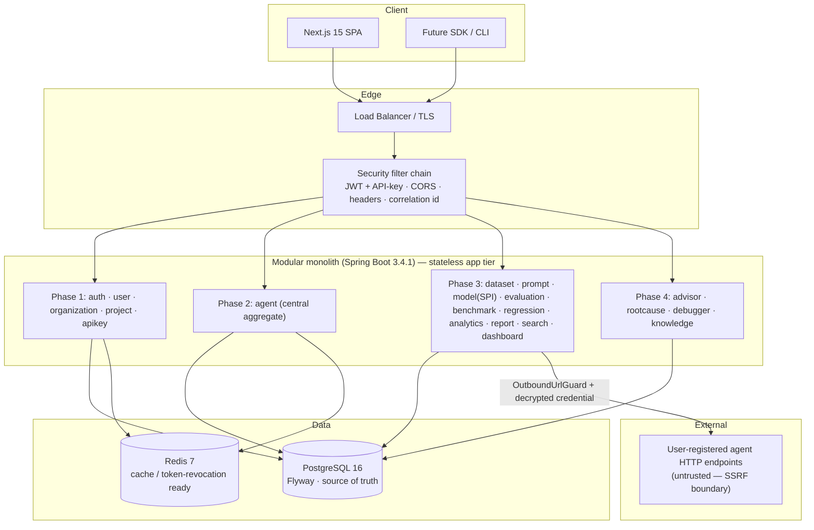
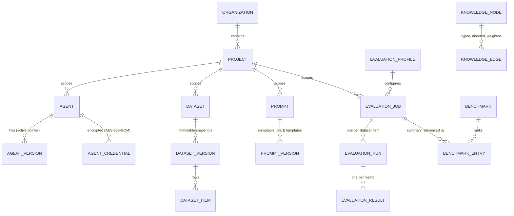
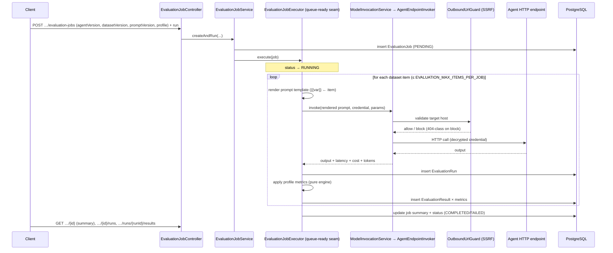

# System Design Walkthrough — Brok's Forge

> **The Engineering Platform for AI Agents.**
>
> | | |
> |---|---|
> | **Document** | `docs/SYSTEM_DESIGN_WALKTHROUGH.md` |
> | **Purpose** | A full system-design-interview walkthrough using Brok's Forge as the case study |
> | **Audience** | The engineer presenting this in a system-design interview; reviewers |
> | **Source of truth** | [MASTER_ARCHITECTURE.md](./MASTER_ARCHITECTURE.md), the [ADRs](./adr/README.md) |

This is "design an AI-agent evaluation platform" answered with a system that actually exists.
Capacity numbers are *assumptions for the exercise* (illustrative), explicitly labelled; everything
about the implemented architecture traces to the source-of-truth docs.

---

## 1. Requirements

### Functional
1. **Register and version agents.** Framework-agnostic agent metadata; immutable versioned
   deployments with an active-version pointer (activate/rollback); encrypted upstream credentials;
   health checks.
2. **Manage evaluation inputs.** Immutable, versioned datasets (CSV/JSON import) and a versioned
   prompt library with `{{variable}}` templating.
3. **Run evaluations.** Take an agent version + dataset version + prompt version + metric/threshold
   profile, execute per dataset item, and score each output against multiple metrics.
4. **Compare and guard.** Benchmark variants (leaderboards) and detect regressions of a candidate vs
   a baseline across latency/cost/quality/tokens.
5. **Explain and advise.** Root-cause a failure, recommend fixes (prompt/model/cost/agent/RAG),
   reconstruct a per-run execution timeline, and browse a knowledge graph of patterns.
6. **Report and observe.** JSON/CSV/HTML exports; analytics trends; global search; a project
   dashboard.

### Non-functional
- **Multi-tenant isolation.** `Organization → Project` scoping; no cross-tenant leakage, even by
  guessed id.
- **Reproducibility.** A historical evaluation must mean the same thing on re-read (immutable inputs).
- **Provider/framework neutrality.** No coupling to a single LLM vendor or agent framework.
- **Scale headroom.** Evaluation is `items × metrics`; the data model must reach millions of result
  rows.
- **Security.** Secret confidentiality, SSRF defense on outbound calls, RBAC, no info-leak errors.
- **Operability.** Correlation IDs, metrics, structured logs, health probes.
- **Availability target (illustrative):** 99.9% for the API tier; stateless app tier scales
  horizontally.

---

## 2. Capacity & scale assumptions *(illustrative — for the exercise, not measured)*

| Dimension | Assumption | Implication |
|---|---|---|
| Tenants | 10k orgs, 50k projects | Tenancy columns + indexes on every aggregate |
| Agents | ~5 agents/project → ~250k agents | `Agent` central, referenced by id everywhere |
| Eval job size | up to ~10k items × ~5 metrics = ~50k result rows/job (today capped at 500 items/job synchronously) | Fan-out tree; insert-only hot path |
| Throughput | 100s of jobs/day initially → millions of result rows over time | Partition-by-job; precomputed summaries |
| Read pattern | Dashboards/benchmarks read job summaries, not leaf rows | One row per job, not millions, on the read path |
| Outbound | Every eval item = 1 outbound HTTP call to an agent endpoint | SSRF guard on every call; this is the latency-dominant step |

The dominant cost is **outbound model/agent invocation latency**, not DB or CPU. That shapes the
biggest known bottleneck (below).

---

## 3. High-level architecture

Key properties: **stateless app tier** (JWT access tokens are stateless; refresh tokens and caches
live in Postgres/Redis) so it scales horizontally behind a load balancer with no sticky sessions;
**DB is the source of truth** with `ddl-auto=validate`; the **only outbound surface** is the
SSRF-guarded path to agent endpoints.

---

## 4. API surface (representative)

All business endpoints require auth and are tenant-nested under
`/api/v1/organizations/{orgId}/projects/{projectId}`; knowledge endpoints are platform-global.

| Area | Representative endpoints |
|---|---|
| Auth | `POST /auth/register · login · refresh · logout · change-password · forgot-password · reset-password` |
| Agents | `…/agents` (CRUD) · `…/agents/{id}/versions` (+ `activate`/`rollback`) · `…/credentials` · `…/health-check` |
| Datasets | `…/datasets` · `…/datasets/{id}/versions` · `…/versions/{vId}/items` · `…/stats` |
| Prompts | `…/prompts` · `…/prompts/{id}/versions` (+ `activate`/`rollback`) · `…/compare` |
| Evaluation | `…/evaluation-profiles` · `…/evaluation-jobs` (+ `run`/`cancel`) · `…/{id}/runs` · `…/runs/{runId}/results` |
| Compare | `…/benchmarks` (+ `leaderboard`/`entries`) · `…/regression-checks` |
| Insights | `…/analytics?windowDays=30` · `…/reports/export` · `…/search?q=` · `…/dashboard` |
| Advisor (P4) | `…/advisor` · `…/advisor/agents/{id}` · `…/advisor/prompts/{id}` |
| Diagnose (P4) | `…/root-cause/jobs/{id}` · `…/root-cause/regressions/{id}` · `…/debugger/jobs/{id}/runs/{runId}/timeline` |
| Knowledge (P4) | `GET /api/v1/knowledge/nodes` · `…/nodes/{key}` · `…/graph` |

Conventions: thin controllers, immutable record DTOs (request DTOs omit server-controlled fields),
Spring `Pageable` + `PageResponse<T>`, one stable `ApiError` error contract.

---

## 5. Data model

Universal table skeleton on every table: `id UUID` (`gen_random_uuid()`), optimistic `version`,
audit columns (`created_at/by`, `updated_at/by`), soft-delete on soft-deletable aggregates, tenancy
columns (`organization_id`, `project_id`) + FKs + indexes, and **text-backed enums** (so new
frameworks/providers/metrics need no migration).

Notes:
- **No cross-module JPA associations.** The ER diagram shows *logical* references; in code the
  `evaluation` module stores a plain `UUID agentId` / `datasetVersionId` / `promptVersionId`, not a
  `@ManyToOne`. Cross-module reads go through published services.
- **Immutability for reproducibility.** A `DatasetVersion`'s items never change; a corrected import is
  a *new* version. A job pins `datasetVersionId` + `promptVersionId`, so it's reproducible forever.
- **`evaluation_jobs.summary` (JSONB)** is the precomputed aggregate every downstream reader uses.
- **Knowledge graph** is platform-global reference data — no tenancy columns — seeded with 20 nodes +
  20 edges (Flyway V24/V25).

---

## 6. Deep dive: the evaluation pipeline

This is the heart of the system and the part designed for scale
([ADR 0005](./adr/0005-evaluation-job-as-top-level-aggregate.md)).

Pipeline in one line: **Job → N prompts → N executions → N results → summary.** A single failed item
fails *its run*, not the job; the job's terminal status reflects the aggregate.

**Metric engine.** `EvaluationMetricType` (EXACT_MATCH, CONTAINS, REGEX_MATCH, JSON_VALID, LENGTH,
LATENCY, COST, TOKEN_COUNT, NON_EMPTY) — one strategy per type from a registry. Adding a metric = one
enum constant + one bean, no migration. Evaluators are *pure* (already-loaded inputs → value records),
so they're deterministic and unit-testable.

---

## 7. Bottlenecks & how the design handles them

### 7.1 The synchronous executor (known issue)
**Problem:** `EvaluationJobExecutor` runs synchronously on the request thread today. Since the
latency-dominant step is the outbound agent call, a large job ties up a thread (and could hold a DB
connection across network calls if written naively).
**Mitigations in place:**
- **Bounded work:** `EVALUATION_MAX_ITEMS_PER_JOB` (default 500) caps synchronous job size.
- **Connection-pool discipline:** don't hold a transaction open across the network call — runs/results
  are persisted around the invocation, and the heavy aggregate read is replaced by the precomputed
  `summary` so downstream paths never scan leaf rows under a held connection.
- **Queue-ready seam:** the executor is the *only* component that fans a job into runs; nothing
  outside assumes synchronous completion.
**The fix (roadmap):** move the executor behind a durable queue + worker fleet (retries, backpressure).
The `Job → Run → Result` schema, the domain model and the API are unaffected — it's an infrastructure
change behind the seam.

### 7.2 Read amplification on dashboards/benchmarks
**Problem:** comparing or trending over millions of result rows would be `GROUP BY`-over-everything.
**Handled by:** the **precomputed job summary**. Benchmarks, regression, analytics and the dashboard
read one summary row per job. Benchmarks are built *from* summaries, not by re-running anything.

### 7.3 On-read derived data (advisor/root-cause) costing CPU per request
**Problem:** recomputing recommendations on every read uses CPU.
**Handled by:** bounding the analysis window (most-recent jobs), keeping the analyzers cheap,
allocation-light passes, and configurable thresholds (`AdvisorProperties`). The trade is accepted
because on-read advice *can never drift* and costs zero schema/scheduler/invalidation machinery
([ADR 0011](./adr/0011-ai-engineering-advisor.md)). If history is ever needed, a snapshot table is
additive.

### 7.4 Hot, ever-growing result tables
**Handled by:** insert-only, partition-by-job layout (indexed FKs `evaluation_runs.evaluation_job_id`,
`evaluation_results.evaluation_run_id`); old jobs can be archived/partitioned out without touching live
work.

---

## 8. Scaling roadmap

| Stage | Move | Why it's cheap here |
|---|---|---|
| Now | Synchronous executor, monolith | Seam + id-only boundaries in place |
| Next | Async eval workers behind a queue | Executor is the single seam; schema/API don't move |
| Then | Partition/retention on `evaluation_runs`/`results` | Already partitionable by job |
| Then | Extract Evaluation Engine (`evaluation`+`model`) to a service | Others hold only `agentId`/`agentVersionId`; published-service contract is already a UUID wire contract |
| Later | Extract Insights / Discovery as read-side (CQRS) services | They already read job summaries only |
| Later | Multi-region, KMS envelope encryption, egress proxy for SSRF defense-in-depth | Versioned ciphertext + the guard make these additive |

What makes extraction mechanical: **no cross-module JPA associations or shared repositories** (no
hidden joins), **id references** (the contract is already a wire-friendly UUID), and the **executor
seam** (the highest-volume path is already isolated).

---

## 9. Security (recap in design terms)

- **AuthN:** JWT access (short-lived, stateless) + rotating refresh tokens; SHA-256 API keys shown
  once. **AuthZ:** `OWNER > ADMIN > MEMBER` enforced in the service layer.
- **Tenant isolation / IDOR:** every aggregate loaded by `(id, projectId, organizationId)` → foreign
  id is **404**, never a 403 that leaks existence.
- **Secrets:** verification secrets hashed (BCrypt/SHA-256); agent usage credentials **encrypted**
  (AES-256-GCM, versioned ciphertext) — write-only, never returned, never logged.
- **SSRF:** `@ValidEndpointUrl` (write) + `OutboundUrlGuard` (runtime, every outbound call) block
  private/loopback/metadata targets.
- **Injection:** JPA parameter binding (SQLi); CSV/formula-injection- and XSS-safe report exports.
- **Errors:** one `ApiError` contract; **no stack trace ever leaks**.
- **Observability:** correlation/request IDs everywhere; Prometheus metrics + ECS-JSON logs +
  liveness/readiness probes for the release ([ADR 0015](./adr/0015-production-observability-metrics-and-structured-logging.md));
  distributed tracing is a wired-up-later seam.

---

## 10. What I'd say at the whiteboard, condensed

> "Central aggregate is the Agent. Everything references it by id, never by a join, so the monolith
> splits cleanly later. Evaluation is the scale concern: I model it as Job → Run → Result, keep the
> hot path insert-only and partitionable, and precompute a per-job summary so reads never touch the
> leaf rows. Execution sits behind one seam that's synchronous today and queue-ready tomorrow. Inputs
> are immutable versioned datasets/prompts, so results are reproducible. Providers sit behind an SPI,
> so new vendors are code-only. Tenancy is a tuple guard that turns cross-tenant access into a 404.
> Advice is computed on read so it never drifts. And I'm honest about what's a seam vs. shipped —
> async workers, provider-direct clients, distributed tracing and the test suite are documented next
> steps, not claims."
