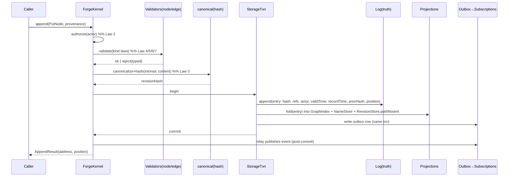
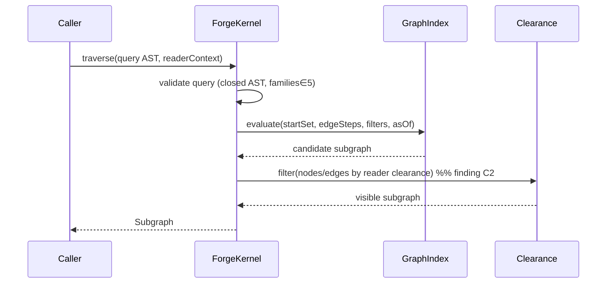
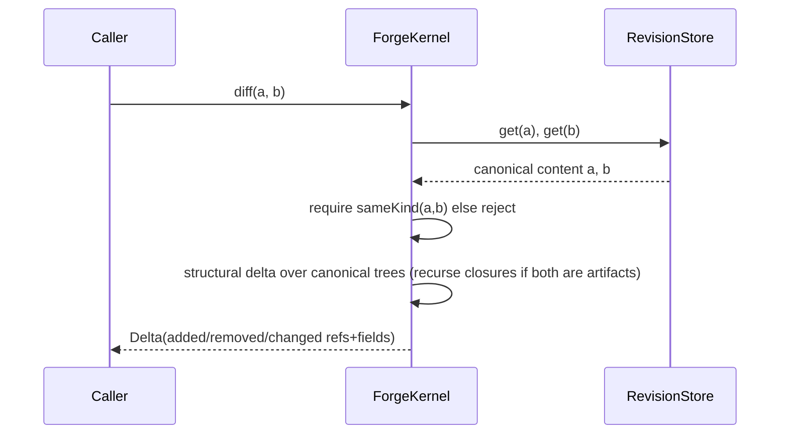
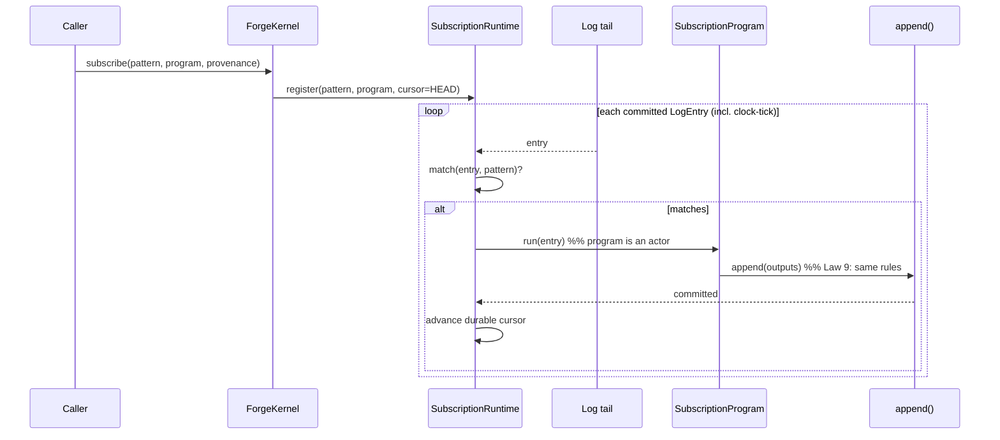
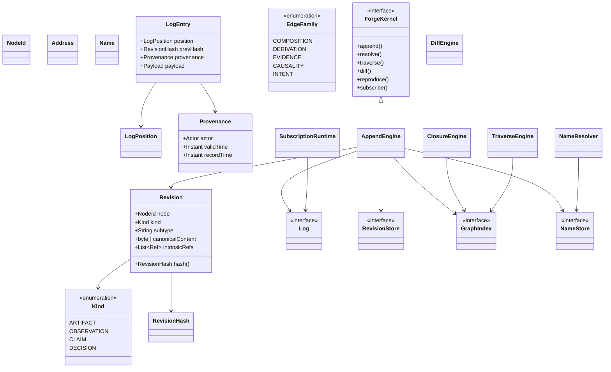
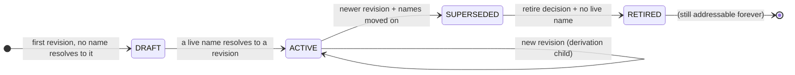
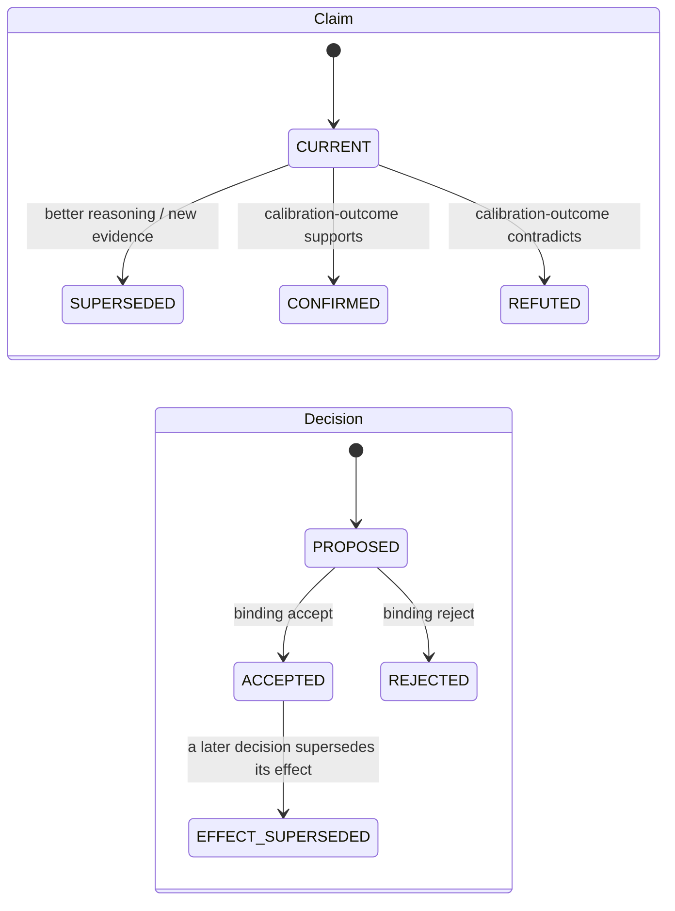
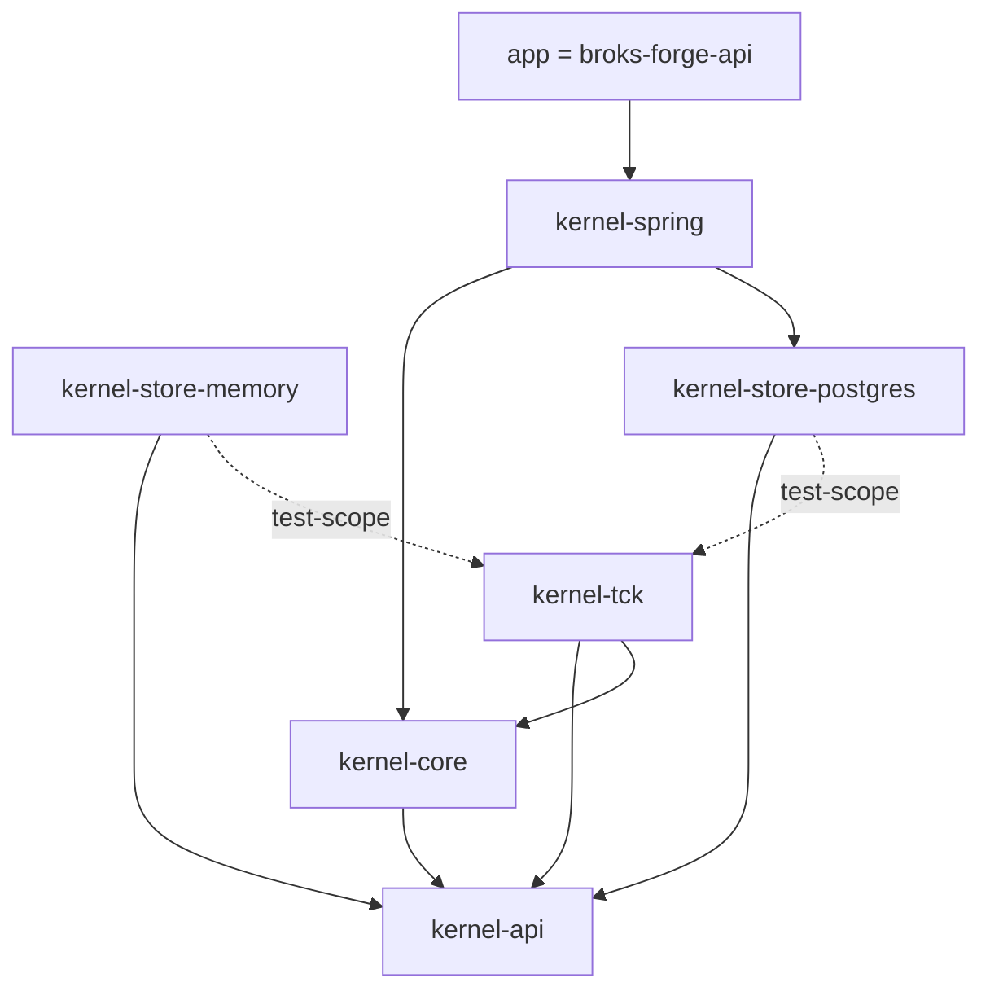

# Forge Kernel — Implementation Plan (Phase 1)

**Status:** Plan of record, pre-code. This document is the gate the founding mandate requires:
no kernel code is written until this plan is complete and the Final Validation checklist (§21)
passes. It implements the frozen constitution — [MANIFESTO.md](MANIFESTO.md),
[adr/](adr/README.md), [DOMAIN_MODEL.md](DOMAIN_MODEL.md), as amended by
[ADVERSARIAL_REVIEW.md](ADVERSARIAL_REVIEW.md) — and invents nothing beyond it. Where an
implementation force would require bending a kernel law, the plan **stops and files a proposed
amendment** rather than working around it; §20 lists the one such stop encountered while
planning.

**Scope discipline.** The kernel knows nothing of agents, prompts, models, evaluations, or
deployments. It understands only: identity, revision, node (four kinds), edge (five families),
name, closure, log position, and the six operations. If every AI concept vanished tomorrow, the
kernel would remain a valid general-purpose engineering substrate — that is the acceptance test
for "no leakage" (§21).

**Language & stack.** Java 21, to live inside the existing backend and be reused by every V1
module without a second runtime. The kernel *core* is framework-free (no Spring, no JPA on its
classpath — enforced at compile time by the module boundary, §1); Spring appears only in the
outermost wiring module. This mirrors how the repo already separates concerns and keeps the
substrate portable to any future runtime.

---

## 1. Package architecture

The kernel is introduced as a **Maven reactor** so that "storage-engine agnostic" is enforced by
the compiler, not by discipline: `kernel-core` literally cannot import a storage or framework
type because those artifacts are not on its classpath. This is the single structural change to
the existing build (migration and its risk: §10, §19).

```
broks-forge/backend/                 (reactor root pom — inherits spring-boot-starter-parent)
├── kernel-api/          pure interfaces + immutable value types. ZERO dependencies (JDK only).
├── kernel-core/         the engine. Depends on: kernel-api ONLY.
├── kernel-store-memory/ in-memory adapters (reference + tests). Depends on: kernel-api.
├── kernel-store-postgres/ Postgres adapters + Flyway. Depends on: kernel-api (+ JDBC).
├── kernel-tck/          Technology Compatibility Kit — the contract suite every backend passes.
│                        Depends on: kernel-api, kernel-core.
├── kernel-spring/       Spring Boot auto-configuration wiring core + a chosen store. Depends on:
│                        kernel-core + a kernel-store-*.
└── app/  (= today's broks-forge-api, code unmoved)   Depends on: kernel-spring.
```

**The allowed-dependency law** (verified by an ArchUnit test in `kernel-tck`, and structurally by
Maven scoping):

```
kernel-api  ◄── kernel-core  ◄── kernel-spring  ◄── app
     ▲              ▲                  │
     │              │                  ▼
kernel-store-* ─────┘            kernel-store-*   (chosen at wiring time)
     ▲
kernel-tck (test-scope only; depended-on by store modules' test suites)
```

- Nothing depends on a concrete store except `kernel-spring` at assembly time. Swapping Postgres
  for FoundationDB is a new `kernel-store-*` module + a one-line wiring change; `kernel-core`
  does not recompile. (ADR-V2-0001; requirement: "storage-engine agnostic".)
- `kernel-api` has no dependencies at all, so a value type (`RevisionHash`, `Address`) can never
  smuggle in a framework annotation. Content addressing stays deterministic and portable.

**Package layout inside `kernel-core`** (each package carries a `package-info.java` citing the
articles/ADRs/laws it implements — the documentation requirement):

```
com.broksforge.kernel.core
├── identity/     NodeId, RevisionHash, Address, Name, LogPosition parsing/formatting/validation
├── canonical/    canonical serialization (RFC 8785 JCS profile) + Merkle hashing
├── node/         Revision assembly + the four kind validators (Artifact/Observation/Claim/Decision)
├── edge/         edge families, verb registry, intrinsic-vs-extrinsic projection
├── append/       AppendEngine — the transaction, the heart (Article I, §5)
├── name/         NameResolver + compare-and-swap repointing (ADR-V2-0006)
├── closure/      ClosureEngine — transitive composition fixpoint, memoized (ADR-V2-0005)
├── traverse/     TraverseEngine + the closed query AST (ADR-V2-0007 op 3)
├── diff/         DiffEngine — generic structural delta (op 4)
├── reproduce/    ReproduceOrchestrator + Reproducer SPI (op 5)
├── subscribe/    SubscriptionRuntime + clock-tick source (op 6, Article VI)
├── erase/        cryptographic erasure of regulated content (Law 1, amended; finding D1)
└── registry/     subtype + verb + reproducer + method registration (ADR-V2-0010)
```

---

## 2. Internal module responsibilities

| Package | Owns | Must never |
|---|---|---|
| `identity` | The four identity notions as parse/validate/format value types; ULID/UUIDv7 minting for `NodeId`; multihash formatting for `RevisionHash` | Contain business meaning; know a subtype exists |
| `canonical` | The one canonical byte encoding; the Merkle hash of a revision over its intrinsic content | Depend on wall-clock, locale, map iteration order, or any non-determinism |
| `node` | Assemble a `Revision` from a payload + intrinsic refs; run the kind validator; reject illegal nodes at construction | Persist anything; know AI subtypes (only the *kind*, which is one of four) |
| `edge` | Classify a verb into its family; project a revision's intrinsic refs into edge-facts; validate endpoint-kind rules | Allow a sixth family; allow a caller to invent a family |
| `append` | The atomic append transaction: validate → hash → serialize log entry (hash-chained) → persist (log + projections) in one storage txn → enqueue outbox event | Mutate in place; skip a law; assign identity the caller could forge |
| `name` | Resolve names at any log position; compare-and-swap repointing | Store any truth a name-repoint fact doesn't already carry |
| `closure` | Pure `hash → closure` over composition refs, memoized | Follow extrinsic edges; be non-deterministic |
| `traverse` | Execute the closed query AST against the `GraphIndex` projection, clearance-filtered | Return anything not derivable from the log |
| `diff` | Structural delta of two same-kind revisions / two closures | Know how to *render* a subtype (that is a userspace lens) |
| `reproduce` | Orchestrate re-derivation via the `Reproducer` SPI; capture outputs as new observations | Contain any executor logic itself |
| `subscribe` | Durable-cursor log tailing; dispatch to `SubscriptionProgram`s; emit clock ticks | Be a second event system; deliver out of log order |
| `erase` | Destroy per-subject content keys; write the tombstone fact | Remove a node, edge, hash, or log position |
| `registry` | Hold open registrations (subtypes, verbs, reproducers, methods) as data | Require a code change to add a type (ADR-V2-0010) |

---

## 3. Public API surface

The entire kernel is reachable through **one façade interface** exposing exactly the six
constitutional operations, plus value types from `kernel-api`. No seventh operation exists (§20
records the one that was demanded and rejected).

```
// kernel-api — signatures only; semantics in the cited sections. Illustrative, not final code.

interface ForgeKernel {
  // 1. append — the only write (Article I; §5). Returns the address of the created fact.
  AppendResult append(AppendCommand command, Provenance who);

  // 2. resolve — name or address → a concrete revision, deterministically, as of a position.
  Revision resolve(Ref ref, LogPosition asOf);            // asOf = HEAD for "now"

  // 3. traverse — the read. A closed query AST → a subgraph. Clearance-filtered by `who`.
  Subgraph traverse(Query query, ReaderContext who);

  // 4. diff — structural delta of two same-kind revisions (or two closures).
  Delta diff(RevisionHash a, RevisionHash b);

  // 5. reproduce — re-derive under the pinned closure; outputs land as new observations.
  ReproduceResult reproduce(Ref ref, Closure under, Provenance who);

  // 6. subscribe — standing query bound to a program; matches invoke it; outputs are appends.
  SubscriptionHandle subscribe(Query pattern, SubscriptionProgram program, Provenance who);
}
```

`AppendCommand` is a sealed hierarchy — the *only* legal shapes of a write:

```
sealed interface AppendCommand
  permits PutNode, AssertEdge, RetractEdge, RepointName, Annotate, EraseContent;
```

There is deliberately no `UpdateNode`, no `DeleteNode`, no `SetStatus`. Their non-existence is how
Law 1 and Law 10 are enforced "by code, not convention": the illegal operation is unrepresentable
in the type system.

Derived vocabulary (version, compare, explain, replay, branch, merge, rollback, deploy,
blast-radius, why, seen-before) ships as a **thin userspace convenience layer** in `kernel-spring`
that calls only these six — never as kernel operations (DOMAIN_MODEL §8.2). Each convenience
method carries a comment naming its reduction.

---

## 4. Storage abstraction

**The governing principle (ADR-V2-0001 + "never cache truth, only cache derivations"): the Log is
the sole source of truth. Every other store is a materialized view, defined as a pure function of
the log, and rebuildable by replay.** This is what makes "no duplicate sources of truth" literally
true rather than aspirational — there is exactly one truth, and everything else is an index over
it that can be dropped and regenerated.

Four ports (`kernel-api`), each with a memory and a Postgres adapter, all held to the `kernel-tck`
contract:

```
interface Log {                       // TRUTH. Append-only, hash-chained, totally ordered per org.
  LogEntry append(OrgId org, LogEntry.Unsealed e);   // assigns position + prevHash; atomic
  Stream<LogEntry> read(OrgId org, LogPosition from, LogPosition to);
  LogPosition head(OrgId org);
}

interface RevisionStore {             // DERIVATION. Content-addressed value index (hash → bytes).
  boolean putIfAbsent(RevisionHash h, byte[] canonicalBytes);   // dedup; idempotent
  Optional<byte[]> get(RevisionHash h);
}

interface GraphIndex {                // DERIVATION. Edge adjacency for traverse/closure.
  void apply(LogEntry e);             // fold a committed entry into the projection
  Subgraph query(OrgId org, Query q, LogPosition asOf);
}

interface NameStore {                 // DERIVATION. Current name → target, for fast resolve(HEAD).
  void apply(LogEntry e);
  Optional<Target> current(OrgId org, Name n);   // historical resolve replays the Log instead
}
```

Because `RevisionStore`, `GraphIndex`, and `NameStore` are all `apply(LogEntry)` folds, a cold
start or a corrupt index is repaired by `read(org, 0, head)` and re-folding. The Log alone must be
durable and correct; the rest is convenience that can always be rebuilt (crash recovery: §13).

The **memory** backend is the reference implementation and the fuzzing oracle; **Postgres** is the
production backend (reuses the repo's existing datasource, Flyway, Testcontainers). SQLite and
FoundationDB are future modules that need only pass the TCK — no kernel change (requirement met by
construction).

---

## 5. Transaction model

Every write is one **append transaction**, atomic and durable, executed by `AppendEngine`:

1. **Authorize** provenance — reject if `Provenance.actor` is absent (Law 2). No anonymous write
   path exists.
2. **Validate** against the law set for the command's kind/shape (§10 of DOMAIN_MODEL; the
   validators in `node/`). Illegal → typed rejection *before* anything is written. A rejection is
   itself appended as a fact where it is security-relevant (e.g., a failed CAS repoint), never
   silently dropped.
3. **Canonicalize + hash** node content (for `PutNode`) → `RevisionHash` (§7). Deterministic,
   caller cannot supply the hash.
4. **Dedup** the immutable value: `RevisionStore.putIfAbsent`. Identical content is stored once;
   the *fact* of this actor asserting it is still recorded in step 6.
5. **Idempotency**: if the command carries a client key already recorded in a bounded processed-key
   window, return the prior result — safe retries.
6. **Seal + append the log entry** inside a single storage transaction that also **folds the entry
   into `GraphIndex` and `NameStore`** and **writes a transactional-outbox row** for the event.
   The log entry is sealed with `prevHash` (hash chain, §12) and assigned the next per-org
   `LogPosition` (concurrency: §14).
7. **Commit.** After commit, the outbox relay publishes the event to `SubscriptionRuntime`
   (at-least-once; consumers are idempotent via content dedup + subscription cursors — §8).

Properties this buys: **atomic** (one storage txn), **durable** (commit before ack), **crash-safe**
(outbox means no event without a committed fact, and projections are rebuildable), **idempotent**
(keys + content dedup), **auditable** (the fact and its provenance are the same record).

Name repointing adds **compare-and-swap** in step 2: the command carries the expected current
target; the engine reads the `NameStore` projection under the per-org serialization and rejects a
stale expectation (finding D4). Two concurrent deploys → exactly one wins; the loser gets an
appended rejection fact, never a silent clobber.

---

## 6. Identity model

Four distinct notions, never conflated (DOMAIN_MODEL §1; requirement "no shortcuts"):

| Notion | Type | Derivation | Mutable? | Purpose |
|---|---|---|---|---|
| **Identity** | `NodeId` | Minted once (UUIDv7 — time-ordered, index-friendly) at a continuant's first append | No (never reused) | The subject a biography is about |
| **Revision** | `RevisionHash` | `multihash(sha-256(canonical intrinsic content))` | No (value) | One immutable state; equality; dedup; Merkle closure |
| **Address** | `Address` | Structural: `forge:<org>/<kind>/<nodeId>[@<revisionHash>]` or `forge:<org>/name/<path>` | No (a name-address *resolves* to different revisions over time; the address string is stable) | Universal citation/sharing/subscription currency |
| **Name** | `Name` | A path string, org-scoped | The pointer is (via repoint appends) | Human handle; deploy targets; branches |
| **Position** | `LogPosition` | Monotonic per-org sequence assigned at append | No | The causal clock; the axis of `asOf` time-travel |

Key separations, each defended in the adversarial review or domain model:
- **`NodeId` ≠ `RevisionHash`.** A continuant persists across revisions; identity is *assigned*
  (opaque, not content-derived) precisely so a thing can change while remaining the same thing.
- **The Revision (value) ≠ the Append (fact).** Two actors publishing byte-identical content
  produce **one** `RevisionHash` (dedup) but **two** `LogEntry` facts with distinct positions,
  actors, and times. Provenance and bitemporality live on the fact, never in the content hash —
  which is why identical content at different times still dedups (the hash omits time/actor).

---

## 7. Revision model

**Intrinsic vs. extrinsic — the central modeling decision.** A revision's content is a
self-contained canonical document that includes *typed, hash-pinned references to other
revisions* (its **intrinsic** edges). Everything else about a node is **extrinsic** — separate
appended facts.

| | Intrinsic (in the content hash) | Extrinsic (separate appended facts) |
|---|---|---|
| **What** | The refs that define *what the node is* | Assertions made *about* the node later |
| **Artifact** | composition child-refs; derivation parent-refs | annotations; usage observations |
| **Observation** | the closure hash it occurred under; child observations (structure) | later disputes; citations by claims |
| **Claim** | statement, method-ref, evidence-refs, confidence | supersession by a newer claim; confirm/refute observations |
| **Decision** | choice, considered alternatives, cited-claim-refs (or judgment-call flag) | what it later produced; its acceptance/rejection |
| **Edge family** | composition, derivation, evidence, intent-that-defines | causality (always extrinsic — asserted by a claim), annotation |

Consequences, each load-bearing:
- **Merkle closure is free and acyclic by construction.** A ref can only point at a
  `RevisionHash` that already exists (you cannot hash content referencing a not-yet-computed
  hash), so the composition/derivation DAG cannot contain a cycle — acyclicity needs no check
  (DOMAIN_MODEL §4.3).
- **Law 5 becomes a constructor invariant.** A `Claim` revision literally cannot be canonicalized
  without non-empty evidence-refs, a method-ref, and a confidence — the value is unconstructable
  otherwise, so an unexplained claim is unrepresentable, not merely rejected (finding: Law 5
  enforced by code).
- **The append engine projects intrinsic refs into edge-facts** for `traverse`, so composition is
  simultaneously in-content (for closure) and a first-class edge (for the graph) with no second
  authoring step.

**Canonicalization** (`canonical/`): the RFC 8785 JSON Canonicalization Scheme profile — UTF-8
with Unicode NFC string normalization, lexicographically sorted object keys, no insignificant
whitespace, RFC 8785 number formatting, and references encoded as their `sha256:…` multihash
strings. Golden test vectors pin the byte output forever (§9). `RevisionHash` carries a multihash
prefix so the hash function can migrate without ambiguity a decade out. **No wall-clock, locale,
RNG, or map-ordering may enter this path** — determinism tests enforce it.

---

## 8. Event model

**The append log is the event bus** (ADR-V2-0008; requirement "no second event system"). There is
no broker, no separate topic schema — an event *is* a committed `LogEntry`, and the event types
are exactly the append types (DOMAIN_MODEL §5): `node-appended`, `edge-asserted`, `edge-retracted`,
`name-repointed`, `annotation-appended`, `clock-tick`.

- **Delivery.** `SubscriptionRuntime` tails the Log from a **durable per-subscription cursor**
  (last processed `LogPosition`). Delivery is at-least-once, in strict log order; effective
  exactly-once because a program's appends dedup by content and the cursor advances only after the
  program's outputs commit. A crashed subscriber resumes from its cursor — no lost or reordered
  events.
- **Cascades are visible, not forbidden.** A program's appends can match other subscriptions.
  Each firing declares an append budget; exhaustion is itself a `clock`/budget observation; cascade
  chains are traceable as intent-edge lineage (finding: no silent runaway autonomy).
- **Clock ticks close the quiet-log hole (finding B3).** A kernel `ClockSource` appends `clock-tick`
  observations at a declared coarse granularity, so time-driven subscriptions (the nightly pass)
  fire even when nothing else is happening. Time itself is in the record. Ticks are the *only*
  facts the substrate authors on its own behalf, and it does so as a named actor under all laws
  (Law 9).

The event model needs no bitemporal complexity: ordering is by `LogPosition` (the causal clock);
wall-clock `recordTime`/`validTime` are attributes carried for query, not for ordering.

---

## 9. Testing strategy

Testing is implementation, not afterthought. Every constitutional law maps to a named, automated
test (the traceability matrix, §22, has a "Test" column for exactly this).

- **Unit** — each validator, the canonical serializer, identity parsers, the query AST evaluator.
- **The TCK (`kernel-tck`)** — one storage-contract suite that *every* backend (memory, Postgres,
  future FoundationDB) must pass identically: append atomicity, dedup, hash-chain continuity,
  projection-rebuild equivalence, CAS repoint semantics, ordering. This is how "every backend
  replaceable without rewriting kernel logic" is *proven*, not asserted (JPA-TCK / K8s-conformance
  precedent).
- **Property-based** (jqwik) — over random legal append sequences, assert the invariants hold:
  append-only (no operation reduces history), dedup (equal content ⇒ equal hash ⇒ single stored
  value), closure acyclicity, `resolve` determinism, projection = replay(log).
- **Determinism** — the canonical encoder produces byte-identical output across JVMs, locales, and
  runs; golden vectors; a "same content, shuffled map order ⇒ same hash" test.
- **Concurrency** — N threads appending to one org (assert a gapless total order, no lost writes);
  N threads racing a single name repoint (assert exactly one CAS winner); readers under writers
  (assert no torn reads against immutable revisions).
- **Crash recovery** — kill between storage-commit and outbox-publish (assert no event without a
  fact, and rebuildable projections); kill mid-transaction (assert atomic rollback); drop a
  projection and rebuild from the log (assert identical query results).
- **Fuzz** — the canonical serializer and the `Address`/`Name` parsers against malformed and
  adversarial input.
- **Determinism of the reduction** — property test that each derived-vocabulary method equals its
  documented composition of the six operations.
- **Benchmarks** (JMH) — append throughput/latency, hash cost, closure of deep DAGs, traverse on a
  large index. Correctness first; benchmarks guard against regressions, not premature tuning.

---

## 10. Migration strategy

Two migrations: the build, and the schema. Both additive; neither touches V1 runtime behavior.

- **Build.** Convert `backend/pom.xml` into a reactor parent and add the kernel modules plus an
  `app` module that *is* today's application with its sources unmoved (only its `<parent>` changes
  to the reactor). This is the one structural change; it is mechanical, fully covered by the
  existing CI suite (backend-ci, docker, e2e), and reversible by reverting the pom split. Risk and
  fallback (single-module + ArchUnit) in §19.
- **Schema.** The kernel owns its own Flyway history in `kernel-store-postgres`
  (`kernel_log`, `kernel_revision`, `kernel_edge`, `kernel_name`, `kernel_outbox`,
  `kernel_processed_key`, plus projection tables), on a **separate migration path** from V1's
  `db/migration` so the two never collide and `ddl-auto=validate` still holds. No V1 table is
  altered. The kernel starts empty; V1 continues untouched.
- **V1 coexistence.** Phase 1 ships the kernel *dark* — present, wired, tested, but no V1 module
  depends on it yet. Later phases (V2.0+) mirror V1 concepts into the kernel as userspace; that is
  out of scope here and gated on this plan's completion.

---

## 11. Performance considerations

Optimize only after correctness (stated philosophy). The design is nonetheless performance-aware
where the choice is free:

- **Immutable + structural sharing.** Revisions are values; closures share subtrees by hash.
- **Memoized derivations, keyed by hash.** Closures and diffs are pure functions of immutable
  hashes → safe to cache indefinitely; caching a *derivation* (never truth) honors the discipline.
- **Streaming over loading.** `Log.read` and `traverse` return `Stream`/cursor, not materialized
  lists, so history size does not bound memory.
- **Index-backed reads.** `traverse`/`closure` hit the `GraphIndex` projection; `resolve(HEAD)`
  hits `NameStore`; only historical `resolve(asOf)` replays the log.
- **Content dedup** bounds storage growth against repeated identical content (common with prompts
  and configs).
- **Hashing cost** (SHA-256 per append) is acceptable and parallelizable across orgs; measured by
  JMH before any optimization.
- **Sharding by org** is the horizontal-scale axis (§14): orgs are independent logs.

---

## 12. Security considerations

- **Tamper-evident log (hash chain).** Each `LogEntry` seals `prevHash = hash(previous entry)`.
  The head hash is a compact commitment to the entire org history; any retroactive edit breaks the
  chain and is detectable by re-verification. This makes "append-only" *cryptographically*
  auditable, upgrading Law 1 from code-enforced to math-enforced (Certificate-Transparency
  precedent).
- **Provenance authentication.** `Provenance.actor` is an authenticated identity (the app supplies
  it from the existing security context); optional per-append signatures make facts
  non-repudiable. No append path omits it (Law 2, Law 9).
- **Read visibility (finding C2).** Nodes may carry a classification set at append; `traverse`
  filters by the `ReaderContext`'s clearance; clearance policies are themselves versioned
  artifacts. Provenance-total is not visibility-total. This closes a gap the review flagged as
  **blocking for V2.0** — Phase 1 lands the classification field and the filter hook; the full
  policy model is specified before any multi-tenant read ships.
- **Regulated-content erasure (finding D1).** `EraseContent` destroys a per-subject content key,
  rendering payload bytes permanently unreadable while the node identity, hash, edges, and log
  position remain, plus an authorized tombstone fact. Facts are never deleted; content is
  crypto-shredded when law demands. Erasure is a privileged, authorized, logged operation.
- **Tenant isolation** inherits V1 doctrine: the org is the graph boundary; deny-by-default; no
  shared graph across orgs.
- **Trust boundary (finding D5).** The kernel guarantees no *actor* is privileged; the
  trustworthiness of the substrate *binary* (that the append code truly enforces the laws) is an
  operational property — open implementation, reproducible builds, and the hash chain for external
  verification — not a conceptual claim. Stated once, here.

---

## 13. Failure recovery

- **Projection loss/corruption** (`GraphIndex`, `NameStore`, `RevisionStore`): drop and rebuild by
  re-folding `Log.read(org, 0, head)`. The Log is the only store that must survive; everything else
  is regenerable. Rebuild is a covered operation with its own test (§9).
- **Crash mid-append**: the single storage transaction rolls back atomically — no partial fact, no
  orphan projection row.
- **Crash between commit and event publish**: the transactional outbox holds the event durably in
  the same committed transaction; the relay republishes on restart. No committed fact ever lacks
  its event; no event ever precedes its fact.
- **Subscriber crash**: resume from the durable cursor; at-least-once + idempotent appends ⇒ no
  loss, no duplicate effect.
- **Log verification**: the hash chain lets a recovery tool prove the restored Log is intact and
  un-rewritten before projections are rebuilt on top of it.
- **Poison program** in a subscription: budget exhaustion and a dead-letter fact quarantine it
  without stalling the runtime.

---

## 14. Concurrency model

- **Per-org total order is the one serialization point.** Within an org, log appends are
  linearized (assigning a gapless `LogPosition`); across orgs they are fully parallel. This is the
  Kafka-partition / single-writer-per-shard model — the axis of horizontal scale.
- **How the order is enforced, per backend (a port contract, not a kernel assumption):** Postgres
  satisfies it with a per-org monotonic allocation inside a `SERIALIZABLE` transaction (a
  `kernel_org_head` row locked `FOR UPDATE`, or a per-org sequence with a uniqueness constraint on
  `(org, position)`); the memory backend uses a per-org lock/striped monitor. The TCK asserts the
  guarantee regardless of mechanism.
- **Compare-and-swap names** ride the same per-org serialization: read-projection → check expected
  → append, all within the ordered section, so a repoint race has exactly one winner (finding D4).
- **Reads are lock-free**: immutable revisions need no locking; projections serve reads under
  MVCC/snapshot semantics; historical reads replay an immutable log range.
- **Idempotent appends** (client keys + content dedup) make retries under contention safe.
- Preference order honored: immutable structures, lock-free reads, explicit state transitions,
  locking confined to the minimal per-org append section.

---

## 15. Sequence diagrams — the six operations

**append (PutNode):**


**resolve:**
```mermaid
sequenceDiagram
  participant C as Caller
  participant K as ForgeKernel
  participant N as NameStore
  participant L as Log
  C->>K: resolve(ref, asOf)
  alt ref is a revision address
    K-->>C: revision (direct; content-addressed)
  else ref is a name @ HEAD
    K->>N: current(org, name)
    N-->>K: target
    K-->>C: resolve(target)
  else ref is a name @ past position
    K->>L: read(org, 0, asOf) filter name-repoint
    L-->>K: last repoint ≤ asOf
    K-->>C: resolve(target)  %% deterministic, historical
  end
```

**traverse:**


**diff:**


**reproduce:**
```mermaid
sequenceDiagram
  participant C as Caller
  participant K as ForgeKernel
  participant Cl as ClosureEngine
  participant Rg as Registry(Reproducer SPI)
  participant U as Userspace Reproducer
  participant K2 as append()
  C->>K: reproduce(ref, under closure, provenance)
  K->>Cl: closure(ref) ; assert closed (no unresolved names)  %% Law 7
  K->>Rg: reproducerFor(kind, subtype)
  alt registered
    Rg-->>K: reproducer
    K->>U: run(node, closure)
    U-->>K: raw outputs
    K->>K2: append outputs as Observations (generated-from → ref)
    K-->>C: ReproduceResult(new observation addresses)
  else none (e.g., an Observation)
    K-->>C: NotReproducible(reason)  %% reality is not replayable
  end
```

**subscribe:**


---

## 16. Class diagram (core value + engine types)



---

## 17. State-transition diagrams (status is a query — §9.x of the domain model)

These are **derived** predicates over graph history, never stored columns (Law 10). The diagrams
document how the query functions classify a node.





Observations have no substantive transitions (reality is static; they only accrete annotations).
Names: `CREATED → (repointed)* → RELEASED`, the full history being the repoint log.

---

## 18. Dependency graph



Acyclic, single-direction toward `kernel-api`. No module depends on a concrete store except
`kernel-spring` at assembly. Enforced by Maven scoping and an ArchUnit test in `kernel-tck`.

---

## 19. Risk analysis

| # | Risk | Likelihood | Impact | Mitigation |
|---|---|---|---|---|
| R1 | **Build reactor split** destabilizes the working V1 app | Medium | High | Sources unmoved (only pom `<parent>` changes); full CI (backend/docker/e2e) as safety net; reversible; fallback = keep single module + ArchUnit boundary tests (§10) |
| R2 | **Canonical-serialization drift** — a future change alters hashes, breaking all identity/dedup | Low | Critical | Frozen golden vectors; multihash-prefixed hashes for versioned migration; canonical encoder change requires a new hash algorithm id, never a silent edit |
| R3 | **Per-org append becomes a throughput bottleneck** | Medium | Medium | Org sharding is the scale axis; batch append; measure with JMH before optimizing; the serialization section is minimal |
| R4 | **Projection/log divergence** (a bug folds an entry wrong) | Medium | High | Log is sole truth; periodic rebuild-and-compare; TCK asserts projection == replay(log) |
| R5 | **`reproduce` semantics leak AI into the kernel** | Medium | High | Reproducer is an SPI; kernel knows the protocol, never the executor; an executable could be a shell script — tested with a non-AI reproducer to prove neutrality (§21) |
| R6 | **Read-visibility model under-specified** blocks multi-tenant GA | High | High | Flagged blocking for V2.0; Phase 1 lands the field + filter hook; full policy spec precedes any shared read |
| R7 | **Clock-tick volume** floods the log | Low | Medium | Coarse declared granularity; ticks are cheap observations; subscriptions match narrowly |
| R8 | **Subtype registry misuse** (userspace smuggles behavior into kernel) | Medium | Medium | Registry holds data only; no code-loading; ArchUnit forbids kernel→userspace refs |
| R9 | **Erasure vs. hash chain** — does crypto-shred break verification? | Low | High | Erasure destroys *content bytes/keys*, not the entry or its hash; the chain covers envelope hashes, which survive; tested explicitly |

---

## 20. Contradiction encountered while planning (the mandated STOP)

The mandate says: if implementation discovers a contradiction, **stop and file a proposed
amendment** rather than working around it. One arose, and is recorded here rather than silently
resolved.

**The `reproduce` operation appears to require the kernel to execute userspace semantics** — but
the kernel must not know AI (or any executor) exists. Executing an "executable artifact" is
inherently domain-specific.

- **Was it a real contradiction?** No — resolvable *within* the constitution, so no amendment is
  filed. `reproduce` is defined as an **orchestration** over a `Reproducer` SPI: the kernel
  asserts the closure is closed (Law 7), invokes the registered reproducer for the node's subtype,
  and captures its outputs as observations. The kernel supplies the *protocol and the guarantees*;
  userspace supplies the *execution*. This is exactly how a VFS calls a filesystem driver or the
  K8s API server calls a controller — the substrate defines the contract, not the behavior. A
  subtype with no registered reproducer is simply `NotReproducible`, which is also the correct
  answer for every Observation (reality is not replayable).
- **Why record a non-amendment?** Because the discipline requires the reasoning to be visible: the
  next engineer must see that the kernel/AI boundary was *tested against* this pressure and held,
  not that it was never questioned. If a future force *cannot* be resolved this way, the same
  section is where the proposed ADR amendment will go.

No other contradiction surfaced. The four kinds, five families, six operations, and ten laws
mapped to implementable mechanisms without requiring a kernel concept to bend.

---

## 21. Final validation (the gate)

Honest answers to the mandate's checklist, with the evidence in this plan:

| Check | Answer | Evidence |
|---|---|---|
| Kernel contains no AI-specific logic | **Yes** | Four kinds only; subtypes are userspace data (§2, ADR-V2-0010); `reproduce`/`diff` neutrality proven by a non-AI reproducer test (§20, R5) |
| Every future module implementable without changing the kernel | **Yes** | Open subtype/verb/reproducer/method registries; the six operations are complete for the derived vocabulary (§3); new storage = new module, no core change (§1) |
| Follows every constitutional article | **Yes** | Traceability matrix (§22) maps each article/ADR/law to a package + mechanism + test |
| No duplicate sources of truth | **Yes** | Log is sole truth; all other stores are rebuildable folds (§4, §13) |
| Every persisted object justifies its existence | **Yes** | Log (truth); projections (rebuildable read acceleration); outbox (crash-safety); processed-keys (idempotency) — each named with its reason (§4, §5) |
| Every kernel law enforced by code, not convention | **Yes** | No update/delete in the command type (§3); claim law as constructor invariant (§7); CAS in the append txn (§5, §14); hash chain (§12) |
| Would still make sense in ten years | **Yes** | Framework-free core, storage-agnostic ports, TCK, golden-vector determinism, immutable value model (Git/SQLite/K8s lineage) |

All answers are "Yes." The gate is open; code generation for Phase 1 may begin from this plan.

---

## 22. Constitutional traceability matrix

Every kernel package cites what it implements; this is the index (the documentation requirement).

| Constitution | Package(s) | Mechanism | Enforcing test |
|---|---|---|---|
| Art. I / Law 1 (append-only) | `append`, `Log` | sealed `AppendCommand` (no update/delete); hash-chained log | `AppendOnlyPropertyTest`, `HashChainTest` |
| Law 1 amended (erasure) | `erase` | key-shred + tombstone fact | `RegulatedErasureTest` |
| Law 2 (provenance) | `append` | mandatory `Provenance.actor` | `NoAnonymousAppendTest` |
| Law 3 (content addressing) | `canonical`, `identity` | JCS + multihash; engine-computed hash | `DeterminismTest`, golden vectors |
| Law 4 (epistemic partition) | `node` | `Kind` enum of 4; fixed at construction | `KindImmutabilityTest` |
| Law 5 (claim law) | `node` (claim validator) | evidence/method/confidence as constructor invariant | `ClaimLawTest` |
| Law 6 (decision law) | `node` (decision validator) | cited claims ∨ judgment-call flag | `DecisionLawTest` |
| Law 7 (reproducibility) | `closure`, `reproduce` | closed-closure assertion; pinnability classes | `ClosedClosureTest`, `PinnabilityTest` |
| Law 8 (bitemporality) | `append`, `LogEntry` | valid + record time on every fact | `BitemporalTest` |
| Law 9 (no privileged writer) | `subscribe`, `append` | programs append via the same API as an actor | `KernelActorParityTest` |
| Law 10 (one fact/status-is-query) | `traverse`, lifecycle queries | no status columns; derived predicates | `StatusIsQueryTest` |
| ADR-V2-0001 (sole substrate) | `append`, all ports | Log-as-truth; rebuildable projections | TCK `ProjectionEqualsReplay` |
| ADR-V2-0005 (closure) | `closure` | memoized composition fixpoint | `ClosureAcyclicTest` |
| ADR-V2-0006 (names) | `name` | CAS repoint; historical resolve | `NameCasTest`, `ResolveAsOfTest` |
| ADR-V2-0007 (six ops) | `ForgeKernel` façade | exactly six methods; reduction layer | `ReductionEquivalenceTest` |
| ADR-V2-0008 (log = bus) | `subscribe` | durable-cursor tail; clock ticks | `ExactlyOnceEffectTest`, `QuietLogTickTest` |
| ADR-V2-0010 (generic registry) | `registry` | data-only subtype/verb registration | `NoCodeChangeForSubtypeTest` |

---

## 23. Implementation roadmap (Phase 1, ordered by dependency)

> **Roadmap revision (applied during implementation, architecture unchanged):** the original
> Milestone 2 and the *runtime* portion of Milestone 3 were merged into a single **KERNEL RUNTIME**
> milestone — a fully functioning in-memory kernel (append engine, hash-chained log, storage ports,
> in-memory backend, all six operations, event bus, reproduce SPI). The **PERSISTENCE** milestone
> now holds only infrastructure (PostgreSQL adapter, Flyway, Testcontainers, TCK compliance,
> persistence benchmarks). This improved testability (the whole substrate is exercisable in memory
> before any database exists) without changing any primitive, law, or ADR. Status and evidence:
> [kernel/KERNEL-RUNTIME-REPORT.md](kernel/KERNEL-RUNTIME-REPORT.md).

1. **kernel-api** — value types (`NodeId`, `RevisionHash`, `Address`, `Name`, `LogPosition`,
   `Kind`, `EdgeFamily`), `Provenance`, `AppendCommand` hierarchy, the `ForgeKernel` façade, and
   the four storage ports. No logic. *(unblocks everything)*
2. **canonical** — the JCS encoder + Merkle hashing + golden vectors + determinism tests. *(the
   correctness bedrock; everything downstream trusts it)*
3. **kernel-store-memory** + **kernel-tck** skeleton — the reference backend and the contract it
   must satisfy, co-developed so the TCK is real from day one.
4. **append engine + node/edge validators** — the transaction, the four kind validators, intrinsic
   projection. The law tests (§22) land here.
5. **name** (resolve + CAS) and **closure** — the two derived engines with the cleanest specs.
6. **traverse** (+ query AST) and **diff** — the read and comparison operations.
7. **subscribe** (+ clock source) and **reproduce** (SPI + non-AI reference reproducer) — the
   reactive and re-derivation operations; the AI-neutrality proof.
8. **erase** + **hash-chain verification tool** — the security-critical, lower-frequency paths.
9. **kernel-store-postgres** — the production backend; must pass the identical TCK; Flyway schema.
10. **kernel-spring** — auto-configuration wiring core + Postgres; the derived-vocabulary
    convenience layer. Ships the kernel *dark* (no V1 dependency yet).
11. **Benchmarks (JMH)** + the full property/concurrency/crash/fuzz suites green in CI.

Exit criteria for Phase 1: the TCK passes on both backends, every §22 test is green, the
AI-neutrality test passes, and the kernel is wired but dormant — ready for V2.0 to build the first
userspace (component registries and system snapshots) *on top of it, without touching it.*
