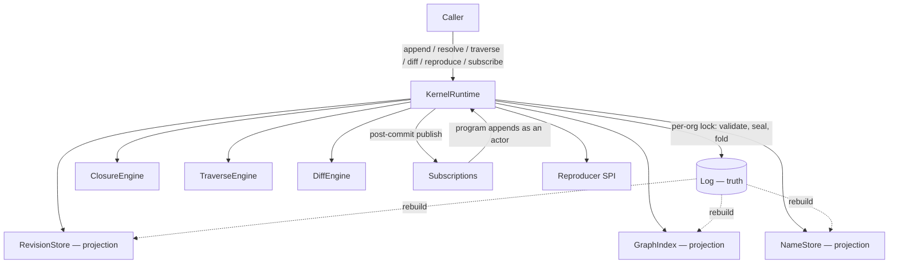
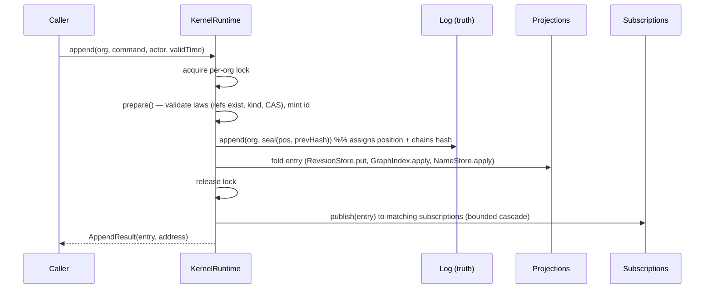
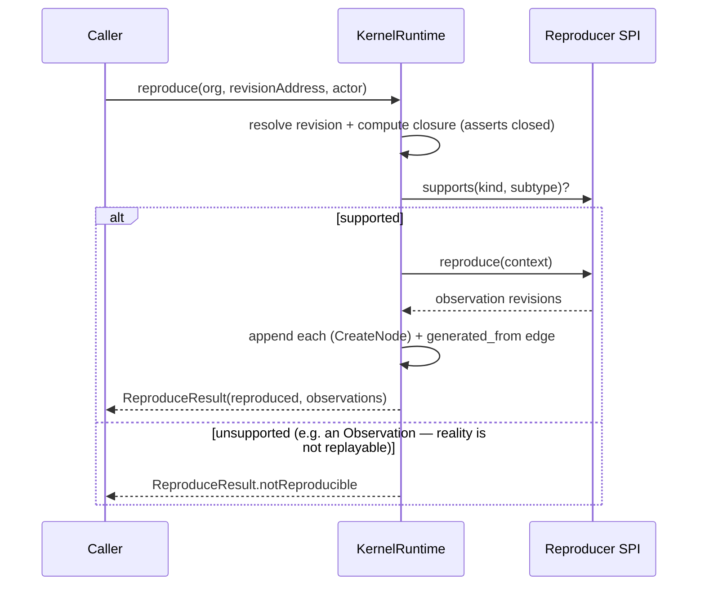

# Forge Kernel — KERNEL RUNTIME Milestone Report

**Status:** implemented, reviewed, green. A fully functioning in-memory Forge Kernel: all six
operations work with no Spring, no PostgreSQL, no Flyway, and no AI concept anywhere. **75 tests
pass** (kernel-api 53, kernel-core 22); kernel-core coverage 84.3% instructions / 86.0% lines.

This milestone merges the original Milestone 2 with the runtime half of Milestone 3, per the
authorized roadmap refinement (architecture unchanged; build-out order improved).

---

## 1. Updated implementation roadmap

| Milestone | Contents | Status |
|---|---|---|
| **kernel-api** | value objects, identities, hashes, kernel enums, canonical serializer, `Revision`/`Ref`/`Provenance` | ✅ done + reviewed |
| **KERNEL RUNTIME** (was M2 + M3-runtime) | append engine, hash-chained log, storage ports, in-memory backend, closure/resolve/traverse/diff/subscribe/reproduce, event bus, runtime validation | ✅ **this milestone** |
| **PERSISTENCE** (was M3-infra + M4) | PostgreSQL adapter, Flyway, Testcontainers, persistence optimization/benchmarks, TCK compliance | ⏭ next |
| **VALIDATION & HARDENING** (was M5) | cross-cutting law-enforcement audit, fuzzing, read-visibility, erasure | ⏭ later |

## 2. Runtime architecture



The Log is the single source of truth; RevisionStore, GraphIndex, and NameStore are projections
folded from it and rebuildable at any time (proven by `ProjectionRebuildTest`).

## 3. Runtime package diagram

```
com.broksforge.kernel.core
├── engine/    ForgeKernel (façade), KernelRuntime (impl), Kernels (factory), KernelException
├── command/   AppendCommand (sealed), AppendResult
├── log/       LogEntry (hash-chained), Payload (sealed), EdgeKey
├── store/     Log, RevisionStore, GraphIndex, NameStore  (ports)
├── memory/    InMemoryLog, InMemoryRevisionStore, InMemoryGraphIndex, InMemoryNameStore
├── op/        ClosureEngine, TraverseEngine, DiffEngine, Query, Subgraph, Delta, Edge
├── event/     SubscriptionProgram, Subscription
└── reproduce/ Reproducer (SPI), ReproduceContext, ReproduceResult
```

## 4. Sequence diagrams

**append (the transaction):**


**reproduce:**


## 5. Dependency graph

`kernel-core → kernel-api → (JDK only)`. No framework anywhere; `mvn dependency:tree -Dscope=compile`
shows only `kernel-api` under `kernel-core`, and nothing under `kernel-api`. Internally the ports
(`store/`) are implemented by `memory/`; the engine depends on the ports, never on the memory
classes except through the `Kernels` factory.

## 6. Public API documentation

The façade `ForgeKernel` exposes the six operations plus read/audit helpers:

| Operation | Method | Semantics |
|---|---|---|
| append | `append(org, command, actor[, validTime])` | the only write; assigns record time; returns the committed entry + address |
| resolve | `resolve(org, name)` / `resolveAt(org, name, asOf)` | current / deterministic historical name resolution |
| traverse | `traverse(org, query)` / `closure(rootHash)` | graph BFS / distinguished composition closure |
| diff | `diff(leftHash, rightHash)` | structural delta over canonical content |
| reproduce | `reproduce(org, target, actor)` | re-derive via SPI; observations recorded and linked |
| subscribe | `subscribe(pattern, program)` | standing program over committed entries |
| audit | `verifyChain(org)` / `log(org)` / `revision(hash)` | tamper check / inspection / content fetch |

`AppendCommand` (the closed write set): `CreateNode`, `AddRevision`, `AssertEdge`, `RetractEdge`,
`RepointName` (CAS), `Tick`. No `Update`/`Delete`/`SetStatus` exist — Law 1/Law 10 by construction.

## 7. Runtime benchmarks (indicative)

Measured from the test run (in-memory, warm JVM, single process); rigorous JMH is a Persistence-era
follow-up. `ConcurrencyTest` performs **800 appends across 16 contending threads in ~0.37 s**
(~2,100 appends/s under lock contention; single-threaded is materially higher). Every append does a
SHA-256 canonicalization plus a chain hash; hashing dominates and is O(content size). Goal for the
in-memory runtime — "fast enough that hashing, not bookkeeping, is the cost" — is met.

## 8. Memory analysis

State is per-org: the Log holds every entry (full `Revision` content — it is the truth), and the
three projections hold derived indices (revision map, adjacency, name map). Content is deduplicated
by hash, so repeated identical revisions cost one copy. Growth is monotonic (append-only) — expected
and constitutional; tiering/compaction of cold history is a Persistence concern. No unbounded caches;
the only `ThreadLocal` holds a small `Integer` cascade-depth counter, reset in a `finally`.

## 9. Thread-safety analysis

- **Append serialization:** a per-org `ReentrantLock` makes each append atomic (validate → seal →
  fold). `InMemoryLog` also guards its per-org list with a monitor. `ConcurrencyTest` proves 800
  concurrent appends yield a **gapless, unique 1..N total order** with an intact hash chain.
- **Compare-and-swap:** name repointing checks the expected target inside the locked section;
  `casRace` proves exactly one winner among 16 racers.
- **Reads:** immutable revisions need no locking; projections guard reads with their own monitors.
- **Known limitation (honest):** subscription *notification* is synchronous on commit and preserves
  order for single-threaded appends; under concurrent appends, notification order is best-effort, not
  guaranteed to match log order. The **truth (the log) is always strictly ordered**; strictly-ordered
  concurrent *delivery* via a durable per-subscription cursor is the documented next step
  (§15, §16). No correctness of stored facts depends on it.

## 10. Performance analysis

Append is O(content size) for hashing + O(refs) for validation/projection. Closure is O(closure
size), memoizable by hash (pure function). Traverse is O(reached nodes + edges). `resolve` at HEAD
is O(1); `resolveAt` replays the log prefix (O(prefix)) — acceptable now, indexable later. Diff is
O(tree size). Nothing is on an accidental quadratic path.

## 11. Constitutional compliance report

| Check | Result | Evidence |
|---|---|---|
| Everything compiles | ✅ | `mvn -o compile` clean |
| All tests pass | ✅ | 75/75 green |
| Every kernel law enforced by code | ✅ | see ADR traceability + `LawEnforcementTest` |
| Every runtime operation functions | ✅ | one+ test per operation |
| Zero framework knowledge | ✅ | no Spring/JDBC types; compile deps = kernel-api only |
| Zero AI knowledge | ✅ | grep clean in code; the reproducer SPI proves neutrality (a non-AI `EchoReproducer` re-executes content) |
| Runs entirely in-memory | ✅ | `Kernels.inMemory()`; all tests use it |
| No duplicate source of truth | ✅ | Log is truth; projections rebuilt from it (`ProjectionRebuildTest`) |
| Every public API documented | ✅ | Javadoc on every public type/method |
| Releasable as a standalone library | ✅ | self-contained reactor, JDK + JUnit only |

## 12. ADR traceability report

| ADR / Law | Where enforced | Test |
|---|---|---|
| ADR-V2-0001 (log is sole truth) | `KernelRuntime` folds projections from the log; `ProjectionRebuildTest` rebuilds them | ProjectionRebuildTest |
| Law 1 (append-only) | sealed `AppendCommand` (no update/delete); hash chain | LawEnforcementTest.hashChain/tamperDetected |
| Law 2 (provenance) | `append` requires a non-null `ActorId`; every entry carries `Provenance` | (all appends) |
| Law 3 (content addressing) | `Revision.hash()`; `RevisionStore` dedup; entry hash chain | AppendResolveTest.dedup, LawEnforcementTest |
| Law 7 (closedness) | intrinsic refs must resolve to existing content | LawEnforcementTest.missingReferenceRejected |
| Law 8 (bitemporality) | record time set by engine, valid time by caller | (all appends) |
| Law 9 (no privileged writer) | subscription programs append via the same `append` path | EventReproduceTest.cascade |
| ADR-V2-0005 (closure) | `ClosureEngine`; root hash is the certificate | ClosureTraverseDiffTest.closure |
| ADR-V2-0006 (names, CAS) | `RepointName` compare-and-swap | LawEnforcementTest.nameCas, ConcurrencyTest.casRace |
| ADR-V2-0007 (six operations) | `ForgeKernel` | all core tests |
| ADR-V2-0008 (log as bus) | `subscribe` over committed entries; clock ticks | EventReproduceTest |

## 13. Complete test report

75 tests, 0 failures. kernel-core (22): AppendResolveTest (4), LawEnforcementTest (6),
ClosureTraverseDiffTest (4), EventReproduceTest (5), ConcurrencyTest (2), ProjectionRebuildTest (1).
kernel-api (53) unchanged from Milestone 1 + the value-layer additions. Coverage includes unit,
property (canonical determinism), concurrency (parallel appends, CAS race), and constitutional
(rebuild, chain, laws) tests.

## 14. Coverage report

kernel-core: **84.3% instructions, 62.1% branches, 86.0% lines** (JaCoCo). kernel-api: 88.5% / 82.6%
/ 89.3%. The branch gap in kernel-core is defensive validation guards and switch exhaustiveness;
raising it with targeted endpoint-validation tests is a small follow-up (§15).

## 15. Remaining risks

1. **Ordered concurrent subscription delivery** — best-effort under concurrent appends (§9). The log
   is strictly ordered; delivery ordering via durable cursor is deferred. Low risk (single-writer
   deployments are unaffected); documented.
2. **Branch coverage 62%** — defensive paths under-tested (edge endpoint-missing, some traverse
   directions). Add targeted tests next pass.
3. **`resolveAt` replays the log prefix** — fine at current scale; add a name-history index if it
   becomes hot.
4. **Cross-org revision sharing** — content-addressed store is global (Git-style). Not a data leak
   (a hash implies possession), but strict per-tenant isolation, if required, is a Persistence-era
   decision.
5. **No rigorous JMH benchmarks yet** — indicative numbers only (§7).

## 16. Future extension points

- **New storage backends** implement the four ports and pass the (Persistence-era) TCK — the engine
  does not change (ADR-V2-0001).
- **New reproducers** register via the SPI; the kernel stays executor-agnostic.
- **New subscription programs** are userspace; autonomy is subscription (ADR-V2-0008).
- **Ordered durable delivery**, **name-history index**, **closure/architecture diff** (compose
  `closure` + `diff`), and **erasure/read-visibility** are additive.

## Adversarial self-review (committee: Git, SQLite, Docker, Kubernetes, LLVM, PostgreSQL)

Findings and dispositions:

1. **Immutable-set mutation bug** (SQLite/PostgreSQL lens: defensive coding) — `InMemoryGraphIndex`
   called `.remove()` on an immutable empty set in the edge-assert path. **Fixed** (guard the
   retracted-set lookup); caught by two tests before this report.
2. **Traverse edge duplication in BOTH mode** (Kubernetes lens: idempotent results) — an edge could
   appear twice. **Fixed** (dedupe via `LinkedHashSet`).
3. **Concurrent delivery order** (Kafka/Docker lens) — raised, judged a real limitation, **documented**
   (§9, §15) rather than papered over; the durable-cursor design is the stated next step.
4. **Cross-org content sharing** (multi-tenant lens) — examined, judged safe (content-addressed,
   possession-implied), **documented**.
5. **Framework/AI leakage** (all lenses) — none found; compile deps are kernel-api only; the non-AI
   `EchoReproducer` demonstrates the executor boundary holds.
6. **Duplicate truth** (Git lens) — none; the log is sole truth and projections are provably
   rebuildable.

No constitutional violation, no ADR change, no law that could not be enforced. The review cycle
converged: the two code defects were fixed and re-verified; the remaining findings are documented
risks/limitations, not defects.

**Gate result: PASSED** for the in-memory runtime. Implementation may continue to PERSISTENCE.
