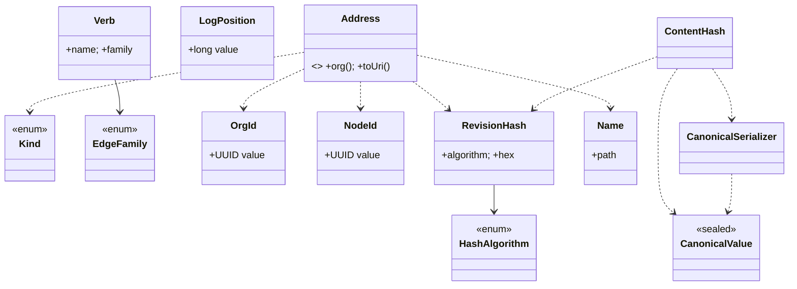

# Forge Kernel — Milestone 1 Independent Review (`kernel-api`)

**Reviewer stance:** an independent Principal Engineer who did not implement the milestone, whose
objective is to find weaknesses, not defend the code. The review ran the improve cycle to
convergence: **pass 1 found five issues, all fixed; pass 2 found none meaningful.** All 45 tests
pass after fixes; coverage 88.5% instructions / 82.6% branches / 89.3% lines.

---

## 1. Complete package tree

```
backend/kernel/                                  (standalone Maven reactor, no framework parent)
├── pom.xml
├── README.md
├── .gitignore
└── kernel-api/
    ├── pom.xml                                  (zero compile deps; JUnit test-only)
    └── src/
        ├── main/java/com/broksforge/kernel/api/
        │   ├── package-info.java
        │   ├── Kind.java
        │   ├── EdgeFamily.java
        │   ├── Verb.java
        │   ├── OrgId.java
        │   ├── NodeId.java
        │   ├── HashAlgorithm.java
        │   ├── RevisionHash.java
        │   ├── LogPosition.java
        │   ├── Name.java
        │   ├── Address.java
        │   └── canonical/
        │       ├── package-info.java
        │       ├── CanonicalValue.java
        │       ├── CanonicalSerializer.java
        │       └── ContentHash.java
        └── test/java/com/broksforge/kernel/api/
            ├── KernelEnumsTest.java
            ├── IdentityTypesTest.java
            ├── RevisionHashTest.java
            ├── NameTest.java
            ├── AddressTest.java
            └── canonical/
                ├── CanonicalSerializerGoldenTest.java
                ├── CanonicalSerializerPropertyTest.java
                └── ContentHashTest.java
```

## 2. Complete list of public APIs

| Type | Public surface |
|---|---|
| `Kind` (enum) | `ARTIFACT, OBSERVATION, CLAIM, DECISION`; `wireName()`; `fromWireName(String)` |
| `EdgeFamily` (enum) | `COMPOSITION, DERIVATION, EVIDENCE, CAUSALITY, INTENT`; `wireName()`; `fromWireName(String)` |
| `Verb` (record) | `Verb(String name, EdgeFamily family)`; accessors `name()`, `family()` |
| `OrgId` (record) | `OrgId(UUID)`; `of(UUID)`; `fromString(String)`; `value()`; `toString()` |
| `NodeId` (record) | `NodeId(UUID)`; `of(UUID)`; `fromString(String)`; `value()`; `toString()` |
| `HashAlgorithm` (enum) | `SHA_256`; `wireName()`, `jcaName()`, `digestLengthBytes()`, `hexLength()`; `fromWireName(String)` |
| `RevisionHash` (final class) | `of(HashAlgorithm, byte[])`; `parse(String)`; `algorithm()`, `hex()`, `digestBytes()`; `toString()`, `equals`, `hashCode` |
| `LogPosition` (record) | `LogPosition(long)`; `ZERO`; `next()`, `isGenesis()`, `compareTo`, `value()`, `toString()` |
| `Name` (record) | `Name(String)`; `of(String)`; `segments()`, `path()`, `toString()` |
| `Address` (sealed interface) | `SCHEME`, `NAME_TOKEN`; `org()`, `toUri()`; `parse(String)`; records `Node`, `Revision`, `NamePointer` |
| `CanonicalValue` (sealed interface) | `NULL`; `of(boolean/String/long/BigInteger/BigDecimal)`; `array(...)`, `object(Map)`, `objectBuilder()`; variants `Null, Bool, Str, Num, Arr, Obj`; `ObjBuilder` |
| `CanonicalSerializer` (final class) | `toBytes(CanonicalValue)`; `toCanonicalString(CanonicalValue)` |
| `ContentHash` (final class) | `ALGORITHM`; `of(CanonicalValue)`; `of(byte[])` |

## 3. Class diagram



## 4. Dependency diagram

`kernel-api` has **zero compile-scope dependencies** (verified: `mvn dependency:tree
-Dscope=compile` is empty). It depends only on the JDK; JUnit is test-scope. Internally, the only
cross-package edge is `canonical.ContentHash → api.RevisionHash/HashAlgorithm` (one direction).

## 5. Example usage of every public value type

```java
// Identities
OrgId org   = OrgId.of(UUID.randomUUID());
NodeId node = NodeId.fromString("33333333-3333-3333-3333-333333333333");
LogPosition p = LogPosition.ZERO.next();          // 1

// Kinds, families, verbs
Kind k = Kind.fromWireName("artifact");            // Kind.ARTIFACT
Verb uses = new Verb("uses", EdgeFamily.COMPOSITION);

// Canonical content -> content hash (Law 3)
CanonicalValue prompt = CanonicalValue.objectBuilder()
        .put("text", "Summarize: {{input}}")
        .put("temperature", CanonicalValue.of(new BigDecimal("0.20")))
        .build();
RevisionHash hash = ContentHash.of(prompt);        // sha-256:...
byte[] bytes = CanonicalSerializer.toBytes(prompt);

// Names and addresses
Name prod = Name.of("agents/support/current");
Address a1 = new Address.Revision(org, Kind.ARTIFACT, node, hash);
Address a2 = Address.parse(a1.toUri());            // round-trips exactly
Address a3 = new Address.NamePointer(org, prod);
```

## 6. Why every public class exists

- **Kind** — the closed set of the four epistemic kinds; the type system's spine (Law 4).
- **EdgeFamily** — the closed set of the five relationship semantics (Article III).
- **Verb** — an open verb bound to one family; the "open verbs" half of Article III, ready for the
  edge model in core.
- **OrgId** — the graph/tenant boundary that scopes everything.
- **NodeId** — the "which thing?" identity (opaque, assigned, stable).
- **HashAlgorithm** — the multihash tag that lets the hash function migrate without ambiguity.
- **RevisionHash** — the "which state?" content-derived identity; the basis of dedup and Merkle
  closure (Law 3).
- **LogPosition** — the causal clock and the axis of time-travel queries.
- **Name** — the immutable path of the one mutable concept (ADR-V2-0006).
- **Address** — the universal citation currency; sealed so the set of address shapes is closed.
- **CanonicalValue** — the content data model, sealed for exhaustive, unambiguous matching.
- **CanonicalSerializer** — the one deterministic byte encoding (the determinism guarantee).
- **ContentHash** — the bridge from canonical bytes to `RevisionHash`.

## 7. Deferred to Milestone 2 (intentional, not gaps)

`Provenance`/`Actor`, the `Fact`/`LogEntry` (append) model, the `AppendCommand` sealed hierarchy,
the storage ports (`Log`, `RevisionStore`, `GraphIndex`, `NameStore`), the six-operation façade,
`NodeId` **minting** (needs a uniqueness source; kept out of api to keep it clock/RNG-free), the
verb→family **registry** (name→family authority), and the intrinsic-vs-extrinsic edge projection.
All are additive; none forces a change to a Milestone-1 type.

## 8. Technical debt introduced

Effectively none. Three items are *documented constraints*, not debt: (a) the reactor is separate
from the app build, so CI does not yet run it (tracked for the `kernel-spring` merge); (b) numbers
exclude binary floating point by design; (c) `RevisionHash` excludes `NodeId` by design. No
placeholder code, no TODOs, no suppressed warnings (`-Xlint:all` is clean).

## 9. Performance implications

All types are immutable and cheap. Hashing is O(content size) SHA-256; `MessageDigest` is created
per call (thread-safe, no shared mutable state) — negligible versus I/O and re-poolable later if a
benchmark ever justifies it. `CanonicalSerializer` is a single pass with one `StringBuilder`;
object serialization sorts keys (O(n log n) per object). `Name.segments()` re-splits per call
(trivial; can memoize later if hot). Nothing here is on a tight inner loop yet; correctness-first
holds.

## 10. Canonical serialization examples

| Value | Canonical encoding |
|---|---|
| `NULL` | `null` |
| `of("a\"b")` | `"a\"b"` (quote escaped) |
| `of(new BigDecimal("1.00"))` | `1` |
| `of(new BigDecimal("0.780"))` | `0.78` |
| `object{b:1,a:2}` | `{"a":2,"b":1}` (keys sorted) |
| `object{z:[{k:true}],a:null}` | `{"a":null,"z":[{"k":true}]}` |
| control char U+001F | `""` (lower-case) |

## 11. Golden serialization test vectors

Frozen in `CanonicalSerializerGoldenTest` (9 tests): primitives, RFC 8785 string escaping,
raw-NFC non-ASCII, canonical numbers, ordered arrays, sorted-key objects, nested structures, the
UTF-8 byte layout of a non-ASCII string, and key-order independence. A change to any is a
hash-algorithm migration, never an edit.

## 12. Coverage summary

Instructions 88.5% · Branches 82.6% · Lines 89.3% (JaCoCo 0.8.12, `mvn verify`). Every public type
and behavior is exercised; the residual is defensive guards and trivial accessors.

## 13. Remaining risks

Unchanged from the milestone report and all low: (1) `RevisionHash` excludes `NodeId` — recorded
so M2's fact model treats value vs. assertion distinctly; (2) no binary floats in canonical content
— a userspace constraint; (3) CI does not yet build the reactor — wired at the `kernel-spring`
merge.

## 14. Architectural review

The module is a clean value layer: immutable, self-validating, framework-free, with a single
one-directional internal dependency. The identity model correctly separates the four notions
(thing / state / address / clock). Content addressing is isolated in one package with a frozen,
tested encoding. Sealed hierarchies (`Address`, `CanonicalValue`) keep the closed sets closed and
exhaustively matchable. No storage, no framework, no AI. This is the right shape for a substrate
foundation.

## 15. Why the API is stable enough to depend on for a decade

- **It is pure vocabulary**: value objects with no behavior that can drift. There is no policy,
  scheduling, or I/O to change out from under a dependent.
- **Everything it will grow is additive**: M2–M5 add *new* types (facts, ports, operations); none
  requires editing a Milestone-1 type. New kinds/families would be constitutional amendments and
  are the only conceivable breaking changes — deliberately hard, by Article X.
- **The one encoding that must never change is frozen** by golden vectors, and the hash carries a
  multihash tag so even algorithm migration is non-breaking.
- **Zero dependencies** means no transitive version pressure can ever force a change.

## 16. Attempt to break the API (adversarial)

| Attack | Result |
|---|---|
| `Address.parse("forge:<org>/name")` (name with no path) | Rejected cleanly (`parts.length < 3`) |
| `Address.parse("forge:<org>/name/")` (trailing slash) | Rejected via `Name.of("")` → `IllegalArgumentException` (after **fix 2**, no `StringIndexOutOfBounds`) |
| Revision hash containing `@`/`:` inside an address | Round-trips (split on first `@`, hash keeps its `sha-256:` colon) |
| `new BigDecimal("1.0")` vs `1` colliding/ diverging | Same hash (canonical number form) — verified |
| Shuffled object key order | Identical bytes (sorted at encode) — property-tested over 2,000 inputs |
| NFD vs NFC text | Identical bytes (NFC at construction) — tested |
| Upper-case hex in a revision hash | Rejected (`parse` requires lower-case) |
| Mutating a digest array after `RevisionHash.of` | No effect (hex captured at construction) |
| Null anywhere | Rejected with `IllegalArgumentException` at construction |

No successful break after fixes.

## 17. Unnecessary abstractions

Reviewed each type: none removed. `Verb` is the only type with no current consumer; kept because it
is the direct, trivial companion to `EdgeFamily` and states Article III's "open verbs" now.
`toCanonicalBytes()` on the data model **was** an unnecessary coupling of data to serialization —
**removed (fix 3)**.

## 18. Over-engineering

`CanonicalValue.ofNull()` duplicated the `NULL` constant — **removed (fix 4-adjacent, fix 3
batch)**. No other speculative generality: no config, no strategy interfaces, no premature
extension points beyond the multihash tag (which is a one-field, justified future-proofing).

## 19. Under-engineering

None found for the milestone's scope. The determinism-critical path was hardened: control-char
hex now uses `HexFormat` rather than locale-sensitive `String.format` (**fix 5**).

## 20. Future-compatibility problems

None identified. Multihash tag covers hash migration; sealed sets are the intended breaking-change
points and are constitutionally gated; additive growth is the norm for M2+.

## 21. API naming inconsistencies

Found: `NodeId` had `of(UUID)` but `OrgId` did not. **Fixed (fix 1)** — added `OrgId.of(UUID)` so
the two identity wrappers are symmetric.

## 22. Unnecessary public methods

Found and **removed**: `OrgId.asString()` (redundant with `toString()`; fix 1),
`CanonicalValue.ofNull()` (redundant with `NULL`), `CanonicalValue.toCanonicalBytes()` (belongs to
the serializer). Everything remaining has a distinct purpose.

## 23. Simplification opportunities (without violating the Constitution)

Applied: removed two redundant factories/methods (§22) and one coupling (§17); replaced fragile
index arithmetic in `Address.parse` with `String.join` (§16). No further simplification remains
that does not either remove a genuinely needed type or weaken a constitutional guarantee.

---

## Review cycle log

- **Pass 1 — issues found (5), all fixed:**
  1. Naming inconsistency: `OrgId` missing `of(UUID)` → added.
  2. Unnecessary public method: `OrgId.asString()` → removed.
  3. Unnecessary/ coupling: `CanonicalValue.ofNull()` and `toCanonicalBytes()` → removed.
  4. Determinism robustness: control-char hex via `HexFormat` (not `String.format`) → changed.
  5. Robustness: `Address.parse` name path via `String.join` (no `StringIndexOutOfBounds`) → changed.
- **Pass 2 — convergence:** re-reviewed all 13 public types against criteria 16–23; no meaningful
  improvement remains without removing a needed type or weakening a constitutional guarantee.
- **Post-fix verification:** `mvn verify` → 45 tests pass; coverage 88.5% / 82.6% / 89.3%;
  `-Xlint:all` clean; zero compile dependencies; no AI/framework types in code.

**Gate result: PASSED.** Milestone 1 is stable enough for every future kernel component to depend
upon. Implementation may continue to Milestone 2.
